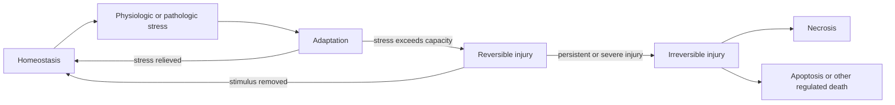
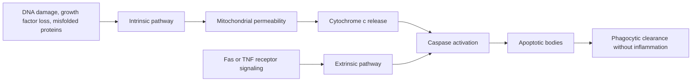

<!-- markdownlint-disable MD052 MD060 -->

# 02 - Cell Injury, Cell Death, and Adaptations - Study Notes

## Description

Third-party generated study notes for Chapter 2, "Cell Injury, Cell Death, and Adaptations." These notes are designed as revision aids and website-ready study content derived primarily from the local Chapter 2 textbook PDF, with trusted college material used for syllabus alignment and exam framing.

## Source Notes

- Primary textbook chapter source: `Robbins Basic Pathology`, 10th Edition, Chapter 2, "Cell Injury, Cell Death, and Adaptations."
- Course-alignment source: `RCPA - Basic Pathological Sciences Syllabus 2026 - October 2025.`
- The syllabus reference for Section 2 cites: `Robbins and Cotran Pathologic Basis of Disease`, edited by Vinay Kumar, Abul K. Abbas, and Jon C. Aster, 10th Edition, 2020, Elsevier.

## Page Reference Convention

Inline citations in this document use the format `[n]`, where `n` is the printed book page number as it appears in the physical Robbins Basic Pathology 10th Edition textbook, not the sequential page position within the chapter PDF. Chapter 2 occupies book pages 31-56; citations were checked against the Chapter 2 source extraction, which preserves the printed page markers from the approved chapter PDF.

## Disclaimer

These notes are third-party generated study materials. They are not produced by, reviewed by, approved by, endorsed by, or affiliated with the textbook authors, Elsevier, the Royal College of Pathologists of Australasia, or any other authority, institution, publisher, or examining body.

## Exam Alignment

The college syllabus breaks this chapter into eight revision buckets:

1. Causes of cell injury
2. How cells respond to injury
3. Mechanisms of cell injury
4. Types of cell injury and death
5. Adaptations of cellular growth and differentiation
6. Intracellular accumulations
7. Pathologic calcification
8. Cellular aging

Use those eight buckets to structure MCQ revision, short-answer recall, and mechanism-based differential questions.

## Big Picture

Pathology starts by asking why disease occurs and how it develops. Chapter 2 supplies the core framework: cells exposed to stress either adapt, undergo reversible injury, or cross an irreversible threshold and die; the type of death and the downstream tissue reaction determine the morphology seen by pathologists and the clinical consequences seen by patients. [31][32]

## 1. Injury Framework

Etiology means the underlying cause of disease, whereas pathogenesis means the mechanism by which disease develops and progresses. That distinction is basic but high yield: exam stems often ask for either the initiating insult or the downstream mechanism, and the correct answer depends on separating those two ideas. [31]

Cells maintain homeostasis until rising workload, nutrient deprivation, hypoxia, toxins, or other stressors force a response. If compensation succeeds, the cell reaches a new steady state; if the insult is excessive or intrinsically harmful, injury develops; and if the injury is severe, rapid, or persistent, the process becomes irreversible and cell death follows. [31]

| Term | Meaning | Exam angle |
|---|---|---|
| Etiology | Cause of disease | "Why did this disease arise?" |
| Pathogenesis | Mechanism of development | "How did the lesion develop?" |
| Adaptation | Reversible new steady state | Increased demand without cell death |
| Reversible injury | Recoverable derangement | Cell swelling, fatty change |
| Irreversible injury | Nonrecoverable damage | Mitochondrial failure, membrane damage, DNA injury |

This framework table is distilled from the introductory overview and the early stress-response discussion. [31][33][34]

## 2. Causes of Cell Injury

The chapter groups cell injury into a limited number of recurring categories: hypoxia/ischemia, toxins, infections, immunologic reactions, genetic abnormalities, nutritional imbalances, physical agents, and aging. Knowing these categories lets you classify unfamiliar clinical vignettes quickly even before you know the exact mechanism. [32]

| Cause | Core mechanism or example | High-yield clue |
|---|---|---|
| Hypoxia / ischemia | Reduced oxygen; ischemia also reduces nutrients and impairs waste removal | Most common cause of clinically important injury |
| Toxins | Environmental chemicals, drugs, ethanol, cigarette smoke | Can act directly or after metabolic activation |
| Infections | Viruses, bacteria, fungi, protozoans | Damage may be direct or immune-mediated |
| Immunologic reactions | Autoimmunity, allergy, chronic immune responses | Injury often mediated by inflammation |
| Genetic abnormalities | Enzyme deficiency, damaged DNA, misfolded proteins | Can trigger apoptosis when beyond repair |
| Nutritional imbalance | Protein-calorie deficiency or excess intake | Both deficiency and excess can injure cells |
| Physical agents | Trauma, temperature, radiation, electric shock, pressure change | Broadly disruptive insults |
| Aging | Reduced stress response over time | Lowers reserve and promotes cell loss |

This cause-of-injury table is synthesized from the chapter's category list and examples. [32]

### High-yield distinctions

- Hypoxia means oxygen deficiency; ischemia means reduced blood supply. Ischemia is usually more damaging because it deprives tissue of oxygen and nutrients and also prevents metabolite clearance. [32][42]
- Toxins are not limited to poisons; even normally useful substances can become toxic in excess, and some agents become harmful only after metabolic activation. [32][45]
- Immune responses can be protective against microbes but destructive to host tissues when misdirected or excessive. [32][47]

## 3. Reversible Injury and the Point of No Return

Reversible injury is the stage at which disturbed function and morphology can return to normal if the injurious stimulus is removed. The classic mechanism is failure of energy-dependent ion pumps, which causes sodium and water influx, cellular swelling, and dilation of organelles. [33]

The two main morphologic correlates of reversible injury are cellular swelling and fatty change. Microscopically, the cell may show membrane blebs, blunting of microvilli, mitochondrial swelling, ER dilation with ribosome detachment, chromatin clumping, and myelin figures derived from damaged membranes. [33]

Irreversibility is defined less by a single microscopic feature than by three functional failures: inability to restore mitochondrial oxidative phosphorylation, loss of plasma and organellar membrane integrity, and loss of DNA/chromatin structural integrity. Once lysosomal membranes fail, enzymatic digestion of the cell drives necrosis. [34][35]

| Feature | Reversible injury | Irreversible injury / necrosis |
|---|---|---|
| Cell size | Swollen | Often more swollen, then fragmented |
| Plasma membrane | Blebs, microvillus loss | Disrupted with leakage of contents |
| Mitochondria | Swollen | Severe dysfunction, permeability transition |
| ER | Dilated with ribosome detachment | Breakdown progresses |
| Nucleus | Chromatin clumping | Pyknosis -> karyorrhexis -> karyolysis |
| Outcome | Recovery possible | Cell death |

This comparison summarizes the reversible-injury section and the transition-to-necrosis discussion. [33][34][35]

## 4. Necrosis, Apoptosis, and Other Pathways of Cell Death

Necrosis is the form of cell death in which membranes break down, enzymes leak out, and the cell is digested, usually provoking local inflammation. It is the dominant outcome of severe ischemia, toxins, infections, and trauma. [34][35]

Apoptosis is a regulated form of cell death in which cells activate enzymes that degrade their own DNA and proteins, fragment into membrane-bound apoptotic bodies, and are rapidly cleared by phagocytes without significant inflammation. It can be physiologic or pathologic depending on context. [35][37]

| Feature | Necrosis | Apoptosis |
|---|---|---|
| Cell size | Enlarged / swollen | Reduced / shrunken |
| Membrane | Disrupted | Intact but altered |
| Nuclear change | Pyknosis, karyorrhexis, karyolysis | Fragmentation into nucleosome-sized pieces |
| Contents | Leak out | Packaged in apoptotic bodies |
| Inflammation | Common | Minimal or absent |
| Typical significance | Always pathologic | Often physiologic, sometimes pathologic |

This table follows the chapter's side-by-side comparison of necrosis and apoptosis. [34]

### Morphologic patterns of necrosis

| Pattern | Typical setting | Key feature |
|---|---|---|
| Coagulative | Ischemic infarcts in solid organs except brain | Preserved tissue architecture for days |
| Liquefactive | Bacterial/fungal infections; hypoxic injury in CNS | Tissue digested into viscous liquid |
| Gangrenous | Limb ischemia, often lower leg | Clinical term for extensive coagulative necrosis; infection adds wet gangrene |
| Caseous | Tuberculosis | Friable "cheesy" granular debris with lost architecture |
| Fat | Acute pancreatitis | Lipase-mediated fat destruction with chalky soap formation |
| Fibrinoid | Immune-mediated vascular injury; severe hypertension | Bright pink vessel wall deposits of immune complexes and plasma proteins |

This necrosis-pattern table summarizes the tissue patterns section and the linked figures. [36][37]

### Apoptosis pathways and uses

Apoptosis serves normal developmental sculpting, turnover of proliferative tissues, involution of hormone-dependent tissues, contraction of immune responses, and deletion of self-reactive lymphocytes. The same machinery is also used pathologically to eliminate cells with severe DNA damage, irreparable protein misfolding, or some viral infections. [37][38]

The mitochondrial, or intrinsic, pathway is the dominant pathway in most physiologic and pathologic situations. Loss of survival signals, DNA damage, or protein misfolding activates BH3-only sensors, shifts the balance of the Bcl-2 family toward Bax/Bak-mediated mitochondrial permeabilization, releases cytochrome c, and activates caspases. [38][39]

The death-receptor, or extrinsic, pathway is triggered by members of the TNF receptor family such as Fas. It is especially important in eliminating self-reactive lymphocytes and in cytotoxic T-cell mediated killing. [39]

### Other pathways of cell death and autophagy

Necroptosis is a regulated death pathway downstream of TNF receptors and other triggers in which RIP kinases drive membrane dissolution, producing a death pattern with features of both necrosis and apoptosis. It is suspected in some infections, ischemic injury, and inflammatory settings, though its exact clinical importance remains uncertain. [40]

Pyroptosis is associated with inflammasome activation. It couples cell death to production of proinflammatory cytokines and therefore links apoptosis-like enzymatic activation with overt inflammation and fever. [40]

Autophagy is primarily a survival mechanism during nutrient deprivation. Cells sequester organelles and cytosol in autophagic vacuoles, fuse these with lysosomes, and recycle the contents for nutrients; if stress is too severe or prolonged, the same process can coexist with atrophy or culminate in apoptotic death. [40][41]

## 5. Core Mechanisms of Cell Injury

Although different insults use different entry points, cell injury usually converges on damage to a limited set of vital structures: mitochondria, membranes, DNA, proteins, and the protein-handling machinery of the ER. The response depends on the type, severity, and duration of the insult and on the metabolic state, adaptability, and genetic makeup of the affected cell. [41]

### Hypoxia and ischemia

Oxygen deprivation impairs oxidative phosphorylation and depletes ATP, making hypoxia and ischemia among the most important causes of necrotic injury in medicine. The earliest consequences are failure of ATP-dependent sodium pumps, sodium and water influx, potassium efflux, ER dilation, and cell swelling. [42]

As ATP depletion worsens, anaerobic glycolysis increases, glycogen stores are consumed, lactic acid accumulates, intracellular pH falls, protein synthesis declines because ribosomes detach from rough ER, and mitochondrial and lysosomal damage eventually make the injury irreversible. Cardiac myocytes lose contractility within minutes of ischemia, well before light microscopic evidence of cell death appears. [42][43][35]

| ATP depletion consequence | Effect |
|---|---|
| Na+/K+ pump failure | Cell swelling, ER dilation |
| Increased anaerobic glycolysis | Lactic acidosis, lower pH |
| Ribosome detachment | Reduced protein synthesis |
| Mitochondrial injury | Less ATP, more ROS, necrosis risk |
| Lysosomal membrane damage | Enzymatic digestion of cell contents |

This ATP-depletion table synthesizes the hypoxia/ischemia mechanism section. [42][43]

### Ischemia-reperfusion injury

Restoring blood flow to ischemic tissue can paradoxically worsen injury. Reoxygenation promotes ROS generation, reperfusion increases influx of leukocytes and plasma proteins, and complement activation can amplify tissue damage and inflammation. [43]

### Oxidative stress

Oxidative stress refers to abnormal accumulation of reactive oxygen species, or ROS, including superoxide, hydrogen peroxide, hydroxyl radical, and peroxynitrite. These molecules are generated during mitochondrial respiration, by phagocyte respiratory burst, by radiation, by toxins, and during reperfusion of ischemic tissue. [43][44]

| ROS or defense system | High-yield role |
|---|---|
| Superoxide | Early ROS intermediate |
| Hydrogen peroxide | More stable; crosses membranes |
| Hydroxyl radical | Extremely reactive and highly damaging |
| Superoxide dismutase | Converts superoxide to hydrogen peroxide |
| Glutathione peroxidase | Breaks down hydrogen peroxide using glutathione |
| Catalase | Decomposes hydrogen peroxide in peroxisomes |

This ROS table summarizes the oxidative-stress section and the free-radical table. [44][45]

ROS injure cells by lipid peroxidation of membranes, crosslinking and fragmentation of proteins, and DNA damage. Low levels of ROS also serve physiologic signaling functions, which is why cells tightly regulate both production and removal. [45]

### Toxic injury

Toxins injure cells either directly or after metabolic activation. Direct-acting toxins bind crucial molecules immediately, whereas latent toxins require conversion to reactive metabolites, often by cytochrome P-450 in smooth ER. [45]

Carbon tetrachloride is the textbook prototype of latent toxic injury. After metabolic activation in the liver, its free-radical metabolite drives membrane lipid peroxidation, decreases apoprotein synthesis, causes fatty change, damages mitochondria, depletes ATP, and culminates in cell death. [45]

### Endoplasmic reticulum stress and misfolded proteins

Misfolded proteins accumulating in the ER first trigger the unfolded protein response, which increases chaperone production, enhances degradation of abnormal proteins, and decreases overall protein translation. If the burden remains too high, ER stress activates BH3-only proteins and caspases, pushing the cell toward mitochondrial apoptosis. [45][46]

This mechanism explains disease in two major ways: the cell may lose an essential protein because the misfolded version is degraded, or the misfolded protein load itself may cause apoptosis. Cystic fibrosis, alpha-1-antitrypsin deficiency, and several neurodegenerative diseases are important examples. [46]

### DNA damage, inflammation, and common final pathways

Severe DNA damage leads to accumulation of p53, which first arrests the cell cycle at G1 to permit repair and then, if repair fails, triggers apoptosis through BH3-only proteins and the Bcl-2 family effectors Bax and Bak. When p53 is absent or mutated, cells with damaged DNA may survive and become neoplastic. [47]

Inflammation is itself a major source of tissue injury because leukocytes release molecules designed to destroy microbes but capable of damaging host tissues. That principle underlies many hypersensitivity and autoimmune disorders. [47]

Two recurring end-stage abnormalities appear across many insults. Mitochondrial dysfunction reduces ATP generation, increases ROS, and releases proapoptotic proteins; membrane permeability defects affect mitochondrial, plasma, and lysosomal membranes, leading to ionic imbalance, loss of cellular contents, and lysosomal enzyme-mediated necrosis. [47][48]

## 6. Cellular Adaptations to Stress

Adaptations are reversible changes in cell size, number, phenotype, metabolic activity, or function that allow cells to survive altered environmental demands. They preserve viability but often do so at the cost of normal specialized function. [48]

| Adaptation | Definition | Typical example | High-yield mechanism |
|---|---|---|---|
| Hypertrophy | Increased cell size | Hypertensive heart; gravid uterus | Increased workload or hormonal stimulation |
| Hyperplasia | Increased cell number | Breast in pregnancy; liver regeneration | Growth factor-driven proliferation |
| Atrophy | Reduced cell size and function | Disuse, denervation, aging | Less synthesis, more proteasomal breakdown, autophagy |
| Metaplasia | One adult cell type replaced by another | Smoker bronchus becomes squamous | Stem-cell reprogramming under chronic stress |

This adaptation table summarizes the chapter's four major stress responses. [48][49][50][51]

### Hypertrophy

Hypertrophy is an increase in cell size that enlarges the organ. It is physiologic in the gravid uterus and pathologic in the heart subjected to hypertension or aortic valve disease. In nondividing cells such as cardiac and skeletal muscle, hypertrophy rather than hyperplasia provides the adaptive response to increased workload. [48][49]

Cardiac hypertrophy is driven by mechanical stretch and soluble mediators such as growth factors and adrenergic hormones. Initially it is compensatory, but persistent stress eventually outstrips vascular, mitochondrial, and biosynthetic reserves, leading to degenerative change, ventricular dilation, and heart failure. [49]

### Hyperplasia

Hyperplasia is an increase in cell number due to proliferation of differentiated cells or stem/progenitor cells. Physiologic forms include hormonal hyperplasia of the breast and compensatory hyperplasia of the liver after partial resection. [49][50]

Pathologic hyperplasia is usually caused by excess hormone or growth factor stimulation, as in endometrial hyperplasia or benign prostatic hyperplasia. It remains controlled and regresses when the stimulus is removed, which distinguishes it from neoplasia, but it can create a fertile setting for later malignant transformation. [50]

### Atrophy

Atrophy is shrinkage of cells due to loss of cell substance; when enough cells are involved, the whole organ becomes smaller. Causes include disuse, denervation, reduced blood supply, inadequate nutrition, loss of endocrine stimulation, and aging. [50]

The mechanism combines decreased protein synthesis with increased protein degradation through the ubiquitin-proteasome system, often accompanied by autophagy. Atrophic cells are smaller and functionally diminished, but they are not necessarily dead. [50]

### Metaplasia

Metaplasia is a reversible replacement of one differentiated adult cell type by another adult cell type better suited to the new environment. In smokers, ciliated columnar respiratory epithelium is replaced by stratified squamous epithelium that tolerates smoke better but loses mucus production and ciliary clearance. [50][51]

Metaplasia is usually due to stem-cell reprogramming rather than direct conversion of one mature cell into another. Because the same chronic stressors can also promote dysplasia and malignancy, persistent metaplasia is a warning sign rather than a benign curiosity. [51]

## 7. Intracellular Accumulations

Cells can accumulate abnormal amounts of lipids, proteins, glycogen, pigments, or indigestible material when metabolism, transport, degradation, or clearance fails. The deposit may be harmless, may simply mark prior injury, or may contribute directly to dysfunction. [51][52]

| Accumulation | Typical setting | Key point |
|---|---|---|
| Triglycerides (steatosis) | Liver, heart, muscle, kidney | Common with alcohol, obesity, diabetes, toxins, hypoxia |
| Cholesterol / cholesteryl esters | Atherosclerosis | Often in overloaded macrophages and smooth muscle cells |
| Reabsorbed proteins | Kidney tubules in nephrotic syndrome | Hyaline droplets are reversible if proteinuria resolves |
| Glycogen | Diabetes mellitus; glycogenoses | Due to abnormal glucose or glycogen metabolism |
| Carbon pigment | Lungs and tracheobronchial nodes | Anthracosis from inhaled air pollutant |
| Lipofuscin | Aging or atrophy | Wear-and-tear pigment marking free radical injury |
| Hemosiderin | Iron overload or hemorrhage | Golden-brown hemoglobin-derived iron pigment |

This accumulation table synthesizes the intracellular deposition section. [51][52][53]

### Pigments worth distinguishing

- Lipofuscin is a brown-yellow peroxidation product that marks past free-radical injury and aging; it is not usually toxic by itself. [52]
- Melanin is produced by melanocytes but can accumulate in nearby keratinocytes and macrophages. [52]
- Hemosiderin is an iron-storage pigment that becomes prominent in systemic or local iron overload and can be confirmed with Prussian blue stain. [52][53]

## 8. Pathologic Calcification

Pathologic calcification is abnormal deposition of calcium salts, often with smaller amounts of other minerals. It occurs either as dystrophic calcification in dead or injured tissue with normal serum calcium, or as metastatic calcification in normal tissue because of hypercalcemia. [53][54]

| Type | Calcium state | Where it occurs | Typical example |
|---|---|---|---|
| Dystrophic | Normal serum calcium | Injured or necrotic tissue | Atherosclerotic plaques, damaged heart valves, tuberculous lesions |
| Metastatic | Hypercalcemia | Otherwise normal tissues | Kidneys, lungs, gastric mucosa, vasculature |

This calcification table is based on the calcification section and its examples. [53][54]

Dystrophic calcification often begins in membrane-bound vesicles or mitochondria of dying cells and can be clinically important even when systemic calcium metabolism is normal; calcific aortic valve disease is a classic example. [53]

Metastatic calcification is driven by hypercalcemia, most commonly from excess parathyroid hormone, bone destruction, vitamin D-related disorders, or renal failure with secondary hyperparathyroidism. Extensive nephrocalcinosis can impair renal function. [53][54]

## 9. Cellular Aging

Cellular aging reflects progressive decline in life span and function, driven not by one process but by several interacting abnormalities. The chapter emphasizes accumulation of DNA damage, replicative senescence from telomere shortening, defective protein homeostasis, and the contributions of chronic inflammation and metabolism. [54][55]

| Mechanism | High-yield consequence |
|---|---|
| Accumulated DNA damage | Functional decline and cell loss |
| Telomere shortening | Replicative senescence and stem-cell depletion |
| Defective protein homeostasis | Loss of normal proteins, buildup of misfolded proteins |
| Persistent low-level inflammation | Acceleration of chronic disease and aging |
| Calorie restriction / exercise | Slowing of aging-associated pathways |

This aging table summarizes the late-chapter overview and figures. [54][55][56]

### Telomeres and senescence

Somatic cells lose telomeric repeats with each division because chromosome ends cannot be fully replicated. When telomeres become critically short, chromosome ends are sensed as DNA damage, the cell cycle arrests, and replicative senescence results. [54][55]

Telomerase preserves telomere length in germ cells and some stem cells, is largely absent from most somatic cells, and is commonly reactivated in cancers. Telomere maintenance defects underlie several "telomeropathies," including marrow failure syndromes and fibrosing disorders. [54][55]

### Protein homeostasis, inflammation, and slowing aging

Aging cells synthesize proteins less effectively, use chaperones and proteasomes less efficiently, and accumulate misfolded proteins more readily. Persistent inflammation driven by damaged cells and inflammasome activation further promotes chronic disease states such as atherosclerosis and type 2 diabetes. [55][56]

Calorie restriction has been shown across species to slow aging-associated pathways, partly through reduced insulin/IGF signaling, lower cell growth and metabolic stress, improved DNA repair, and better protein homeostasis. Exercise is similarly associated with slower aging, whereas stress and chronic inflammation accelerate it. [55][56]

## Rapid Review Tables

### Very common exam contrasts

| Pair | Distinction |
|---|---|
| Hypoxia vs ischemia | Oxygen deficiency alone vs reduced blood supply with nutrient loss and waste retention |
| Reversible injury vs necrosis | Recoverable swelling/fatty change vs membrane breakdown with enzyme leakage |
| Necrosis vs apoptosis | Inflammatory accidental death vs regulated noninflammatory cell death |
| Coagulative vs liquefactive necrosis | Preserved architecture vs complete enzymatic digestion |
| Hypertrophy vs hyperplasia | Bigger cells vs more cells |
| Atrophy vs metaplasia | Smaller cells from loss of substance vs replacement by another mature cell type |
| Dystrophic vs metastatic calcification | Normal serum calcium in injured tissue vs hypercalcemia in normal tissue |
| Replicative senescence vs apoptosis | Cell-cycle arrest from telomere shortening vs regulated cell death |

These are the chapter's most testable "compare and contrast" pairs. [32][34][36][42][48][50][53][55]

## Exam-Focused Takeaways

- If the stem says reduced blood flow, think ischemia rather than simple hypoxia, and expect ATP depletion plus metabolite accumulation. [32][42]
- If the lesion is in a solid-organ infarct outside the brain, coagulative necrosis is the default pattern. [36]
- If a dead cell is cleared without inflammation, think apoptosis, not necrosis. [34][37]
- If TNF signaling plus RIP kinases are emphasized, think necroptosis; if inflammasome activation and fever are emphasized, think pyroptosis. [40]
- If reperfusion worsens damage after ischemia, think ROS generation, leukocyte influx, and complement activation. [43]
- If a toxin requires cytochrome P-450 activation, it is acting as a latent toxin rather than a direct-acting toxin. [45]
- If cardiac muscle adapts to pressure overload, think hypertrophy because adult myocytes have limited proliferative capacity. [48][49]
- If a smoker's bronchus is described as losing cilia and becoming squamous, think metaplasia with loss of protective function and increased cancer risk. [50][51]
- If calcium deposits appear in dead tissue despite normal serum calcium, think dystrophic calcification. [53]
- If aging is framed as fewer divisions, think telomere shortening and replicative senescence; if it is framed as damaged proteins, think defective protein homeostasis. [54][55]
