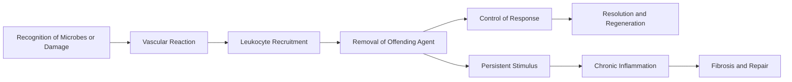

# 03 - Inflammation and Repair - Study Notes

## Description

Third-party generated study notes for Chapter 3, "Inflammation and Repair." These notes are designed as revision aids and website-ready study content derived from the local Chapter 3 textbook PDF, with trusted college material used only for exam framing and topic emphasis.

## Source Notes

- Primary textbook chapter source: `Robbins Basic Pathology`, 10th Edition, Chapter 3, "Inflammation and Repair."
- Course-alignment source: `RCPA - Basic Pathological Sciences Syllabus 2026 - October 2025.`
- The syllabus reference for Section 3 cites: `Robbins and Cotran Pathologic Basis of Disease`, edited by Vinay Kumar, Abul K. Abbas, and Jon C. Aster, 10th Edition, 2020, Elsevier.

## Page Reference Convention

Inline citations in this document use the format `[n]`, where `n` is the printed book page number as it appears in the physical Robbins Basic Pathology 10th Edition textbook, not the sequential page position within the chapter PDF file. Chapter 3 occupies book pages 57-96; citations were aligned to those printed page numbers while drafting these notes. \[57\]\[96\]

## Disclaimer

These notes are third-party generated study materials. They are not produced by, reviewed by, approved by, endorsed by, or affiliated with the textbook authors, Elsevier, the Royal College of Pathologists of Australasia, or any other authority, institution, publisher, or examining body.

## Exam Alignment

The college syllabus breaks this chapter into four core revision domains:

1. Acute inflammation
2. Chronic inflammation
3. Systemic effects of inflammation
4. Tissue repair

For exam purposes, the highest-yield discriminators sit at the borders between acute and chronic inflammation, between different mediator classes, and between regeneration and fibrosis. \[57\]\[81\]\[87\]

## Big Picture

Inflammation is the host response that recognizes injury, recruits leukocytes and plasma proteins, removes the offending agent, shuts the response down, and then repairs the tissue. Acute inflammation is fast and neutrophil-rich; chronic inflammation is prolonged, macrophage- and lymphocyte-rich, and closely linked to fibrosis. \[57\]\[58\]\[60\]\[81\]

## 1. Overview, Causes, and Recognition

Inflammation is a response of vascularized tissues to infection and tissue damage that delivers host-defense cells and proteins to the site where they are needed. The textbook frames the sequence as recognition, recruitment, removal, control, and repair, which is a reliable mental model for both short-answer and MCQ work. \[57\]\[58\]

### Core ideas

- Major triggers are infections, tissue necrosis, foreign bodies, and immune reactions. \[59\]
- Acute inflammation develops within minutes to hours and is dominated by edema and neutrophil emigration. \[57\]
- Chronic inflammation lasts weeks to months and combines inflammation, tissue injury, and attempted repair. \[58\]\[81\]
- The classic cardinal signs are heat, redness, swelling, pain, and loss of function. \[58\]

High-yield distinctions from the overview section are summarized below. \[58\]\[81\]

| Feature | Acute inflammation | Chronic inflammation |
| --- | --- | --- |
| Onset | Minutes to hours | Days to months |
| Dominant cells | Neutrophils | Macrophages, lymphocytes, plasma cells |
| Tissue effect | Usually self-limited | Tissue destruction plus fibrosis |
| Usual outcome | Resolution, abscess, fibrosis, or progression | Persistent injury with repair and scarring |

Recognition uses both cellular receptors and circulating proteins. TLRs on macrophages, dendritic cells, and other sentinel cells recognize pathogen-associated molecular patterns, while cytosolic sensors detect damage-associated molecular patterns such as uric acid, ATP, reduced intracellular potassium, and misplaced DNA. Those DAMP sensors activate the inflammasome and drive IL-1 production. Complement, mannose-binding lectin, and collectins provide a parallel circulating recognition system. \[59\]\[60\]

| Recognition route | Typical trigger | Main consequence |
| --- | --- | --- |
| TLRs and other microbial sensors | Microbial motifs and PAMPs | Cytokine production and immune activation |
| Inflammasome | Uric acid, ATP, low intracellular K+, cytosolic DNA | IL-1 production and leukocyte recruitment |
| Circulating proteins | Blood-borne microbes and microbial sugars | Complement activation and opsonization |

## 2. Acute Inflammation: Vascular Reactions

Acute inflammation has three main components: vasodilation, increased microvascular permeability, and leukocyte emigration. The vascular reaction is designed to move plasma proteins and leukocytes out of the circulation and into the site of infection or injury. \[60\]

Vasodilation is an early event, mediated prominently by histamine, and causes increased blood flow, heat, and erythema. It is followed by increased permeability with leakage of protein-rich fluid, then by stasis, margination, and adhesion of leukocytes to activated endothelium. \[60\]\[61\]

The exudate-transudate distinction is a favorite exam discriminator. \[60\]\[61\]

| Fluid type | Protein content | Cells/debris | Mechanism |
| --- | --- | --- | --- |
| Exudate | High | Present | Increased vascular permeability in inflammation |
| Transudate | Low | Minimal or absent | Hydrostatic or osmotic imbalance with normal permeability |
| Pus | High | Neutrophils plus necrotic debris | Purulent inflammation |

Several mechanisms increase vascular permeability. The most common is endothelial cell retraction with opening of interendothelial gaps in postcapillary venules, producing the immediate transient response to mediators such as histamine, bradykinin, and leukotrienes. More severe injury causes endothelial necrosis and detachment, while some settings may also involve increased transcytosis. \[61\]\[62\]

Lymphatics are part of the same story. Increased lymph flow helps drain edema fluid, but inflamed lymphatics and draining nodes may themselves become involved, producing lymphangitis and lymphadenitis. \[62\]

## 3. Acute Inflammation: Leukocyte Recruitment and Clearance

Leukocyte recruitment is a multistep process: margination, rolling, firm adhesion, transmigration, and chemotaxis. The logic is simple: slow the cell, anchor it, push it through the vessel wall, and guide it to the offending agent. \[62\]\[65\]

| Step | Dominant molecules | High-yield point |
| --- | --- | --- |
| Rolling | Selectins | Weak, reversible adhesion |
| Firm adhesion | Integrins binding ICAM-1/VCAM-1 | Chemokines switch integrins to high-affinity form |
| Transmigration | PECAM-1 (CD31) | Happens mainly in postcapillary venules |
| Chemotaxis | Bacterial peptides, chemokines, C5a, LTB4 | Guides cells along a chemical gradient |

Selectins mediate the initial rolling phase. P-selectin can move to the endothelial surface within minutes after histamine or thrombin exposure, whereas E-selectin expression is induced by TNF and IL-1. Integrins then take over once chemokines displayed on the endothelial surface increase leukocyte avidity for ICAM-1 and VCAM-1. \[63\]\[64\]\[65\]

The cellular infiltrate changes with time. Neutrophils dominate most acute inflammatory responses in the first 6-24 hours because they are abundant in blood, respond quickly, and bind efficiently to early endothelial adhesion molecules. Monocyte-derived macrophages then become dominant over 24-48 hours because they survive longer and may proliferate in tissues. \[65\]

Phagocytosis proceeds through recognition and attachment, engulfment, and intracellular killing. Opsonins such as IgG, C3b, and mannose-binding lectin improve recognition; the microbe is then enclosed in a phagosome, which fuses with lysosomes to form a phagolysosome. \[66\]\[67\]

Microbicidal mechanisms rely on reactive oxygen species, reactive nitrogen species, and lysosomal enzymes. NADPH oxidase generates superoxide and hydrogen peroxide, myeloperoxidase converts hydrogen peroxide into hypochlorite, and inducible nitric oxide synthase in macrophages produces nitric oxide that can combine with superoxide to form peroxynitrite. \[67\]\[68\]

## 4. Leukocyte Injury and the Major Mediators of Inflammation

The same leukocyte products that kill microbes can injure host tissues. This happens in normal collateral damage around infections, in autoimmune disease, in hypersensitivity reactions, and during frustrated phagocytosis when leukocytes try to attack material they cannot engulf. Alpha-1-antitrypsin normally limits protease injury; deficiency leaves tissues vulnerable to elastase-mediated damage. \[69\]

Neutrophil extracellular traps are another high-yield mechanism. NETs are extracellular chromatin meshes that trap microbes and concentrate antimicrobial substances, but NET formation kills the neutrophil and may expose nuclear antigens that contribute to autoimmune disease such as lupus. \[69\]

The mediator section is dense but very testable. \[70\]\[77\]

| Mediator class | Main examples | Major actions | Exam hook |
| --- | --- | --- | --- |
| Vasoactive amines | Histamine, serotonin | Vasodilation, increased permeability | Histamine is the immediate transient mediator |
| Prostaglandins | PGE2, PGD2, PGI2, TXA2 | Vasodilation, pain, fever, platelet effects | COX inhibitors block synthesis |
| Leukotrienes | LTB4, LTC4, LTD4, LTE4 | Chemotaxis, leukocyte activation, permeability, bronchospasm | LTB4 recruits neutrophils; cysteinyl leukotrienes drive asthma |
| Lipoxins | LXA4, LXB4 | Suppress neutrophil recruitment | Endogenous brake on inflammation |
| Cytokines and chemokines | TNF, IL-1, IL-6, IL-17, IL-8 | Endothelial activation, chemotaxis, systemic effects | TNF and IL-1 are central acute inflammatory cytokines |
| Complement | C3a, C5a, C3b, MAC | Anaphylatoxin effects, chemotaxis, opsonization, lysis | Terminal complement deficiency predisposes to Neisseria |
| Kinins | Bradykinin | Permeability, vasodilation, pain | Similar in many ways to histamine |

Histamine is stored preformed in mast cells, basophils, and platelets, and is released by physical injury, antibody-mediated mast-cell activation, and complement-derived anaphylatoxins. It acts mainly through H1 receptors to dilate arterioles and increase venular permeability. \[71\]

Prostaglandins and leukotrienes come from arachidonic acid released from membrane phospholipids. PGE2 contributes to pain and fever, TXA2 promotes platelet aggregation and vasoconstriction, PGI2 does the opposite, LTB4 is strongly chemotactic for neutrophils, and LTC4/LTD4/LTE4 drive bronchospasm and vascular leakage. Lipoxins counterbalance the system by inhibiting neutrophil recruitment. \[71\]\[72\]\[73\]

TNF and IL-1 activate endothelium, promote leukocyte recruitment, and help generate the systemic acute-phase response. Chemokines create both endothelial activation and directional migration. Complement activation converges on cleavage of C3 and then C5, producing C3b for opsonization, C3a/C5a for inflammatory signaling, and the membrane attack complex for lysis. \[73\]\[74\]\[75\]\[76\]\[77\]

## 5. Morphologic Patterns and Outcomes of Acute Inflammation

The morphology of acute inflammation is often diagnostically useful because different stimuli tend to produce recognizably different patterns. \[78\]\[79\]

| Pattern | Defining feature | Common clue |
| --- | --- | --- |
| Serous inflammation | Cell-poor fluid in epithelial or serous spaces | Skin blister, pleural or pericardial effusion |
| Fibrinous inflammation | Fibrin-rich exudate from large vascular leaks or local procoagulant stimulus | Fibrinous pericarditis or pleuritis |
| Purulent inflammation | Pus made of neutrophils, necrotic debris, and edema fluid | Abscess, especially with pyogenic bacteria |
| Ulcer | Local surface defect from sloughing of inflamed necrotic tissue | Oral, GI, GU, or lower-extremity lesions |

Serous inflammation is the least cellular pattern. Fibrinous inflammation appears when the leak is large enough to let fibrinogen escape and polymerize in tissues or body cavities. Purulent inflammation is rich in neutrophils and is classically associated with pyogenic bacteria such as staphylococci. Abscesses are localized collections of pus that may require surgical drainage if they persist or arise in critical sites. \[78\]\[79\]

Acute inflammation has three broad outcomes. It may resolve completely if the injury is short-lived and the tissue framework is intact; it may heal by fibrosis if the damage is extensive or regeneration is impossible; or it may progress to chronic inflammation if the offending stimulus persists. \[79\]\[80\]

## 6. Chronic Inflammation

Chronic inflammation is a prolonged response in which inflammation, tissue injury, and repair coexist. The major causes are persistent infections, hypersensitivity diseases, and prolonged exposure to toxic exogenous or endogenous substances such as silica or cholesterol. \[81\]

Its morphologic hallmarks are mononuclear cell infiltrates, tissue destruction, and attempts at healing by angiogenesis and fibrosis. Compared with acute inflammation, the reaction is less about plasma leakage and more about macrophage-lymphocyte circuits that sustain damage and repair at the same time. \[81\]\[82\]

Macrophages are the dominant effector cells. They can follow a classically activated M1 program, driven by microbial products and IFN-gamma, or an alternatively activated M2 program, driven by IL-4 and IL-13. \[82\]\[83\]

| Macrophage program | Major triggers | Main function |
| --- | --- | --- |
| M1 (classical) | Microbial products, TLR ligands, IFN-gamma | Microbicidal activity, ROS and NO production, proinflammatory cytokines |
| M2 (alternative) | IL-4, IL-13 | Tissue repair, angiogenesis, fibroblast activation, collagen synthesis |

Lymphocytes amplify the reaction. TH1 cells activate macrophages through IFN-gamma, TH2 cells promote eosinophils and alternative macrophage activation, and TH17 cells recruit neutrophils and monocytes through chemokine induction. Eosinophils are especially prominent in parasite infection and IgE-mediated disease, mast cells contribute both to acute and chronic inflammation, and some chronic lesions retain many neutrophils, producing an "acute on chronic" picture. \[83\]\[84\]\[85\]

Granulomatous inflammation is a specialized form of chronic inflammation characterized by collections of activated macrophages, often with T cells and sometimes with central necrosis. Immune granulomas reflect persistent T-cell activation against hard-to-eradicate agents, whereas foreign body granulomas form around relatively inert material that cannot be phagocytosed. Tuberculosis is the prototype and should always be excluded when granulomas are identified. \[85\]\[86\]

| Granuloma type | Typical trigger | Key feature |
| --- | --- | --- |
| Immune granuloma | Persistent microbe or self antigen | T-cell and macrophage activation; may be caseating |
| Foreign body granuloma | Talc, sutures, fibers, other inert material | Giant cells around non-immunogenic material |
| Caseating pattern | Tuberculosis classically | Central amorphous necrotic debris |
| Noncaseating pattern | Sarcoidosis, Crohn disease, foreign body reactions | No central caseous necrosis |

## 7. Systemic Effects of Inflammation

Even localized inflammation can trigger a systemic acute-phase response driven mainly by TNF, IL-1, and IL-6. The most important manifestations are fever, increased acute-phase protein synthesis, leukocytosis, and, in severe infection, septic shock or a similar systemic inflammatory response syndrome. \[86\]\[87\]

Fever results when cytokines induce cyclooxygenase activity and prostaglandin production in hypothalamic vascular and perivascular cells, especially PGE2. Acute-phase proteins synthesized in the liver include CRP, fibrinogen, and serum amyloid A; fibrinogen raises the erythrocyte sedimentation rate, while chronic SAA elevation can contribute to secondary amyloidosis. Hepcidin is also increased and contributes to the anemia of chronic inflammation by reducing iron availability. \[86\]\[87\]

Leukocytosis reflects both accelerated release from marrow reserves and increased marrow production. Bacterial infections usually produce neutrophilia, viral infections often cause lymphocytosis, allergies and parasitic disease may cause eosinophilia, and a left shift means increased numbers of immature neutrophil forms in blood. \[87\]

## 8. Tissue Repair, Wound Healing, and Fibrosis

Repair occurs either by regeneration of residual cells and stem-cell-derived cells or by deposition of connective tissue to form a scar. Which route dominates depends on the tissue's regenerative capacity and on how much of the supporting framework has been destroyed. \[87\]\[88\]

| Tissue class | Baseline proliferative behavior | Repair potential |
| --- | --- | --- |
| Labile | Constantly dividing | Readily regenerate |
| Stable | Usually quiescent but can reenter cycle | Limited to moderate regeneration |
| Permanent | Terminally differentiated | Heal mainly by scar formation |

The liver is the classic regeneration model. After partial hepatectomy, remaining hepatocytes proliferate under the influence of cytokines such as IL-6 and growth factors such as HGF. When hepatocyte proliferation is impaired, liver progenitor cells can also contribute. \[89\]

Repair by scarring follows a sequence: hemostatic plug formation, inflammation, cell proliferation with granulation tissue formation, and remodeling. Granulation tissue is composed of proliferating fibroblasts, delicate new vessels, loose extracellular matrix, and scattered inflammatory cells. \[89\]\[90\]\[92\]

Angiogenesis is the development of new vessels from existing ones. Key steps are VEGF-driven vasodilation and permeability, pericyte detachment, endothelial migration and proliferation, capillary tube formation, recruitment of periendothelial support cells, and basement membrane reassembly. Notch signaling helps regulate orderly sprouting and branching. \[90\]\[91\]

Fibroblast migration, fibroblast-to-myofibroblast transition, collagen deposition, and matrix remodeling then stabilize the wound. TGF-beta is the most important fibrogenic cytokine: it stimulates fibroblast migration and proliferation, increases collagen and fibronectin synthesis, and decreases matrix degradation. Over time collagen shifts from type III to stronger type I, while MMPs and TIMPs determine how much extracellular matrix is degraded or retained. \[91\]\[92\]

Delayed or abnormal healing is promoted by infection, diabetes, malnutrition, glucocorticoids, mechanical stress, poor perfusion, foreign bodies, and extensive tissue damage. Important clinical patterns include venous ulcers, arterial ulcers, pressure sores, and diabetic ulcers. Hypertrophic scars remain raised but tend to regress, whereas keloids grow beyond the original wound boundaries and do not regress. Internal-organ fibrosis follows the same basic rules and is especially important in liver, lung, and kidney disease. \[93\]\[94\]\[95\]

## Last-Minute Review

- Acute inflammation = vasodilation, permeability, neutrophils. \[60\]\[65\]
- Chronic inflammation = macrophages, lymphocytes, tissue destruction, fibrosis. \[81\]
- Histamine acts early; prostaglandins drive pain and fever; leukotrienes drive chemotaxis and bronchospasm; complement drives chemotaxis, opsonization, and lysis. \[71\]\[73\]\[76\]
- M1 macrophages kill; M2 macrophages repair. \[83\]
- Tuberculosis is the prototype granulomatous disease and must be excluded when granulomas are found. \[85\]\[86\]
- Regeneration restores structure only when the tissue and scaffold can support it; otherwise healing shifts toward scar formation. \[87\]\[89\]
- VEGF drives angiogenesis, and TGF-beta drives fibrosis. \[90\]\[91\]\[94\]# 03 - Inflammation and Repair - Study Notes
