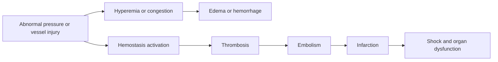
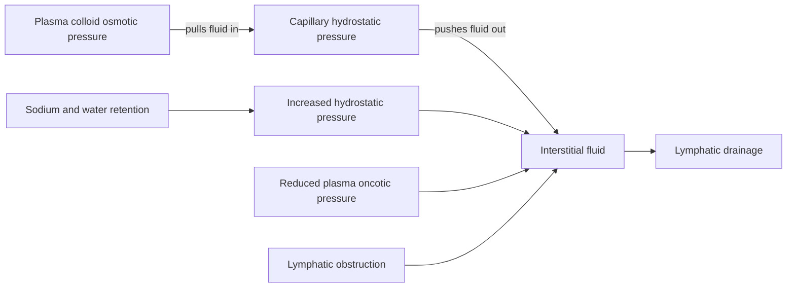

<!-- markdownlint-disable MD052 MD060 -->

# 04 - Hemodynamic Disorders, Thromboembolism, and Shock - Study Notes

## Description

Third-party generated study notes for Chapter 4, "Hemodynamic Disorders, Thromboembolism, and Shock." These notes are designed as revision aids and website-ready study content derived primarily from the local Chapter 4 textbook PDF, with trusted college material used for exam framing and topic emphasis.

## Source Notes

- Primary textbook chapter source: `Robbins Basic Pathology`, 10th Edition, Chapter 4, "Hemodynamic Disorders, Thromboembolism, and Shock."
- Course-alignment source: `RCPA - Basic Pathological Sciences Syllabus 2026 - October 2025.`
- Style-alignment source: `BPS 2026 Mock Exam Question Set.`
- The syllabus reference for Section 4 cites: `Robbins and Cotran Pathologic Basis of Disease`, edited by Vinay Kumar, Abul K. Abbas, and Jon C. Aster, 10th Edition, 2020, Elsevier.

## Page Reference Convention

Inline citations in this document use the format `[n]`, where `n` is the printed book page number as it appears in the physical Robbins Basic Pathology 10th Edition textbook, not the sequential page position within the chapter PDF file. Chapter 4 occupies book pages 97-119; citations were checked against the chapter PDF headers and footers.

## Disclaimer

These notes are third-party generated study materials. They are not produced by, reviewed by, approved by, endorsed by, or affiliated with the textbook authors, Elsevier, the Royal College of Pathologists of Australasia, or any other authority, institution, publisher, or examining body.

## Exam Alignment

The college syllabus frames this chapter around seven high-yield exam areas:

1. Edema and effusions
2. Hyperemia and congestion
3. Bleeding, clotting, and thrombosis
4. Embolism
5. Infarction
6. Shock
7. Laboratory tests used in thromboembolic disease and shock

That sequence is a good way to revise short-answer questions and to predict the most common MCQ stems.

## Big Picture

Hemodynamic pathology is about what happens when blood volume, vascular integrity, coagulation, or perfusion control shifts out of balance. The chapter links pressure-driven fluid movement, clot formation, embolic travel, ischemic tissue death, and whole-body circulatory collapse into one causal chain. [97][98][101][112][115]

## 1. Hyperemia, Congestion, Edema, and Effusions

Hyperemia and congestion both mean increased blood volume in a tissue, but hyperemia is an active increase in inflow caused by arteriolar dilation, whereas congestion is a passive increase caused by impaired venous outflow. Hyperemic tissue is red because it is filled with oxygenated blood; congested tissue is blue-red because deoxygenated hemoglobin accumulates. [97]

### Hyperemia vs congestion

| Feature | Hyperemia | Congestion |
|---|---|---|
| Core mechanism | Increased arteriolar inflow | Impaired venous outflow |
| Typical setting | Inflammation, exercising muscle | Heart failure, local venous obstruction |
| Color | Redder than normal | Blue-red or cyanotic |
| Long-term effect | Usually adaptive or reactive | Hypoxia, edema, hemorrhage, fibrosis |

This distinction is one of the most testable opening contrasts in the chapter. [97]

### Morphologic patterns of congestion

Acute pulmonary congestion produces engorged alveolar capillaries, septal edema, and intra-alveolar hemorrhage. Chronic pulmonary congestion thickens and fibroses septa and fills alveoli with hemosiderin-laden macrophages, the classic heart failure cells. [97]

Acute hepatic congestion distends central veins and sinusoids and may produce centrilobular hepatocyte necrosis. Chronic passive congestion creates the gross nutmeg liver pattern, with depressed red-brown centrilobular zones standing out against paler surrounding parenchyma. [98]

### What edema means

Edema is excess fluid in interstitial tissue spaces, while fluid in body cavities is described as an effusion. Important named examples are hydrothorax, hydropericardium, ascites, and generalized severe edema called anasarca. [98]

The normal balance of fluid movement across capillary beds is set mainly by vascular hydrostatic pressure pushing fluid out and plasma colloid osmotic pressure drawing fluid back in, with lymphatics removing the small net excess. Edema develops when that balance shifts enough that lymphatic return can no longer compensate. [98]

### Major causes of edema

| Mechanism | Typical examples | High-yield logic |
|---|---|---|
| Increased hydrostatic pressure | Congestive heart failure, constrictive pericarditis, venous thrombosis, external compression | More fluid is pushed into interstitium |
| Reduced plasma osmotic pressure | Nephrotic syndrome, cirrhosis, protein malnutrition, protein-losing enteropathy | Less fluid is pulled back into vessels |
| Lymphatic obstruction | Inflammation, neoplasia, postsurgical or postirradiation damage | Excess interstitial fluid cannot be cleared |
| Sodium and water retention | Renal hypoperfusion, renal failure, RAAS activation | Expands intravascular volume and worsens edema |
| Increased vascular permeability | Acute and chronic inflammation | Produces protein-rich exudate |

The textbook table and surrounding discussion make this mechanisms-first framework explicit. [98][99][100]

### Transudate vs exudate

Edema due to increased hydrostatic pressure or reduced plasma oncotic pressure typically produces a protein-poor transudate. Inflammatory edema is a protein-rich exudate because vascular permeability rises. [99]

| Fluid type | Protein content | Usual mechanism |
|---|---|---|
| Transudate | Low | Hydrostatic or oncotic imbalance |
| Exudate | High | Increased vascular permeability from inflammation |

### Increased hydrostatic pressure

The most important systemic cause is congestive heart failure. Reduced cardiac output increases venous pressure and decreases renal perfusion, which activates the renin-angiotensin-aldosterone system, causing further sodium and water retention. If the failing heart cannot respond with higher output, a vicious cycle of fluid retention and worsening edema develops. [99]

Local venous obstruction also causes edema distal to the blockage, with deep venous thrombosis as the classic example. [99]

### Reduced plasma osmotic pressure

Loss or underproduction of albumin lowers plasma colloid osmotic pressure and allows fluid to leave the circulation. Nephrotic syndrome is the classic cause of albumin loss; cirrhosis and protein malnutrition are classic causes of reduced synthesis. [99]

This process also feeds renal hypoperfusion and secondary hyperaldosteronism, so the kidney retains salt and water but does not correct the primary low-protein problem. [99]

### Lymphatic obstruction

Lymphedema develops when interstitial fluid cannot be removed efficiently. Causes include inflammatory fibrosis, tumor obstruction, and treatment-related damage such as axillary node dissection or irradiation after breast cancer. [99][100]

Classic examples that exam writers like are elephantiasis from filariasis and peau d'orange of the breast caused by lymphatic obstruction from tumor infiltration. [99][100]

### Sodium and water retention

Renal failure and glomerular disease can cause enough salt and water retention to increase hydrostatic pressure and worsen edema. This mechanism often works together with other causes rather than acting alone. [100]

### Clinical patterns of edema

Dependent edema appears most in the legs when standing and over the sacrum when recumbent. Pitting edema reflects displacement of interstitial fluid by finger pressure. Periorbital edema is particularly characteristic of renal dysfunction or nephrotic syndrome because loose connective tissue swells early. [100]

Pulmonary edema makes lungs heavy and frothy and can become fatal by impairing oxygen diffusion and favoring infection. Brain edema is especially dangerous because it raises intracranial pressure and can precipitate herniation through the foramen magnum. [100]

## 2. Hemorrhage, Hemostasis, and Coagulation

Hemorrhage is blood extravasation from vessels, most often due to vessel wall damage or defective clot formation. Its consequences depend on the volume lost, the rate of bleeding, and the site involved. A hemorrhage trivial in the skin can be fatal in the brain. [100][101]

### High-yield bleeding terms

| Term | Size / pattern | Core association |
|---|---|---|
| Hematoma | Localized collection of blood in tissue | Can be trivial or fatal depending on site |
| Petechiae | 1-2 mm hemorrhages | Thrombocytopenia, platelet dysfunction, vascular fragility |
| Purpura | 3-5 mm hemorrhages | Petechial causes plus trauma or vasculitis |
| Ecchymosis | 1-2 cm bruise | Subcutaneous blood breakdown with color change |
| Hemothorax / hemopericardium / hemoperitoneum / hemarthrosis | Large bleeding into cavities | Site-specific terminology |

These definitions are classic exam material and are presented directly in the hemorrhage section. [100][101]

Chronic external blood loss can produce iron deficiency anemia because iron leaves the body with hemoglobin, whereas iron from internal hemorrhage is usually recycled after red-cell phagocytosis. [101]

### Normal hemostasis sequence

Normal hemostasis is a tightly regulated local response to vascular injury. It begins with transient vasoconstriction, then rapidly moves through platelet plug formation, fibrin deposition, clot stabilization, and later fibrinolysis and repair. [101][102]

```mermaid
flowchart LR
    A[Vascular injury] --> B[Transient vasoconstriction]
    B --> C[Platelet adhesion to vWF and collagen]
    C --> D[Platelet activation and granule release]
    D --> E[Platelet aggregation via GpIIb/IIIa and fibrinogen]
    E --> F[Coagulation cascade and thrombin generation]
    F --> G[Fibrin deposition]
    G --> H[Stable hemostatic plug]
    H --> I[Fibrinolysis and repair]
```

### Platelet adhesion, activation, and aggregation

Platelets form the primary hemostatic plug and also provide the phospholipid surface needed to assemble coagulation factor complexes. Their key early interaction is adhesion to exposed subendothelial collagen through von Willebrand factor bridging to platelet glycoprotein Ib. [102][103]

Activation changes the platelet from a smooth disk into a spiky cell with increased surface area and exposes negatively charged phospholipids, especially phosphatidylserine, that help localize coagulation complexes. Dense granules release ADP and calcium, while alpha granules contain fibrinogen, factor V, vWF, P-selectin, and several wound-healing mediators. [102][103]

Platelet aggregation then occurs through activated glycoprotein IIb/IIIa receptors binding fibrinogen bridges between adjacent platelets. Thromboxane A2 and ADP amplify recruitment, while thrombin stabilizes and strengthens the plug. Aspirin impairs this step by blocking platelet cyclooxygenase and thromboxane A2 synthesis. [103]

### Platelet disorders worth memorizing

| Defect | Main molecule | High-yield consequence |
|---|---|---|
| von Willebrand disease | vWF deficiency or dysfunction | Impaired platelet adhesion |
| Bernard-Soulier syndrome | GpIb deficiency | Impaired vWF-mediated platelet adhesion |
| Glanzmann thrombasthenia | GpIIb/IIIa deficiency | Impaired platelet aggregation |

These classic disorders are useful because they map directly onto the receptor-ligand pairs in Fig. 4.6. [103]

### Coagulation cascade: what matters clinically

The coagulation cascade is an amplifying enzyme system that culminates in generation of thrombin and deposition of insoluble fibrin. In vivo, tissue factor exposed at the injury site is the dominant initiator of clotting. [104][105]

Thrombin is the central enzyme of coagulation because it converts fibrinogen to fibrin, activates factors V, VIII, XI, and XIII, activates platelets through protease-activated receptors, and links clotting to inflammation and repair. [105]

The clotting pathways as tested in the lab are still clinically important:

| Test | Pathway screened | Main factors emphasized |
|---|---|---|
| PT | Extrinsic and common pathway | VII, X, V, II, fibrinogen |
| PTT | Intrinsic and common pathway | XII, XI, IX, VIII, X, V, II, fibrinogen |

Those assays are useful screens, but the textbook is explicit that they do not fully reproduce in-vivo coagulation biology. [104][105]

### Fibrinolysis and D-dimer

Clotting automatically triggers counter-regulation through fibrinolysis. Tissue plasminogen activator converts plasminogen to plasmin, which degrades fibrin and limits clot size. Fibrin degradation products, especially D-dimers, are clinically useful markers of thrombotic states. [105][106]

### Endothelium as the referee of hemostasis

Normal endothelium is strongly antithrombotic. It blocks platelet access to subendothelial collagen and vWF, releases prostacyclin, nitric oxide, and ADPase to inhibit platelet activation, and expresses thrombomodulin, endothelial protein C receptor, heparin-like molecules, and tissue factor pathway inhibitor to restrain coagulation. [102][106][107]

Activated or injured endothelium shifts toward thrombosis by reducing these anticoagulant programs and increasing procoagulant and antifibrinolytic activity. That transition is a central bridge from normal hemostasis to pathologic thrombosis. [107][108]

## 3. Thrombosis and Hypercoagulability

Thrombosis is the pathologic intravascular formation of a clot in intact, nontraumatized vessels. The three major predisposing forces are endothelial injury, abnormal blood flow, and hypercoagulability, the classic Virchow triad. [106][107]

### Virchow triad

| Component | Why it matters | Common examples |
|---|---|---|
| Endothelial injury or dysfunction | Exposes procoagulant substrates and shifts endothelium toward clotting | Atherosclerosis, inflammation, smoking-related injury |
| Abnormal blood flow | Promotes stasis, endothelial activation, and poor factor washout | Aneurysm, atrial fibrillation, myocardial infarction, venous immobility |
| Hypercoagulability | Raises clotting tendency through inherited or acquired factor changes | Factor V Leiden, pregnancy, malignancy, HIT |

### Endothelial injury and activation

Endothelial injury is especially important in arterial and cardiac thrombosis because high-flow systems require platelet activation to get clotting started. Severe injury exposes vWF and tissue factor directly, but even endothelial activation without denudation can shift gene expression toward thrombosis. [107][108]

Important prothrombotic endothelial changes include reduced thrombomodulin, protein C pathway activity, and tissue factor pathway inhibitor, plus increased plasminogen activator inhibitor expression and reduced fibrinolysis. [108]

### Abnormal blood flow

Turbulence contributes to arterial and cardiac thrombosis by injuring or activating endothelium and creating local pockets of stasis. Stasis is the dominant driver of venous thrombosis because it lets platelets and leukocytes contact the endothelium, slows washout of activated factors, and limits delivery of natural anticoagulants. [108]

Classic exam settings include ulcerated atherosclerotic plaques, aneurysms, post-infarct ventricular akinesia, atrial dilation with atrial fibrillation, hyperviscosity states, and sickle cell disease. [108]

### Hypercoagulability

Hypercoagulability is an abnormally high tendency of blood to clot. It is more strongly linked to venous thrombosis than to arterial thrombosis and may be inherited or acquired. [108]

| Type | High-yield example | Exam point |
|---|---|---|
| Inherited | Factor V Leiden | Resistance to protein C and increased venous thrombosis risk |
| Inherited | Prothrombin G20210A variant | Increased prothrombin transcription and venous thrombosis risk |
| Inherited | Antithrombin III, protein C, or protein S deficiency | Recurrent venous thrombosis in younger patients |
| Acquired | Bed rest, surgery, trauma, cancer | Common real-world DVT settings |
| Acquired | Pregnancy or oral contraceptive use | Estrogen-associated thrombophilia |
| Acquired | HIT | Thrombosis despite thrombocytopenia |
| Acquired | Antiphospholipid antibody syndrome | Recurrent thrombosis and pregnancy loss |

Factor V Leiden is common enough that heterozygotes are clinically important, especially when a second acquired risk factor such as immobility, pregnancy, or long travel is added. [108][109]

Antiphospholipid antibody syndrome is especially high yield because it combines recurrent thromboses, repeated miscarriages, thrombocytopenia, and occasionally false-positive serologic tests for syphilis. [109]

### Thrombus morphology

Thrombi are attached to the vessel wall and typically propagate toward the heart. Arterial thrombi extend retrograde from the point of attachment, whereas venous thrombi propagate in the direction of blood flow. The loosely attached propagating tail is why embolization is such a major risk. [110]

Lines of Zahn are alternating pale platelet-fibrin layers and darker red-cell-rich layers. They indicate clot formation in flowing blood and help distinguish antemortem thrombosis from postmortem clots. [110]

| Thrombus type | Typical setting | Main composition / feature |
|---|---|---|
| Arterial | Endothelial injury, atherosclerosis | Platelet-rich, often occlusive |
| Cardiac mural | Myocardial infarction, dilated cardiomyopathy, myocarditis | Attached to heart wall, embolic risk |
| Venous | Stasis, hypercoagulability | Red cell-rich, almost always occlusive |
| Valvular vegetation | Infective endocarditis or sterile hypercoagulable states | Thrombus on valve surface |

### Fate of a thrombus

Once formed, a thrombus can propagate, embolize, dissolve, or organize and recanalize. Fresh thrombi are most susceptible to fibrinolysis; older thrombi become increasingly resistant because fibrin polymerization stabilizes them. [110][111]

### Clinical significance of thrombosis

Superficial venous thrombi are usually painful but rarely embolize. Deep venous thromboses at or above the knee are far more dangerous because they may be clinically silent and later present as pulmonary emboli. [111]

Arterial and cardiac mural thrombi matter most because they can obstruct critical vessels locally or embolize to organs such as the brain, kidneys, and spleen. [111]

### Disseminated intravascular coagulation

DIC is widespread thrombosis within the microcirculation that may develop suddenly or insidiously. Because it consumes platelets and coagulation proteins while simultaneously activating fibrinolysis, it creates the paradox of excessive clotting and bleeding in the same patient. [111]

## 4. Embolism and Infarction

An embolus is a detached intravascular solid, liquid, or gaseous mass carried by blood to a distant site, where it commonly causes vascular occlusion and tissue dysfunction or infarction. Most emboli are thromboemboli, but fat, amniotic fluid, air, tumor fragments, atherosclerotic debris, and bone marrow can also embolize. [112]

### Pulmonary thromboembolism

Pulmonary emboli arise from deep venous thromboses in more than 95% of cases, usually from leg veins proximal to the popliteal fossa. They are the most common form of thromboembolic disease. [112]

Clinical outcomes depend on size:

| Embolus size / pattern | Typical consequence |
|---|---|
| Small, often multiple | Frequently silent, later organized into vessel wall |
| Large saddle embolus or major pulmonary artery embolus | Sudden death or acute right-heart strain |
| Medium-sized branch embolus | Pulmonary hemorrhage; infarction if bronchial flow is compromised |
| Recurrent emboli over time | Pulmonary hypertension and cor pulmonale |

The chapter explicitly notes that 60% to 80% of pulmonary emboli are small and clinically silent. [112]

### Systemic thromboembolism

Most systemic emboli come from intracardiac mural thrombi, especially after left ventricular infarction or from dilated left atria. In contrast with venous emboli, systemic arterial emboli can lodge almost anywhere, with lower extremities and brain as major destinations. [112]

### Fat embolism

Fat embolism follows long-bone fracture or major soft tissue crush injury, but only a minority of patients develop the symptomatic fat embolism syndrome. The syndrome classically appears 1 to 3 days after injury with pulmonary insufficiency, neurologic symptoms, anemia, thrombocytopenia, and a diffuse petechial rash. [112][113]

Its pathogenesis combines mechanical vascular obstruction by fat globules with biochemical endothelial injury from fatty acids and secondary platelet and leukocyte activation. [113]

### Amniotic fluid embolism

Amniotic fluid embolism is a rare but catastrophic peripartum emergency. Presentation is abrupt with severe dyspnea, cyanosis, hypotensive shock, seizures, and coma; pulmonary edema and DIC commonly follow. [113]

The pathogenesis is now understood less as simple mechanical obstruction and more as biochemical activation of coagulation and innate immunity after amniotic contents enter the maternal circulation. [113]

### Air embolism and decompression sickness

Gas emboli can obstruct blood flow directly. Sudden decompression allows dissolved nitrogen to bubble out of blood and tissues, causing decompression sickness. Painful gas emboli in muscles and joints produce the bends, pulmonary vascular obstruction produces the chokes, and recurrent embolization in bone causes caisson disease with ischemic necrosis. [113][114]

### Infarction

An infarct is an area of ischemic necrosis caused by occlusion of the vascular supply to a tissue. Most infarcts result from arterial thrombosis or embolism, though some follow venous occlusion, torsion, extrinsic compression, or traumatic vascular rupture. [114]

| Infarct type | Usual setting | Key examples |
|---|---|---|
| Red (hemorrhagic) | Venous occlusion, loose tissues, dual circulation, reperfusion | Lung, intestine, ovarian torsion |
| White (anemic) | Arterial occlusion in solid end-arterial organs | Heart, spleen, kidney |

Most infarcts are wedge-shaped. In most tissues they show ischemic coagulative necrosis followed by inflammation and then scar formation; the brain is the major exception because it undergoes liquefactive necrosis. [114][115]

### What determines whether infarction occurs

Three variables matter most: the anatomy of the blood supply, the rate at which occlusion develops, and the vulnerability of the tissue to hypoxia. Tissues with dual supply or time to develop collateral flow are relatively protected; neurons die within minutes, whereas fibroblasts can survive much longer. [115]

## 5. Shock

Shock is systemic tissue hypoperfusion caused by reduced cardiac output or reduced effective circulating blood volume. The immediate consequence is cellular hypoxia; prolonged shock progresses to organ dysfunction and death. [115]

### Major shock categories

| Type | Typical example | Core mechanism |
|---|---|---|
| Cardiogenic | Myocardial infarction, arrhythmia, tamponade, massive PE | Pump failure or outflow obstruction |
| Hypovolemic | Hemorrhage, severe burns, fluid loss | Reduced blood or plasma volume |
| Septic | Severe bacterial or fungal infection | Vasodilation, vascular leak, endothelial injury, cytokine storm, DIC |

The chapter also mentions less common neurogenic shock and anaphylactic shock as additional mechanisms of vascular tone loss. [116]

### Septic shock pathogenesis

Septic shock is driven by the host response to infection rather than by one single toxin. Microbial products activate innate immune pathways, especially through receptors that recognize pathogen-associated molecular patterns, which then trigger TNF, IL-1, HMGB1, complement activation, reactive oxygen species, prostaglandins, platelet-activating factor, and many other mediators. [116][117]

Three linked mechanisms dominate the clinical picture:

1. Inflammatory and counterinflammatory signaling, with patients sometimes swinging from hyperinflammation into immune suppression. [116][117]
2. Endothelial activation and injury, which causes vascular leakage, edema, nitric-oxide-mediated vasodilation, and hypotension. [117]
3. A procoagulant, antifibrinolytic state that can culminate in DIC and further tissue ischemia. [117]

Metabolic dysfunction is also central. Septic patients develop insulin resistance, hyperglycemia, impaired tissue oxygen use, increased lactate production, and lactic acidosis. These changes contribute directly to organ failure. [118]

Superantigen-mediated syndromes such as toxic shock syndrome create a related clinical picture by inducing massive cytokine release through polyclonal T-cell activation. [118]

### Stages of shock

Unless the insult is immediately lethal, shock tends to progress through three phases. [118][119]

| Stage | Main features |
|---|---|
| Nonprogressive | Reflex compensation preserves flow to heart and brain via tachycardia, vasoconstriction, and renal fluid conservation |
| Progressive | Tissue hypoperfusion causes anaerobic glycolysis, lactic acidosis, arteriolar dilation, blood pooling, and worsening organ dysfunction |
| Irreversible | Cellular injury becomes too severe for recovery even if hemodynamics are corrected |

### Morphology and bedside clues

Shock causes a mixture of hypoperfusion injury and microvascular thrombosis. Brain, heart, kidneys, adrenals, and gastrointestinal tract are especially vulnerable; septic or traumatic shock can also produce diffuse alveolar damage, the classic shock lung. [119]

Hypovolemic and cardiogenic shock usually present with hypotension, weak rapid pulse, tachypnea, and cool clammy cyanotic skin. Early septic shock may be different, with warm flushed skin because of peripheral vasodilation. [119]

## 6. High-Yield Laboratory Correlation

The syllabus explicitly expects laboratory thinking in this chapter. The tests below are the ones most worth linking to the mechanisms above.

| Test or marker | What it helps assess | Why it is high yield |
|---|---|---|
| PT | Extrinsic/common pathway function | Screens VII, X, V, II, fibrinogen abnormalities [104] |
| PTT | Intrinsic/common pathway function | Screens XII, XI, IX, VIII, X, V, II, fibrinogen abnormalities [104] |
| D-dimer | Fibrin breakdown after clot formation | Supports the presence of active thrombosis/fibrinolysis [105][106] |
| Activated protein C resistance / Factor V Leiden | Inherited thrombophilia | Common inherited risk for venous thrombosis [108][109] |
| Prothrombin G20210A | Inherited thrombophilia | Raises prothrombin levels and venous thrombosis risk [109] |
| Protein C, protein S, antithrombin III | Natural anticoagulant defects | Important inherited causes of recurrent venous thrombosis [106][109] |
| Antiphospholipid antibodies | Autoimmune thrombophilia | Recurrent thrombosis, pregnancy loss, thrombocytopenia [109] |
| Lactate | Global tissue hypoperfusion | Tracks anaerobic metabolism in shock, especially sepsis [118] |

## 7. Last-Minute Review Sheet

- Hyperemia = active increased inflow; congestion = passive impaired outflow. [97]
- Edema is about hydrostatic pressure, oncotic pressure, permeability, and lymphatic drainage. [98][99][100]
- Primary hemostasis is platelet based; secondary hemostasis is fibrin based. [101][102][103][104]
- Tissue factor is the major initiator of coagulation in vivo, and thrombin is the key effector enzyme. [104][105]
- Virchow triad explains most thrombosis questions: endothelial injury, abnormal flow, hypercoagulability. [106][107]
- DVT matters because it embolizes; arterial thrombosis matters because it obstructs and infarcts. [111][112]
- Red infarcts occur in loose tissues, dual circulation, venous occlusion, or reperfusion; white infarcts occur in solid end-arterial organs. [114][115]
- Septic shock is not just infection plus hypotension; it is a cytokine-driven endothelial, metabolic, and coagulopathic syndrome. [116][117][118]
