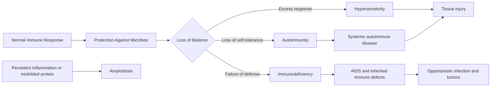
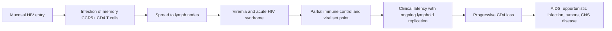

<!-- markdownlint-disable MD013 MD024 MD033 MD041 MD052 MD060 -->

# 05 - Diseases of the Immune System - Study Notes

## Description

Third-party generated study notes for Chapter 5, "Diseases of the Immune System." These notes are designed as revision aids and website-ready study content derived primarily from the local Chapter 5 textbook PDF, with trusted college material used for syllabus alignment and exam framing.

## Source Notes

- Primary textbook chapter source: `Robbins Basic Pathology`, 10th Edition, Chapter 5, "Diseases of the Immune System."
- Course-alignment source: `RCPA - Basic Pathological Sciences Syllabus 2026 - October 2025.`
- The syllabus reference for Section 6 cites: `Robbins and Cotran Pathologic Basis of Disease`, edited by Vinay Kumar, Abul K. Abbas, and Jon C. Aster, 10th Edition, 2020, Elsevier.

## Page Reference Convention

Inline citations in this document use the format `[n]`, where `n` is the printed book page number as it appears in the physical Robbins Basic Pathology 10th Edition textbook, not the sequential page position within the chapter PDF. Chapter 5 occupies book pages 121-188; citations were checked against the approved Chapter 5 source PDF extraction.

## Disclaimer

These notes are third-party generated study materials. They are not produced by, reviewed by, approved by, endorsed by, or affiliated with the textbook authors, Elsevier, the Royal College of Pathologists of Australasia, or any other authority, institution, publisher, or examining body.

## Exam Alignment

The college syllabus breaks this chapter into thirteen revision buckets:

1. Innate immunity
2. Adaptive immunity
3. Major histocompatibility complex molecules
4. Cytokines
5. Cell-mediated immunity
6. Humoral immunity
7. Hypersensitivity reactions
8. Tolerance
9. Autoimmune disease
10. Transplant rejection
11. Immunodeficiency diseases
12. Amyloidosis
13. Laboratory considerations

Use those buckets to structure MCQ practice, short-answer recall, and disease-mechanism comparisons. The textbook supplies almost all of the conceptual detail; the syllabus mainly sharpens the exam emphasis. [121][130][145][162][168][182]

## Big Picture

Chapter 5 is about balance. A competent immune system must recognize microbes quickly, expand highly specific adaptive responses, stop when the threat is gone, avoid attacking self, and avoid collapsing into immunodeficiency. When any part of that balance fails, the result is hypersensitivity, autoimmunity, transplant rejection, immunodeficiency, HIV/AIDS, or amyloid deposition linked to chronic immune activation. [121][134][145][168][182]

## 1. Normal Immune Response

Innate immunity is the immediate first line of defense. Its core components are epithelial barriers, phagocytes, dendritic cells, natural killer cells, and plasma proteins such as complement. Adaptive immunity is slower to start but more powerful and specific; it is mediated by B lymphocytes that produce antibodies and T lymphocytes that activate phagocytes, help B cells, or kill infected cells. [121][122][124]

### Innate immune sensing

Pattern-recognition receptors detect pathogen-associated molecular patterns and damage-associated molecular patterns in the extracellular space, endosomes, and cytosol. The result is inflammation, antiviral defense, and the signals needed to launch adaptive immunity. [122][123]

| Receptor family | Main ligands or danger signals | Main consequence |
|---|---|---|
| Toll-like receptors | Bacterial products; viral and bacterial nucleic acids | Inflammatory mediators, interferons, and proteins that promote lymphocyte activation |
| NOD-like receptors / inflammasome | Necrotic-cell products, ATP, potassium efflux, crystals, some microbes | Caspase-1 activation and IL-1 production |
| C-type lectin receptors | Fungal glycans | Inflammatory responses to fungi |
| RIG-like receptors and cytosolic DNA sensors | Viral RNA and microbial DNA in the cytoplasm | Type I interferon-driven antiviral defense |
| Formyl peptide and mannose receptors | Bacterial peptides and microbial sugars | Chemotaxis and phagocytosis |

This table summarizes the main innate receptor families emphasized in the chapter. [122][123]

### Lymphocytes and their jobs

T cells recognize peptide fragments displayed by MHC molecules. CD4+ helper T cells coordinate immune responses through cytokines and CD40L, whereas CD8+ cytotoxic T cells kill infected or neoplastic cells. B cells recognize many kinds of antigens directly through surface immunoglobulin and, after activation, differentiate into plasma cells that secrete antibodies. NK cells are innate lymphocytes that kill stressed or infected cells when inhibitory signals from normal class I MHC expression are lost. [124][125][128]

| Cell type | What it recognizes | Main function |
|---|---|---|
| CD4+ T cell | Peptide on class II MHC | Helper functions through cytokines and CD40L |
| CD8+ T cell | Peptide on class I MHC | Cytotoxic killing of infected or tumor cells |
| B cell | Native protein, lipid, polysaccharide, nucleic acid, small chemicals | Antibody production after differentiation into plasma cells |
| NK cell | Relative loss of class I MHC and presence of stress ligands | Killing of infected or stressed cells; IFN-gamma production |

This summary condenses the key functional distinctions among the major lymphocyte populations. [124][125][128]

### MHC, antigen presentation, and cytokines

Class I MHC molecules are expressed on all nucleated cells and present peptides derived from cytosolic proteins to CD8+ T cells. Class II MHC molecules are restricted mainly to antigen-presenting cells such as dendritic cells, macrophages, and B cells, and they present peptides derived from extracellular proteins to CD4+ T cells. HLA polymorphism explains both diverse pathogen recognition and the major immunologic barrier to transplantation. [126]

Cytokines are the messenger molecules of the immune system. Innate immune cytokines such as TNF, IL-1, IL-12, type I interferons, and chemokines drive early inflammation and antiviral defense. Adaptive immune cytokines are produced mainly by CD4+ T cells and direct lymphocyte proliferation, macrophage activation, antibody class switching, leukocyte recruitment, and regulation of the immune response. [130]

### How adaptive responses are built

Dendritic cells capture antigens in tissues and carry them to lymph nodes, where naive T cells recognize peptide-MHC complexes. B cells bind soluble or cell-associated antigens in follicles. T-cell activation requires antigen recognition plus costimulation, especially B7 on APCs engaging CD28 on T cells; without this second signal, tolerance rather than immunity may result. [130][131]

Activated CD4+ helper T cells differentiate into functional subsets. TH1 cells activate macrophages against intracellular microbes, TH2 cells drive IgE, eosinophils, and anti-helminth responses, and TH17 cells recruit neutrophils and monocytes against extracellular bacteria and fungi. Activated B cells undergo class switching, affinity maturation, and memory formation, especially within germinal centers under the influence of follicular helper T cells. [132][133]

| Helper T subset | Signature cytokines | Main target or effect | High-yield disease link |
|---|---|---|---|
| TH1 | IFN-gamma | Classical macrophage activation | Chronic inflammation, granulomas |
| TH2 | IL-4, IL-5, IL-13 | IgE production, eosinophils, mucus, alternative macrophage activation | Allergy, helminth defense |
| TH17 | IL-17, IL-22 | Neutrophil and monocyte recruitment | Autoimmunity and neutrophilic inflammation |

This table summarizes the helper T-cell subsets most often tested in immune-pathology questions. [132]

## 2. Hypersensitivity: When Protective Immunity Becomes Pathology

Hypersensitivity disorders are tissue injuries caused by normal immune effector mechanisms that are directed inappropriately, excessively, or persistently. The trigger may be a self antigen, a microbial antigen that is hard to clear, or an otherwise harmless environmental allergen. [134][135]

| Type | Dominant mechanism | Hallmark lesion or effect | Prototype examples |
|---|---|---|---|
| I | TH2, IgE, mast cells | Vasodilation, edema, bronchospasm, mucus, eosinophil-rich late phase | Anaphylaxis, allergic rhinitis, atopic asthma |
| II | IgG or IgM against fixed cell or matrix antigens | Opsonization, complement-mediated inflammation, or receptor dysfunction | Autoimmune hemolytic anemia, Goodpasture syndrome, Graves disease |
| III | Circulating immune complexes | Vasculitis, glomerulonephritis, arthritis | Serum sickness, SLE, some glomerulonephritides |
| IV | T-cell mediated inflammation or cytotoxicity | Delayed-type hypersensitivity, granulomas, target-cell killing | Contact dermatitis, tuberculosis, type 1 diabetes |

This classification table follows the mechanism-based framework used throughout the chapter. [135][142]

### Type I hypersensitivity

Immediate hypersensitivity begins when an allergen drives TH2 differentiation and IgE class switching. IgE coats mast cells via high-affinity Fc epsilon RI receptors. Re-exposure cross-links mast-cell-bound IgE and triggers release of preformed mediators such as histamine, newly synthesized lipid mediators such as prostaglandin D2 and leukotrienes C4 and D4, and cytokines that recruit eosinophils and other leukocytes. [136][137]

The immediate phase appears within minutes and is dominated by vasodilation, vascular leakage, smooth muscle spasm, and mucus secretion. The late phase begins hours later and is dominated by inflammation and tissue injury, particularly eosinophil-mediated epithelial damage. Clinically this pattern explains anaphylaxis, bronchial asthma, allergic rhinitis, sinusitis, food allergy, and atopic dermatitis. [138][139]

### Type II hypersensitivity

Antibody-mediated disease works through three broad mechanisms. Antibodies may opsonize cells for phagocytosis, trigger complement- and Fc receptor-mediated inflammation in tissues, or alter receptor function without directly destroying cells. Goodpasture syndrome is the classic inflammatory pattern, whereas myasthenia gravis and Graves disease are the classic receptor-dysfunction patterns. [139][140]

### Type III hypersensitivity

Immune complex disease is driven by formation of antigen-antibody complexes in the circulation, deposition of those complexes in tissues such as kidney, joints, and small vessels, and complement-mediated recruitment of neutrophils and monocytes that cause tissue injury. The classic systemic model is serum sickness, while the local model is the Arthus reaction. [141][142]

### Type IV hypersensitivity

Type IV reactions are T-cell mediated. CD4+ T cells produce cytokines that activate macrophages and recruit leukocytes, while CD8+ T cells can directly kill antigen-bearing cells. The classic delayed-type hypersensitivity reaction is the PPD skin test, which peaks at 24 to 72 hours and shows perivascular mononuclear cuffing. Persistent TH1-driven stimulation converts macrophages into epithelioid cells and giant cells, producing granulomatous inflammation. [142][143][144]

Contact dermatitis is another major type IV pattern. Small chemicals such as urushiol from poison ivy bind to self proteins, creating neoantigens that are recognized by T cells. Drug rashes may arise by the same principle. Many chronic inflammatory autoimmune disorders, including rheumatoid arthritis, multiple sclerosis, psoriasis, and inflammatory bowel disease, have important TH1 and TH17 components. [143][145]

## 3. Immunologic Tolerance and the Origins of Autoimmunity

Self-tolerance is the state in which the immune system does not mount damaging responses against self antigens. Autoimmunity develops when central and peripheral tolerance mechanisms fail in a genetically susceptible host under the pressure of environmental triggers such as infection, tissue injury, or altered antigen display. [145][147]

| Tolerance checkpoint | Main mechanism | High-yield molecules or examples |
|---|---|---|
| Central T-cell tolerance | Deletion of self-reactive T cells in the thymus | AIRE promotes thymic expression of peripheral self antigens |
| Central B-cell tolerance | Deletion or receptor editing in bone marrow | Self-reactive immature B cells can revise their receptors |
| Peripheral anergy | Antigen recognition without adequate costimulation | Low B7 expression on APCs presenting self antigens |
| Regulatory suppression | FOXP3+ CD4+ CD25+ regulatory T cells suppress responses | IL-10, TGF-beta, CTLA-4 |
| Peripheral deletion | Apoptosis of mature self-reactive lymphocytes | Bim and Fas pathways |
| Immune privilege | Physical sequestration of antigens | Eye, testis, brain |

This table highlights the tolerance mechanisms most often used to explain autoimmune disease stems. [145][146][147]

The genetic contribution to autoimmunity is substantial but polygenic. HLA class II alleles are the most consistent associations, and non-HLA genes such as PTPN22, IL23R, CTLA4, and IL2RA affect signaling, T-cell differentiation, or regulatory pathways. Still, genes alone are not enough; most carriers of susceptibility alleles never develop disease. [147][148]

Environmental triggers can break tolerance by inducing costimulators on APCs, by molecular mimicry between microbial and self antigens, by altering tissue antigens after injury, or by broadening an immune response through epitope spreading. The microbiome may also shape the balance between effector and regulatory immunity. [148][149]

## 4. Systemic Autoimmune Disease Patterns

### Systemic lupus erythematosus

SLE is the prototype systemic autoimmune disease. It is characterized by a wide spectrum of autoantibodies, especially antinuclear antibodies, and by tissue injury driven largely by immune-complex deposition and, in some settings, autoantibodies directed against blood cells or phospholipid-protein complexes. [150][153]

| Autoantibody or pattern | Why it matters |
|---|---|
| Generic ANA | Very sensitive for SLE but not specific |
| Anti-double-stranded DNA | Strongly associated with SLE and lupus nephritis |
| Anti-Sm | Highly specific for SLE |
| Anti-Ro / SS-A | Linked to congenital heart block and neonatal lupus |
| Anti-phospholipid antibodies | False-positive syphilis serology, prolonged PTT in vitro, thrombosis and pregnancy loss in vivo |

This table condenses the highest-yield serologic findings in SLE. [150][151]

Pathogenesis reflects a failure of self-tolerance driven by susceptibility genes and environmental triggers. UV radiation increases apoptotic burden, nuclear antigens persist, autoreactive B and T cells escape control, nucleic acids engage TLRs, and plasmacytoid dendritic cells generate type I interferons that further amplify immune activation. Complement deficiencies and altered inhibitory Fc receptor function also increase risk. [152][153]

Lupus nephritis is the most clinically important organ complication. Diffuse proliferative lupus nephritis (class IV) is the most common severe pattern and produces marked glomerular hypercellularity and wire-loop lesions caused by extensive subendothelial immune-complex deposits. Class III is focal proliferative disease, class V is membranous disease with heavy proteinuria, and class VI is advanced sclerosing end-stage disease. [154][155]

High-yield clinical clues include the malar rash, photosensitivity, nonerosive arthritis, serositis, hematologic cytopenias, neuropsychiatric disease, Libman-Sacks endocarditis, and accelerated coronary artery disease. The course is relapsing and remitting, and renal failure plus infection remain major causes of death. [156][157]

### Sjogren syndrome

Sjogren syndrome is characterized by keratoconjunctivitis sicca and xerostomia due to immune-mediated destruction of lacrimal and salivary glands. It may be primary or associated with another autoimmune disease, most often rheumatoid arthritis. The glands show dense lymphocytic infiltration dominated by activated CD4+ T cells with associated B cells and plasma cells. [158][159]

Anti-Ro/SS-A and anti-La/SS-B antibodies are common and useful diagnostically, and patients have an increased risk of B-cell lymphoma arising in salivary glands or other extranodal sites. Extraglandular disease may include synovitis, pulmonary fibrosis, neuropathy, and tubulointerstitial nephritis with tubular dysfunction. [158][159]

### Systemic sclerosis

Systemic sclerosis is defined by excessive fibrosis, obliterative microvascular disease, and autoimmunity. The disease seems to arise from a three-way interaction among immune activation, vascular injury, and fibroblast stimulation by cytokines such as TGF-beta, IL-13, and PDGF. [159][160]

| Pattern | Typical clues | Serology association |
|---|---|---|
| Diffuse systemic sclerosis | Widespread skin thickening with early visceral disease | Anti-topoisomerase I (anti-Scl-70) |
| Limited systemic sclerosis / CREST | Distal skin disease, calcinosis, Raynaud phenomenon, esophageal dysmotility, sclerodactyly, telangiectasia | Anti-centromere |

This comparison captures the major exam distinction within systemic sclerosis. [159][160][161]

Raynaud phenomenon is often the earliest feature. Progressive fibrosis can involve skin, esophagus, small bowel, lungs, kidneys, heart, and joints. Renal crisis with malignant hypertension is particularly dangerous, while pulmonary hypertension and pulmonary fibrosis are major causes of death in modern treated cohorts. [160][161][162]

### Other autoimmune and fibro-inflammatory entities

- Rheumatoid arthritis is an autoimmune arthritis with extraarticular disease, but its full joint pathology is discussed later in the musculoskeletal chapter. [158]
- Mixed connective tissue disease combines features of SLE, systemic sclerosis, and polymyositis and is marked by high titers of anti-U1 ribonucleoprotein antibodies. [162]
- Polyarteritis nodosa and the other vasculitides are vessel-centered inflammatory disorders with strong immune mechanisms. [162]
- IgG4-related disease is a fibro-inflammatory disorder with IgG4-rich plasma cell infiltrates, storiform fibrosis, and obliterative phlebitis, and it can involve many organs including pancreas, salivary glands, bile ducts, orbit, kidney, and thyroid. [162]

## 5. Transplant Rejection

The major antigens responsible for rejection of allografts are donor HLA molecules. Recipient T cells recognize donor alloantigens either directly on graft APCs or indirectly after uptake and presentation by host APCs. The direct pathway is especially important in acute cellular rejection, while the indirect pathway contributes strongly to chronic rejection. [162][163]

| Rejection type | Main mechanism | Typical timing | High-yield kidney findings |
|---|---|---|---|
| Hyperacute | Preformed anti-donor antibody against endothelial antigens | Minutes to hours | Fibrinoid necrosis, thrombosis, ischemic infarction |
| Acute cellular | CD8+ CTL injury plus CD4+ cytokine-mediated inflammation | Days to weeks, or later if immunosuppression is reduced | Tubulitis, interstitial inflammation, endotheliitis |
| Acute antibody-mediated | Newly formed antibody against graft endothelium | Days to weeks | Glomerulitis, peritubular capillaritis, complement deposition |
| Chronic | Persistent T-cell and antibody-driven vascular injury | Months to years | Graft arteriosclerosis, interstitial fibrosis, tubular atrophy |

This rejection table summarizes the mechanisms and pathology that repeatedly appear in transplant questions. [163][164][165]

Hematopoietic stem-cell transplantation introduces a different problem: graft-versus-host disease. In GVHD, donor T cells attack an immunocompromised recipient, with acute disease targeting skin, liver, and gut, and chronic disease mimicking autoimmune disorders such as systemic sclerosis. [166][167]

## 6. Immunodeficiency Syndromes

Primary immunodeficiency disorders impair either innate immunity, adaptive immunity, or both. Clinically, humoral defects classically produce recurrent pyogenic sinopulmonary infections, T-cell defects predispose to viral, fungal, and protozoal infections, and innate defects impair early containment of bacteria and fungi. [168][169]

| Disorder | Core defect | Typical clue |
|---|---|---|
| Severe combined immunodeficiency | Failure of T-cell development with combined cellular and humoral failure | Severe infections early in life; untreated death in infancy |
| X-linked SCID | Common gamma chain mutation affecting cytokine signaling, especially IL-7 | Marked T-cell deficiency with secondary B-cell dysfunction |
| ADA-deficient SCID | Toxic purine metabolite accumulation | Combined immunodeficiency with absent thymic lymphocytes |
| X-linked agammaglobulinemia | BTK mutation blocks B-cell maturation | Recurrent bacterial and enteroviral infections after maternal Ig wanes |
| DiGeorge syndrome | Thymic hypoplasia from pharyngeal pouch developmental defect | Viral/fungal infection with hypocalcemia and congenital anomalies |
| Hyper-IgM syndrome | Defective CD40L, CD40, or AID | High IgM with low IgG/IgA/IgE; pyogenic infection and Pneumocystis risk |
| Common variable immunodeficiency | Heterogeneous failure of plasma-cell differentiation / antibody production | Recurrent sinopulmonary infection, autoimmunity, lymphoma risk |
| Selective IgA deficiency | Failure of IgA production | Mucosal infections, giardiasis, autoimmunity |

This table focuses on the adaptive immune deficiencies most likely to appear in pathology exams. [168][169][170][171]

Other inherited syndromes teach useful pattern recognition. Wiskott-Aldrich syndrome combines thrombocytopenia, eczema, and recurrent infection due to WASP mutations affecting cytoskeletal signaling. Ataxia-telangiectasia combines neurologic disease, telangiectasia, immune deficiency, and tumor susceptibility because ATM mutations impair DNA-damage responses and antigen-receptor recombination. [171]

Innate immune defects are equally important. Leukocyte adhesion deficiencies impair recruitment of neutrophils to sites of infection, chronic granulomatous disease reflects defective oxidative burst due to phagocyte oxidase defects, Chediak-Higashi syndrome reflects abnormal phagolysosome trafficking, and complement deficiencies create characteristic infection patterns. Early classical pathway deficiencies can mimic lupus, C3 deficiency causes severe pyogenic infection and immune-complex disease, terminal complement deficiencies predispose to Neisseria infection, and C1 inhibitor deficiency causes hereditary angioedema. [172]

## 7. Acquired Immunodeficiency Syndrome (AIDS)

HIV is a lentiviral retrovirus whose major targets are the immune system and central nervous system. The virus infects cells by binding gp120 to CD4 and then to chemokine coreceptors, usually CCR5 or CXCR4; gp41 then mediates membrane fusion. After entry, reverse transcription and integration create a provirus that can remain latent or become transcriptionally active when the infected cell is stimulated. [174][175][176]

The key immunologic lesion is depletion and dysfunction of CD4+ T cells. Most loss is caused by the direct cytopathic effect of viral replication, but chronic immune activation, apoptosis of bystander cells, lymphoid tissue destruction, syncytium formation, and persistent latent reservoirs all contribute. Macrophages and dendritic cells also remain infected and help sustain viral persistence. [176][177]

The natural history has three broad phases. First is acute infection of mucosal memory CD4+ T cells, followed by dissemination and a self-limited acute HIV syndrome. Second is a chronic clinically latent phase with ongoing replication in lymphoid tissues and gradual CD4 decline. Third is AIDS, in which immune containment fails, viremia rises, and opportunistic infections, tumors, and neurologic disease emerge. The viral set point after the acute phase predicts the pace of progression. [178][179]

| AIDS complication | High-yield example |
|---|---|
| Opportunistic fungal or protozoal infection | Pneumocystis jiroveci pneumonia, cryptococcal meningitis, toxoplasma encephalitis |
| Viral reactivation disease | CMV retinitis, JC virus progressive multifocal leukoencephalopathy, HSV ulcers |
| Mycobacterial disease | Tuberculosis and disseminated Mycobacterium avium-intracellulare |
| AIDS-defining tumor | Kaposi sarcoma due to KSHV/HHV-8; EBV-associated B-cell lymphoma |
| CNS disease | HIV-associated neurocognitive disorder |

This table captures the major late manifestations linked to advanced CD4 loss. [180][181]

Combination anti-retroviral therapy reduces plasma viral load to very low levels, allows partial immune reconstitution, and has greatly reduced deaths from classic opportunistic infections and Kaposi sarcoma. However, it does not eradicate latent reservoirs, and long-term therapy introduces complications such as metabolic disease, lipoatrophy or lipoaccumulation, and immune reconstitution inflammatory syndrome. [181][182]

## 8. Amyloidosis

Amyloidosis is the extracellular deposition of fibrillar proteins in a beta-pleated sheet configuration, causing pressure atrophy and organ dysfunction. The main unifying principle is abnormal protein folding with aggregation into insoluble fibrils, not inflammation. [182][183]

| Amyloid type | Precursor | Classic setting |
|---|---|---|
| AL | Immunoglobulin light chain | Plasma-cell proliferations and primary amyloidosis |
| AA | Serum amyloid-associated protein | Chronic inflammatory disorders such as rheumatoid arthritis |
| ATTR | Transthyretin | Familial amyloidotic neuropathies and senile systemic amyloidosis |
| A beta | Amyloid precursor protein | Alzheimer disease |
| A2m | Beta-2-microglobulin | Long-term hemodialysis |

This biochemical classification captures the common amyloid proteins emphasized in the chapter. [183][184]

The morphology is classic. Amyloid is extracellular, eosinophilic, and hyaline on routine staining, but Congo red with apple-green birefringence under polarized light is the key diagnostic stain. Electron microscopy shows nonbranching fibrils. Clinically important organs include the kidneys, spleen, liver, heart, tongue, gut, nerves, and endocrine tissues. [183][186]

Renal amyloidosis is the most common and often the most serious pattern, producing proteinuria, nephrotic syndrome, progressive glomerular obliteration, and renal failure. Cardiac amyloidosis produces restrictive physiology, conduction disturbances, and arrhythmias. Gastrointestinal involvement can cause malabsorption, diarrhea, bleeding, and macroglossia if the tongue is involved. [185][187]

## High-Yield Distinctions

- Class I MHC presents cytosolic peptides to CD8+ T cells; class II MHC presents extracellularly derived peptides to CD4+ T cells. [126]
- TH1 drives macrophage activation, TH2 drives allergy and IgE, and TH17 drives neutrophil-rich inflammation. [132]
- Type I hypersensitivity is IgE and mast-cell mediated; type IV is T-cell mediated and delayed. [135][136][142]
- SLE is the immune-complex prototype; systemic sclerosis is the fibrosis-plus-vasculopathy prototype; Sjogren syndrome is the exocrine-gland autoimmune prototype. [150][158][159]
- Hyperacute rejection is preformed antibody; acute rejection is mainly active T-cell and antibody attack; chronic rejection is progressive vascular narrowing and fibrosis. [163][165]
- Humoral immune defects classically cause recurrent bacterial sinopulmonary infection; T-cell defects cause viral, fungal, and protozoal susceptibility. [168][170]
- HIV first devastates mucosal memory CD4+ CCR5+ T cells, then slowly erodes lymphoid immunity until AIDS-defining disease appears. [175][178][179]
- Amyloid is diagnosed by Congo red positivity with apple-green birefringence and classified by the precursor protein, not by where it deposits. [183][186]
