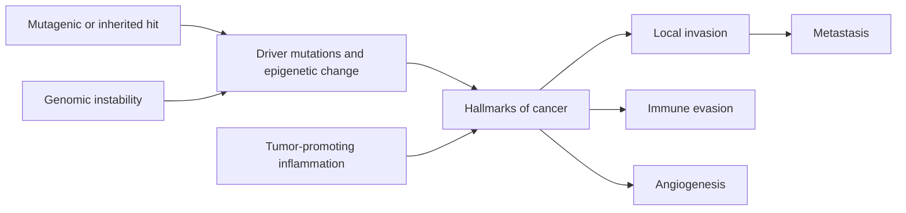

<!-- markdownlint-disable MD052 MD060 -->

# 06 - Neoplasia - Study Notes

## Description

Third-party generated study notes for Chapter 6, "Neoplasia." These notes are designed as revision aids and website-ready study content derived primarily from the local Chapter 6 textbook PDF, with trusted college material used only for exam framing and topic emphasis.

## Source Notes

- Primary textbook chapter source: `Robbins Basic Pathology`, 10th Edition, Chapter 6, "Neoplasia."
- Course-alignment source: `RCPA - Basic Pathological Sciences Syllabus 2026 - October 2025.`
- Style-alignment source: `BPS 2026 Mock Exam Question Set.`
- The syllabus reference for Section 7 cites: `Robbins and Cotran Pathologic Basis of Disease`, edited by Vinay Kumar, Abul K. Abbas, and Jon C. Aster, 10th Edition, 2020, Elsevier.

## Page Reference Convention

Inline citations in this document use the format `[n]`, where `n` is the printed book page number as it appears in the physical Robbins Basic Pathology 10th Edition textbook, not the sequential page position within the chapter PDF. Chapter 6 occupies book pages 189-242; the printed page number is visible in the running header or footer of each page in the chapter PDF. Citations in these notes were checked against the approved Chapter 6 source PDF. [189][190][242]

## Disclaimer

These notes are third-party generated study materials. They are not produced by, reviewed by, approved by, endorsed by, or affiliated with the textbook authors, Elsevier, the Royal College of Pathologists of Australasia, or any other authority, institution, publisher, or examining body.

## Exam Alignment

The college syllabus organizes this chapter into five exam-facing blocks:

1. Nomenclature
2. Epidemiology of cancer
3. Molecular basis of cancer
4. Carcinogenic agents and their cellular interactions
5. Laboratory diagnosis, grading, and staging

Those blocks are used below so the notes map cleanly onto likely short-answer and MCQ themes. [16][17][18]

## Big Picture

Neoplasia is a clonal genetic disease in which accumulated driver mutations and epigenetic changes give cells growth autonomy, resistance to normal restraints, the ability to survive stress, and eventually the capacity to invade, metastasize, and evade host immunity. The chapter moves from naming and morphology, to epidemiology, to the molecular hallmarks of cancer, then to carcinogens and practical diagnosis. [189][200][204][205]

## 1. Nomenclature and Morphologic Behavior

Neoplasia literally means "new growth." Neoplastic cells are transformed cells that keep proliferating with relative autonomy, although they still depend on the host for blood supply, nutrition, and, in some tissues, endocrine support. In everyday clinical usage, neoplasms are often called tumors, and oncology is the study of tumors. [190]

The first practical divide is between benign and malignant tumors. A benign tumor is expected to remain localized and usually can be cured by local excision, whereas a malignant tumor invades and destroys adjacent tissue and may metastasize to distant sites. All tumors have a neoplastic parenchyma that determines biologic behavior and a host-derived stroma that provides support and vascular supply. [190]

### Naming Rules You Need to Know

| Pattern | Meaning | Classic examples |
|---|---|---|
| `-oma` on mesenchymal tissue | Usually benign mesenchymal tumor | Fibroma, lipoma, chondroma |
| Adenoma | Benign epithelial tumor with gland formation or gland origin | Renal tubular adenoma, adrenal adenoma |
| Papilloma | Benign epithelial tumor with finger-like projections | Squamous papilloma |
| Polyp | Gross projection above mucosal surface, not necessarily neoplastic or benign | Colonic polyp, nasal inflammatory polyp |
| Cystadenoma | Benign cystic epithelial tumor | Ovarian cystadenoma |
| Carcinoma | Malignant epithelial tumor | Adenocarcinoma, squamous cell carcinoma |
| Sarcoma | Malignant mesenchymal tumor | Liposarcoma, chondrosarcoma |
| Leukemia / lymphoma | Malignant tumors of hematopoietic and lymphoid cells | Leukemia, lymphoma |

This naming table reflects the chapter's core nomenclature rules and common examples. [190][191][192]

### High-yield Exceptions and Special Terms

- Some malignant tumors keep the `-oma` suffix despite being malignant: lymphoma, mesothelioma, melanoma, and seminoma are the classic traps. [191]
- Hamartoma is a disorganized mass of tissue native to the organ; many are now considered true neoplasms because they show clonal chromosomal abnormalities. [191]
- Choristoma is a heterotopic rest of normal tissue in an abnormal location and is not a true neoplasm. [191]
- Mixed tumors arise from one transformed progenitor capable of divergent differentiation, as in pleomorphic adenoma of the salivary gland. [191]
- Teratomas arise from totipotential germ cells and contain tissues derived from more than one germ layer. [191][192]

### Benign vs Malignant: What Pathologists Actually Use

The most reliable practical discriminators are differentiation or anaplasia, local invasion, and metastasis. Growth rate helps, but it is less reliable because some malignant tumors grow slowly while some benign tumors enlarge quickly. [192]

| Feature | Benign neoplasm | Malignant neoplasm |
|---|---|---|
| Differentiation | Usually well differentiated | Variable; often poorly differentiated or anaplastic |
| Growth | Usually slow | Often faster, sometimes erratic |
| Margins | Usually circumscribed, often encapsulated | Poorly circumscribed and infiltrative |
| Local invasion | Absent | Present |
| Metastasis | Absent | Characteristic of malignancy |

These comparisons summarize the chapter's core morphologic distinctions. [192][193][194][196]

### Differentiation, Anaplasia, Dysplasia, and Carcinoma in Situ

Differentiation refers to how closely the tumor resembles the normal parenchymal cell of origin, morphologically and functionally. Anaplasia means lack of differentiation and is a reliable marker of malignancy. At least some anaplastic cancers appear to arise from transformed stem cells that fail to differentiate properly rather than from mature cells simply running backward. [192][193]

Anaplastic tumors show pleomorphism, hyperchromatic enlarged nuclei, increased nuclear-to-cytoplasmic ratio, giant tumor cells, atypical mitoses, and loss of polarity. Well-differentiated tumors, by contrast, often retain some specialized functions such as hormone production, bile secretion, or keratin formation. [193]

Dysplasia means disordered epithelial growth with cytologic atypia and architectural disarray. When dysplastic change involves the full epithelial thickness without breach of the basement membrane, it is called carcinoma in situ. Once tumor cells cross the basement membrane, the lesion becomes invasive. [194]

## 2. Epidemiology of Cancer

Cancer epidemiology has clarified that common cancers are shaped heavily by environment. Geographic differences, migration studies, and time trends all argue that many cancers are potentially preventable because the major determinants are exposures rather than fixed heredity alone. [196][197]

Worldwide cancer burden is large and rising, and within individual countries the leading tumor types differ by sex and exposure pattern. Declining mortality from some cancers reflects reduced smoking, screening, and improved treatment, not a disappearance of carcinogenic risk. [197][198]

### Dominant Environmental and Host Factors

| Factor | Key high-yield point |
|---|---|
| Smoking | Major cause of lung cancer and also linked to cancers of mouth, pharynx, larynx, esophagus, pancreas, and bladder |
| Alcohol | Raises risk of oropharyngeal, laryngeal, esophageal, and liver cancers; synergizes with smoking |
| Diet and obesity | Many cancers correlate with diet pattern and obesity |
| Reproductive history | Cumulative estrogen exposure raises breast and endometrial cancer risk |
| Infectious agents | Cause a substantial minority of cancers worldwide |

This risk-factor summary is drawn from the chapter's epidemiology overview. [197][198][199]

Cancer frequency rises with age, mainly because somatic mutations accumulate over time and immune competence declines. Most cancer deaths occur between ages 55 and 75, although cancer remains an important cause of childhood death, particularly via leukemias, CNS tumors, lymphomas, and sarcomas. [199][200]

### Acquired Predisposing Conditions and Precursor Lesions

Acquired cancer-predisposing states include chronic inflammation, immunodeficiency, and precursor epithelial lesions. Chronic inflammatory conditions create fertile "soil" for malignant transformation, while immunodeficiency especially predisposes to virus-driven tumors. [200]

Common precursor lesions include bronchial squamous metaplasia and dysplasia in smokers, endometrial hyperplasia and dysplasia with unopposed estrogen, leukoplakia of oral and anogenital squamous epithelium, and villous adenoma of the colon. Progression is not inevitable, but recognizing and removing precursor lesions lowers risk. [199][200]

Environmental and genetic factors also interact. Inherited variation in enzymes such as cytochrome P-450 can alter activation of procarcinogens, and even strong inherited syndromes such as BRCA-associated cancer show risk modification by environment and lifestyle. [200]

## 3. Molecular Basis of Cancer

Cancer is fundamentally a genetic disease caused by nonlethal mutations and epigenetic alterations that affect a finite set of cancer genes. These lesions accumulate in a stepwise fashion, producing clonal expansion, subclonal diversification, and eventually the hallmarks of cancer. An initiated precursor may already have stem cell-like properties before the full malignant phenotype emerges. [189][200][201][204][205]

### Cancer Genes and Genetic Lesions

Cancer genes fall into four broad functional classes: oncogenes, tumor suppressor genes, genes that regulate apoptosis, and genes that regulate interactions between tumor cells and host cells, particularly immune recognition. [200]

Driver mutations give the cell a selective advantage and contribute to malignant behavior; passenger mutations are present but do not materially drive the phenotype. Genetic lesions include point mutations, translocations, inversions, deletions, amplifications, and epigenetic silencing or activation. [201][202][203]

High-yield genomic examples include `BCR-ABL` in chronic myeloid leukemia, `MYC` activation in Burkitt lymphoma, `BCL2` activation in follicular lymphoma, `HER2` amplification in breast cancer, and deletion or silencing of tumor suppressors such as `RB`, `TP53`, and `APC`. [202][203][204][206][207]

### Hallmarks of Cancer

| Hallmark or enabler | Core idea |
|---|---|
| Sustained proliferative signaling | Autonomous growth stimulation |
| Evading growth suppressors | Loss of tumor-suppressor braking systems |
| Altered cellular metabolism | Warburg-type pro-growth metabolism |
| Resisting cell death | Disabling intrinsic apoptosis |
| Enabling replicative immortality | Telomere maintenance |
| Inducing angiogenesis | Vascular supply for growth and spread |
| Activating invasion and metastasis | Tissue destruction, migration, colonization |
| Avoiding immune destruction | Immune escape and checkpoint exploitation |
| Genomic instability | Faster mutation acquisition |
| Tumor-promoting inflammation | Microenvironment that supports malignant traits |

This table follows the chapter's hallmarks framework. [204][205]

### 3.1 Self-sufficiency in Growth Signals: Oncogenes

Oncogenes are mutant or overexpressed proto-oncogenes that encode oncoproteins promoting growth without normal upstream control. Cancer cells achieve this by making their own growth factors, overexpressing or mutating growth-factor receptors, mutating downstream signaling proteins, overactivating transcription factors, or deregulating cyclins and CDKs. [205][206][207][208]

Key examples are autocrine PDGF loops in glioblastoma, `HER2` amplification, activating receptor mutations, `RAS` mutation with impaired GTP hydrolysis, and `BCR-ABL`, a constitutively active tyrosine kinase created by the Philadelphia chromosome. `MYC` translocation or overexpression drives transcription of genes for growth, metabolism, and cell cycling. [206][207][208]

### 3.2 Insensitivity to Growth Inhibitory Signals: Tumor Suppressors

The RB protein governs the G1/S checkpoint. In its active hypophosphorylated form, RB restrains E2F transcription factors and prevents S-phase entry. Loss of both RB alleles removes this brake; the retinoblastoma paradigm established the two-hit hypothesis for tumor suppressor genes. [209][210]

`TP53` encodes p53, the central guardian of the genome. Activated by DNA damage, hypoxia, or oncogenic stress, p53 can induce cell-cycle arrest, DNA repair, senescence, or apoptosis. Loss of p53 function is among the commonest events in human cancer and also underlies Li-Fraumeni syndrome. [211][212]

TGF-beta signaling normally inhibits proliferation by inducing CDK inhibitors and repressing growth-promoting genes such as `MYC` and cyclins. Tumors escape this restraint through receptor mutations, SMAD mutations, or downstream pathway disruption. [213][214]

Contact inhibition is maintained in part by E-cadherin and NF2/merlin. The `APC` tumor suppressor restrains beta-catenin by promoting its degradation; loss of `APC` permits beta-catenin accumulation, nuclear signaling, and activation of proliferative genes. This is central to familial adenomatous polyposis and many sporadic colon cancers. [213][214]

### 3.3 Altered Cellular Metabolism

Cancer cells often display the Warburg effect: high glucose uptake and increased aerobic glycolysis despite adequate oxygen. The point is not efficient ATP generation, but diversion of carbon intermediates into nucleotides, proteins, and lipids needed for rapid growth. PET imaging exploits this glucose avidity clinically. [214][215]

This metabolic rewiring is driven by the same growth-signaling pathways altered by oncogenes and tumor suppressor loss. `RAS`, receptor tyrosine kinases, and `MYC` promote glycolysis and glutamine use, while tumor suppressors such as `PTEN`, `NF1`, and p53 oppose this anabolic state. [215][216][217]

Autophagy can be tumor suppressive by limiting damaged-cell survival, but cancers can also exploit it to survive nutrient stress. Mutant IDH generates the oncometabolite 2-hydroxyglutarate, which perturbs epigenetic regulation and drives oncogenesis in several cancers. [216][217]

### 3.4 Evasion of Cell Death and Replicative Immortality

Tumor cells commonly evade intrinsic apoptosis by disabling p53 or overexpressing anti-apoptotic members of the BCL2 family such as BCL2, BCL-XL, and MCL1. Follicular lymphoma is the classic example: a t(14;18) translocation drives BCL2 overexpression and prolonged B-cell survival. [217][218]

Normal somatic cells eventually undergo senescence as telomeres shorten. Tumor cells escape this limit by reactivating telomerase in most cases, thereby avoiding mitotic catastrophe and gaining limitless replicative potential. Telomerase is normally active in stem cells, but it is absent or very low in most somatic cells. [218][219]

### 3.5 Angiogenesis, Invasion, Metastasis, and Immune Escape

Solid tumors generally cannot grow beyond 1-2 mm without inducing angiogenesis. New vessels provide oxygen and nutrients but are disorganized, leaky, and also facilitate hematogenous dissemination. VEGF is the dominant angiogenic signal in most settings. [219]

Local invasion proceeds through four high-yield steps: loosening of tumor-cell attachments, degradation of basement membrane and interstitial matrix, attachment to newly exposed or newly generated ECM sites, and active locomotion through degraded tissue. Loss of E-cadherin, MMP and cathepsin activity, and stromal cooperation all contribute. [220][221][222][223]

EMT helps explain why invasive carcinoma cells become more migratory. Transcription factors such as SNAIL and TWIST repress E-cadherin and promote a mesenchymal phenotype with increased motility and protease production. Organ tropism is influenced by drainage patterns, adhesion molecules, chemokine receptors such as CXCR4, and the suitability of the target tissue "soil." [223]

The immune system can recognize tumor neoantigens, overexpressed self antigens, cancer-testis antigens, and viral antigens. Effective anti-tumor immunity depends heavily on cross-presentation of tumor antigens to CD8+ cytotoxic T cells. Established cancers survive by immunoediting, loss of antigen presentation, and expression of inhibitory checkpoint ligands such as PD-L1; these insights underpin checkpoint inhibitor therapy targeting PD-1 or CTLA4. [224][225][226]

### 3.6 Genomic Instability, Inflammation, and Multistep Carcinogenesis

Inherited or acquired defects in DNA repair accelerate mutation accumulation and act as enabling lesions. High-yield examples are mismatch-repair defects in hereditary nonpolyposis colorectal cancer with microsatellite instability, nucleotide excision-repair defects in xeroderma pigmentosum, and homologous recombination defects involving BRCA genes. [226][227]

Tumor-promoting inflammation modifies the microenvironment in ways that support proliferation, remove growth restraints, resist anoikis, induce angiogenesis, promote invasion and metastasis, and suppress effective immunity. Macrophages, fibroblasts, endothelial cells, and their cytokines are active collaborators rather than passive bystanders. [228]

The overall model is multistep carcinogenesis: an initiating mutation creates an advantaged clone, additional driver mutations emerge, genetically distinct subclones are selected, and complementary hallmarks accumulate until clinically detectable cancer appears. [204][205]

## 4. Carcinogenic Agents and Their Cellular Interactions

Carcinogens cause genetic damage, and three broad classes matter clinically: chemicals, radiant energy, and microbial agents. Several carcinogens act together or sequentially to create the multiple lesions characteristic of cancer. [228][229][231]

### Chemical Carcinogenesis

Direct-acting carcinogens do not need metabolic activation; they are often weak carcinogens but matter clinically because some alkylating chemotherapy agents can later cause secondary leukemia. Indirect-acting carcinogens require metabolic conversion to an ultimate carcinogen, so host enzyme polymorphisms can modify risk. [229][231]

Initiators create the mutational lesion, whereas promoters enhance tumor development by stimulating proliferation of the altered cells. Important examples include benzo[a]pyrene from tobacco smoke and combustion products, azo dyes, aflatoxin, vinyl chloride, and related industrial or environmental exposures. [229][231]

### Radiation Carcinogenesis

Ionizing radiation causes DNA breaks, chromosomal rearrangements, and occasional point mutations. UV radiation causes pyrimidine dimers and is strongly linked to skin cancers, especially when DNA repair is defective, as in xeroderma pigmentosum. [231][232]

### Oncogenic Microbes

| Agent | Key associated cancers | Core mechanism |
|---|---|---|
| HTLV-1 | Adult T-cell leukemia/lymphoma | Tax-driven proliferation, survival signaling, genomic instability |
| HPV (high-risk types 16, 18) | Cervical, anogenital, many oropharyngeal squamous carcinomas | E6 disables p53 and increases TERT; E7 disables RB and CDK inhibitors |
| EBV | Burkitt lymphoma, lymphomas in immunosuppressed patients, nasopharyngeal carcinoma, some gastric cancers | Viral proteins such as LMP1 and EBNA2 drive B-cell activation and survival |
| HBV / HCV | Hepatocellular carcinoma | Chronic inflammation, regeneration, ROS damage, plus viral signaling effects |
| H. pylori | Gastric adenocarcinoma, gastric MALT lymphoma | Chronic gastritis-metaplasia-dysplasia sequence; CagA signaling; lymphoid stimulation |

This microbe table condenses the chapter's major infectious carcinogenesis mechanisms. [231][232][233][234][235]

HTLV-1 causes adult T-cell leukemia/lymphoma through the Tax protein, which drives proliferation, enhances survival, and increases genomic instability. [232]

High-risk HPV is central to cervical carcinogenesis because E6 degrades p53 and increases telomerase, while E7 binds RB, inactivates p21 and p27, and pushes cells through G1/S. Viral integration increases E6/E7 expression and genomic instability. [232][233]

EBV infects B cells through CD21 and uses proteins such as LMP1 and EBNA2 to mimic growth and survival signaling. In immunocompetent hosts this is usually controlled, but in the right genetic or immunologic setting EBV contributes to Burkitt lymphoma, post-transplant and HIV-associated lymphomas, nasopharyngeal carcinoma, and other EBV-positive tumors. [233][234][235]

HBV and HCV cause most virus-related hepatocellular carcinomas through chronic immune-mediated injury, regeneration, and ROS-mediated DNA damage; HBx and HCV core proteins may also directly stimulate growth pathways. `H. pylori` drives gastric adenocarcinoma through chronic inflammation plus CagA-mediated signaling, and it drives MALT lymphoma through persistent antigenic stimulation of B-cell proliferation. [234][235]

## 5. Clinical Aspects, Grading, Staging, and Diagnosis

The clinical importance of neoplasms lies in what they do to the host: compression or obstruction by location, hormone production, ulceration and bleeding, infection, cachexia, paraneoplastic syndromes, and ultimately organ failure or metastasis. Even small tumors may be devastating if strategically placed, such as in the pituitary or bile duct. [235][236]

Cancer cachexia is a syndrome of loss of body fat and lean mass with weakness, anorexia, and anemia. It is not just simple starvation by the tumor; it reflects cytokine-driven metabolic derangement involving both tumor and host responses. [235][236]

Paraneoplastic syndromes are systemic effects not explained by local or metastatic tumor spread or by hormones native to the tissue of origin. High-yield examples are hypercalcemia, Cushing syndrome, nonbacterial thrombotic endocarditis, clubbing, and diverse neurologic syndromes. PTHrP-mediated hypercalcemia is particularly important. [236][237]

### Grading vs Staging

| Term | What it measures | High-yield point |
|---|---|---|
| Grade | Degree of differentiation, mitotic activity, and architecture | Useful, but less predictive than stage |
| Stage | Anatomic extent of spread | More important clinically than grade |
| TNM | T = primary tumor, N = nodal spread, M = distant metastasis | Standard language for solid tumors |

This comparison reflects the chapter's clinical-prognostic framework. [236][237]

### Laboratory Diagnosis

Morphology remains the starting point. Excision, biopsy, frozen section, fine-needle aspiration, and cytologic smears each have specific uses, and the value of the specimen depends on proper site selection, adequacy, and preservation. [237][238]

Immunohistochemistry helps classify poorly differentiated tumors by identifying lineage-specific proteins such as cytokeratin or PSA. Flow cytometry is especially useful in leukemias and lymphomas because cell-surface phenotype defines entities that look similar morphologically. [238]

Tumor markers such as PSA, CEA, and AFP have limited sensitivity and specificity for screening, but they are often useful for monitoring recurrence or response after diagnosis is established. [239]

Molecular testing now supports diagnosis, prognosis, minimal residual disease detection, hereditary risk assessment, and targeted treatment selection. Examples include PCR or FISH for translocations, mutation testing such as `JAK2`, `TP53`, or `BRAF`, and broader molecular profiling by sequencing and copy-number analysis. Histopathology remains indispensable because molecular data do not replace assessment of differentiation, invasion, heterogeneity, angiogenesis, or immune infiltration. [239][240][241]

## Rapid Review Tables

### Very Common Exam Contrasts

| Pair | Distinction |
|---|---|
| Benign vs malignant | Localized/nonmetastatic vs invasive/metastatic |
| Dysplasia vs carcinoma in situ | Disordered growth vs full-thickness dysplasia without invasion |
| Oncogene vs tumor suppressor | Gain-of-function accelerator vs loss-of-function brake |
| Driver vs passenger mutation | Selective advantage vs bystander alteration |
| Direct vs indirect carcinogen | No activation needed vs activation required |
| Grade vs stage | Histologic aggressiveness vs anatomic extent |

These are among the chapter's most testable contrasts. [192][194][201][229][237]

### Core Named Syndromes and Lesions

| Name | High-yield link |
|---|---|
| Retinoblastoma | Two-hit loss of `RB` |
| Li-Fraumeni syndrome | Germline `TP53` mutation |
| Familial adenomatous polyposis | Germline `APC` mutation |
| HNPCC / Lynch syndrome | Mismatch-repair defect with microsatellite instability |
| Xeroderma pigmentosum | Defective nucleotide excision repair |
| Follicular lymphoma | `BCL2` overexpression via t(14;18) |
| Chronic myeloid leukemia | `BCR-ABL` fusion |

These named associations are repeatedly used in exam stems. [202][209][212][214][218][227]

## Exam-Focused Takeaways

- If a stem asks for the defining difference between benign and malignant tumors, metastasis is the strongest discriminator because benign tumors do not metastasize. [192][196]
- If a lesion is still above an intact basement membrane, think carcinoma in situ rather than invasive carcinoma. [194]
- If a cancer pathway question centers on autonomous signaling, think oncogene activation; if it centers on loss of restraint, think tumor suppressor inactivation. [205][209]
- If DNA damage should trigger arrest, repair, senescence, or apoptosis, p53 is usually the key answer. [211][212]
- If the stem concerns colon polyposis with beta-catenin accumulation, think `APC` loss. [213][214]
- If the question mentions high glucose uptake despite oxygen, think Warburg effect and biosynthetic reprogramming, not energy efficiency. [214][215]
- If a lymphoma survives because apoptosis is blocked rather than because proliferation is explosive, think `BCL2`. [217][218]
- If a solid tumor cannot grow further because it lacks vascular supply, think angiogenesis and VEGF. [219]
- If metastatic spread is being explained mechanistically, remember the four-step sequence: detachment, matrix degradation, new attachment, migration. [220][221][223]
- If a tumor disables CTLs using PD-L1 or CTLA4 pathways, the concept is immune checkpoint-mediated evasion. [225][226]
- If the setting is chronic inflammation plus repeated regeneration, think cancer-promoting microenvironment as well as direct mutagenesis. [200][228][235]
- If you need the more clinically useful prognostic label, stage usually beats grade. [236][237]
