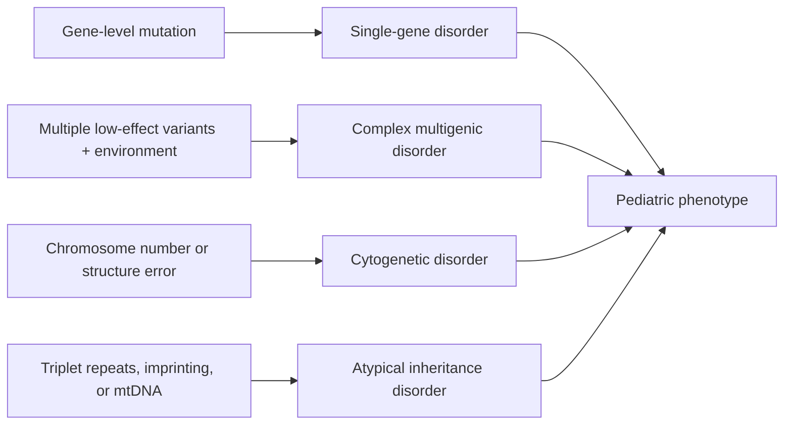
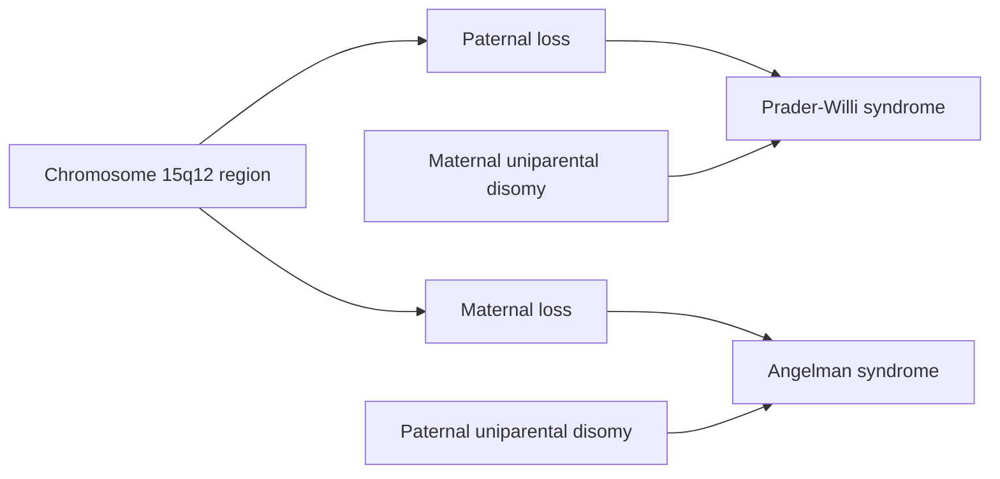

<!-- markdownlint-disable MD052 MD060 -->

# 07 - Genetic and Pediatric Diseases - Study Notes

## Description

Third-party generated study notes for Chapter 7, "Genetic and Pediatric Diseases." These notes are designed as revision aids and website-ready study content derived primarily from the local Chapter 7 textbook PDF, with trusted college material used only for exam framing and topic emphasis.

## Source Notes

- Primary textbook chapter source: `Robbins Basic Pathology`, 10th Edition, Chapter 7, "Genetic and Pediatric Diseases."
- Course-alignment source: `RCPA - Basic Pathological Sciences Syllabus 2026 - October 2025.`
- Style-alignment source: `BPS 2026 Mock Exam Question Set.`
- The syllabus references most relevant to this chapter are Section 5, `Genetic disorders`, and Section 10, `Concepts in congenital anomalies`, both citing `Robbins and Cotran Pathologic Basis of Disease`, edited by Vinay Kumar, Abul K. Abbas, and Jon C. Aster, 10th Edition, 2020, Elsevier.

## Page Reference Convention

Inline citations in this document use the format `[n]`, where `n` is the printed book page number as it appears in the physical Robbins Basic Pathology 10th Edition textbook, not the sequential page position within the chapter PDF. Chapter 7 occupies book pages 243-297; the printed page number is visible in the running header or footer of each page in the chapter PDF. Citations in these notes were checked against the approved Chapter 7 source PDF. [243][244][297]

## Disclaimer

These notes are third-party generated study materials. They are not produced by, reviewed by, approved by, endorsed by, or affiliated with the textbook authors, Elsevier, the Royal College of Pathologists of Australasia, or any other authority, institution, publisher, or examining body.

## Exam Alignment

The syllabus spreads this chapter across two major exam domains: genetic disorders and congenital anomalies. For revision, the material is easiest to retain in five exam-facing blocks: mutation classes and mendelian logic; prototype single-gene disorders; cytogenetic and atypical inheritance disorders; congenital and neonatal disease; and childhood tumors with molecular diagnostics. [243][244][273]

## Big Picture

This chapter joins two themes that are often examined together: disease caused by abnormal genes or abnormal inheritance, and disease that becomes clinically obvious during fetal, neonatal, or childhood life because development is the period of maximum biologic vulnerability. The common thread is abnormal tissue construction, abnormal protein function, or abnormal chromosome dosage expressed at a stage when the body has limited reserve. [243][244][273]

## 1. Mutation Classes and Mendelian Logic

Genetic disease can arise from point mutations within coding sequences, insertions or deletions that truncate or distort proteins, copy-number changes and translocations that alter gene dosage or chromosomal context, and mutations in noncoding RNAs or regulatory sequences. A recurring exam point is that "mutation" in this chapter is broader than a single amino-acid substitution. [244][245]

### High-yield mutation classes

| Class | What changes | Classic chapter consequence |
|---|---|---|
| Coding-sequence mutation | Amino-acid sequence or protein length | Defective structural protein, enzyme, receptor, or growth regulator |
| Copy-number change / translocation | Gene dosage or gene context | Developmental abnormality or abnormal gene expression |
| Noncoding-region mutation | Gene regulation or RNA processing | Disease without a primary coding-sequence change |
| Trinucleotide-repeat expansion | Repeat-length instability | Anticipation and neurodevelopmental or neurodegenerative disease |
| Mitochondrial DNA mutation | Oxidative-phosphorylation genes | Maternal inheritance with high-energy tissues affected |

This table compresses the introductory framework of the chapter and the syllabus mutation list. [244][245][272]

### Mendelian transmission patterns

| Pattern | Core rule | Typical protein class | High-yield clue |
|---|---|---|---|
| Autosomal dominant | Heterozygotes are affected; both sexes transmit | Structural proteins, receptors | Vertical pedigree |
| Autosomal recessive | Both alleles are mutated | Enzymes | Often appears in siblings only |
| X-linked | Carrier females transmit to sons | Variable; many loss-of-function disorders | Male-predominant disease |

Autosomal dominant disorders often arise from defects in structural proteins or receptors, whereas autosomal recessive disorders often reflect loss of enzyme function. X-linked disease is classically transmitted by heterozygous women to affected sons, with female carriers usually protected by random X inactivation. [246][247]

### Pattern-recognition rule

If the question stem emphasizes a structural protein or receptor defect with affected people in successive generations, think autosomal dominant. If it emphasizes missing enzyme activity and substrate accumulation, think autosomal recessive. [246][247]

## 2. Prototype Single-Gene Disorders

### 2.1 Structural protein disorders: Marfan syndrome and Ehlers-Danlos syndromes

Marfan syndrome is an autosomal dominant connective-tissue disorder caused by mutations in `FBN1`, which encodes fibrillin. Fibrillin normally contributes to microfibril formation and helps restrain TGF-beta bioavailability, so Marfan syndrome reflects both mechanical weakness and excessive TGF-beta signaling. [247][248]

The classic Marfan triad is skeletal overgrowth, ocular lens subluxation, and cardiovascular disease. High-yield findings are tall slender habitus, arachnodactyly, high-arched palate, bilateral ectopia lentis, mitral valve prolapse, and especially aortic root dilation with aneurysm or dissection, which is the major cause of death. [247][248]

Ehlers-Danlos syndromes are a group of collagen disorders with dominant or recessive inheritance patterns. The exam pattern is fragile hyperextensible skin, hypermobile joints, poor wound healing, and in selected subtypes rupture of arteries, bowel, cornea, or other fragile tissues. [248]

| Disorder | Mutated component | Core phenotype | Most dangerous complication |
|---|---|---|---|
| Marfan syndrome | Fibrillin (`FBN1`) | Tall habitus, lens subluxation, aortic root disease | Aortic aneurysm or dissection |
| Classical EDS | Usually type V collagen (`COL5A1` / `COL5A2`) | Hyperextensible skin, hypermobile joints | Poor wound healing, hernias |
| Vascular EDS | Type III collagen (`COL3A1`) | Tissue fragility with thin vessels and bowel wall | Arterial or colonic rupture |

These named syndromes are explicitly emphasized by the syllabus and chapter discussion. [247][248]

### 2.2 Receptor and channel disorders: Familial hypercholesterolemia and cystic fibrosis

Familial hypercholesterolemia is an autosomal dominant receptor disease caused most often by loss-of-function mutations in the LDL receptor and less often by activating mutations in `PCSK9`, which accelerates LDL-receptor degradation. The result is reduced LDL uptake into cells and loss of normal feedback control over cholesterol metabolism. [248][249][250]

Heterozygotes have marked hypercholesterolemia with accelerated atherosclerosis and premature ischemic heart disease; homozygotes have even more severe disease. Cholesterol deposits along tendon sheaths produce xanthomas, which are a classic exam clue. [249][250]

Cystic fibrosis is an autosomal recessive disease caused by mutations in `CFTR`, a chloride channel. The key functional defect is impaired chloride transport, producing high sweat electrolyte concentration and thick, viscid secretions in airways and the gastrointestinal tract. [250][251][252][254]

High-yield consequences of cystic fibrosis are meconium ileus in neonates, recurrent pulmonary infection, bronchiectasis, pancreatic insufficiency, male infertility due to congenital bilateral absence of the vas deferens, and increasing liver disease with longer survival. Resistant `Pseudomonas` or `Burkholderia` infection is especially important in advanced pulmonary disease. [251][252][253][254]

### 2.3 Enzyme disorders: PKU, galactosemia, lysosomal storage diseases, and glycogenoses

Phenylketonuria is an autosomal recessive deficiency of phenylalanine hydroxylase. Excess phenylalanine is shunted into abnormal metabolites, causing the classic musty odor and, if untreated, severe neurologic impairment, seizures, and decreased skin and hair pigmentation because tyrosine production falls. [254][255]

Maternal PKU is a separate exam concept: women who stop dietary restriction can expose the fetus to toxic phenylalanine metabolites and cause malformations and neurologic injury even if the fetus is genetically normal. [255]

Galactosemia is an autosomal recessive deficiency of galactose-1-phosphate uridyltransferase (`GALT`). Toxic metabolite accumulation injures liver, brain, and lens, so early disease presents with jaundice, liver dysfunction, cataracts, neural injury, vomiting, diarrhea, and characteristic `E. coli` sepsis. Early dietary galactose restriction prevents much of the irreversible damage. [255][256]

The lysosomal storage diseases in this chapter are best learned as substrate-enzyme-organ patterns rather than as isolated lists. [256][257][258][259][260]

| Disease | Missing function | Stored material | High-yield clinical clue |
|---|---|---|---|
| Tay-Sachs | Hexosaminidase beta subunit | GM2 ganglioside | Progressive neurodegeneration and death by 2-3 years |
| Niemann-Pick A/B | Sphingomyelinase | Sphingomyelin | Hepatosplenomegaly; type A has neuronal damage |
| Niemann-Pick C | Cholesterol trafficking (`NPC1` / `NPC2`) | Cholesterol and gangliosides | Ataxia, dysarthria, psychomotor regression |
| Gaucher | Glucocerebrosidase | Glucocerebroside | Hepatosplenomegaly, bone lesions, Gaucher cells |
| Pompe | Lysosomal acid maltase | Glycogen | Cardiomegaly and cardiorespiratory failure |

This comparison table tracks the chapter's core metabolic-disease contrasts. [256][257][258][259][260][261]

Gaucher disease deserves separate attention because it is common and mechanistically rich. Type 1 disease is the chronic non-neuronopathic form; macrophages become large Gaucher cells with wrinkled tissue-paper cytoplasm, and patients develop hepatosplenomegaly, cytopenias, and skeletal disease. The chapter also notes the clinically important association between Gaucher disease and Parkinson disease. [258][259][260]

The glycogen storage diseases are grouped by where glycogen accumulates most. Von Gierke disease is the hepatic form caused by glucose-6-phosphatase deficiency, McArdle disease is the myopathic form caused by muscle phosphorylase deficiency, and Pompe disease is the lysosomal form in which cardiomegaly dominates. [260][261]

### 2.4 Growth-regulating proteins and inherited tumor predisposition

The chapter briefly bridges single-gene disorders to oncology by noting that inherited mutations in genes regulating cell growth can be transmitted to offspring and later predispose to hereditary tumors. This becomes especially relevant again in the childhood-tumor section, where `RB`, `WT1`, and imprinting abnormalities recur. [261][289][290]

## 3. Chromosomal and Atypical Inheritance Disorders

### 3.1 Complex multigenic disorders

Complex multigenic disorders arise from the combined effects of multiple low-impact genetic variants plus environment. Familial clustering, absence of a clean mendelian pedigree, and a continuous range of severity all point toward this model, but the chapter emphasizes that reduced penetrance and variable expressivity can sometimes mimic multifactorial inheritance. [261][262]

### 3.2 Cytogenetic principles

Cytogenetic disorders result from abnormal chromosome number or structure. The practical diagnostic foundation is the karyotype, usually interpreted with G-banding, while structural lesions include deletions, translocations, inversions, ring chromosomes, and isochromosomes. [262][263]

Aneuploidies most often arise from meiotic nondisjunction. Robertsonian translocations matter because they can create familial trisomy patterns even when chromosome count is not increased in the carrier parent. [263][264][265]

### 3.3 Down syndrome and other autosomal cytogenetic disorders

Down syndrome is the most common clinically important chromosomal disorder and reflects an extra copy of chromosome 21 genes. Most cases are caused by meiotic nondisjunction, usually maternal; smaller subsets arise from Robertsonian translocation or postzygotic mosaicism. [264][265]

The classic phenotype includes flat facial profile, oblique palpebral fissures, epicanthic folds, and developmental delay. High-yield associated disease includes endocardial cushion defects, markedly increased risk of acute leukemia, early Alzheimer-type neuropathology, and recurrent infections or thyroid autoimmunity related to abnormal immune responses. [265][266]

22q11.2 deletion syndrome is another exam favorite. Loss of genes in this region produces a spectrum that includes DiGeorge syndrome and velocardiofacial syndrome, with conotruncal heart disease, thymic hypoplasia with T-cell deficiency, parathyroid hypoplasia with hypocalcemia, and characteristic facial or palatal abnormalities. [266]

| Disorder | Core mechanism | High-yield associations |
|---|---|---|
| Down syndrome | Trisomy 21, Robertsonian translocation, or mosaicism | AV septal defects, leukemia, Alzheimer change |
| Trisomy 13 | Extra chromosome 13 material | Severe multisystem malformation |
| Trisomy 18 | Extra chromosome 18 material | Severe multisystem malformation |
| 22q11.2 deletion syndrome | Microdeletion on chromosome 22 | Conotruncal heart disease, thymic and parathyroid defects |

The syllabus explicitly expects recall of trisomy 21, 18, 13, and 22q11.2 deletion syndrome. [264][265][266]

### 3.4 Sex chromosome disorders

In females, one X chromosome is randomly inactivated during development, which partly explains why sex chromosome imbalance is better tolerated than autosomal imbalance. The two named exam disorders are Klinefelter syndrome and Turner syndrome. [267][268]

Klinefelter syndrome usually reflects two or more X chromosomes with one Y chromosome. Key findings are testicular atrophy, sterility, reduced body hair, gynecomastia, and eunuchoid habitus. It is the most common cause of male sterility. [267][268]

Turner syndrome reflects partial or complete monosomy of genes on the short arm of the X chromosome, most often with a 45,X karyotype. High-yield features are short stature, webbed neck, cubitus valgus, cardiovascular malformations, amenorrhea, failure of secondary sexual development, and fibrotic streak ovaries. [267][268]

### 3.5 Fragile X syndrome and triplet-repeat disease

Fragile X syndrome is the prototype trinucleotide-repeat disorder in which CGG repeats expand in the `FMR1` gene. Full mutations become methylated and silence gene expression, causing loss of FMRP function. [269][270][271][272]

The key exam features are intellectual disability, macroorchidism, and abnormal facies. Two inheritance subtleties matter: anticipation and the fact that premutations typically expand to full mutations during oogenesis, not spermatogenesis. [269][270][271][272]

Fragile X tremor/ataxia syndrome is a premutation disorder rather than a full-mutation disorder. Here the gene remains transcribed, and toxic CGG-containing `FMR1` mRNA accumulates in the nucleus and sequesters proteins needed for neuronal function. [271][272]

### 3.6 Mitochondrial inheritance

Mitochondrial disorders show maternal inheritance because the zygote's mitochondria are derived almost entirely from the ovum. Because mitochondrial DNA encodes oxidative-phosphorylation machinery, disease selectively injures tissues with high energy demand such as CNS, skeletal muscle, heart, liver, and kidney. Leber hereditary optic neuropathy is the prototypic example in this chapter. [272]

### 3.7 Genomic imprinting: Prader-Willi and Angelman syndromes

Genomic imprinting means parent-of-origin-specific silencing of one allele, usually through promoter methylation and related chromatin changes. For imprinted genes, one parental copy is normally inactive, so loss of the active copy causes disease. [271][272][273]

Prader-Willi syndrome results from loss of the functional paternal contribution at chromosome 15q12, most often by paternal deletion and sometimes by maternal uniparental disomy. The phenotype is intellectual disability, short stature, hypotonia, obesity, small hands and feet, and hypogonadism. [272][273]

Angelman syndrome results from loss of the functional maternal contribution at the same chromosomal region, either by maternal deletion or paternal uniparental disomy. The classic phenotype is intellectual disability with ataxia, seizures, and inappropriate laughter. [272][273]

## 4. Congenital, Neonatal, and Infant Disease

### 4.1 Core congenital-anomaly vocabulary

Congenital anomalies are structural defects present at birth, even if they are detected only later. The chapter makes a major distinction between intrinsic developmental errors and extrinsic mechanical or destructive disturbances. [273][274]

| Term | Definition | Classic clue |
|---|---|---|
| Malformation | Primary intrinsic error of development | Organ formed abnormally from the outset |
| Disruption | Secondary destruction of previously normal tissue | Amniotic bands |
| Deformation | Extrinsic mechanical molding | Constraint-related positional abnormality |
| Sequence | Pattern of multiple abnormalities from one initiating event | Potter sequence from oligohydramnios |
| Syndrome | Consistent set of anomalies from one cause | Chromosomal or single-gene developmental disorder |

These definitions are repeatedly tested because the terminology sounds similar but implies different mechanisms and recurrence risk. [273][274]

Potter sequence is the chapter's flagship sequence example. Oligohydramnios compresses the fetus and produces flattened facies, positional limb abnormalities, hip dislocation, and pulmonary hypoplasia because chest-wall and lung growth are restricted. [274]

Disruptions are classically exemplified by amniotic bands, which damage previously normal developing tissue. Deformations, by contrast, reflect abnormal mechanical forces rather than destructive injury. [274]

### 4.2 Causes and timing of anomalies

Congenital anomalies can be genetic, environmental, or multifactorial. The chapter repeatedly stresses timing: the earlier the in utero insult, especially during organogenesis, the greater the structural impact. [275][276]

Environmental teratogens include infections, drugs, alcohol, radiation, maternal metabolic disease, and other exposures. The text highlights the close relationship between teratogenic pathways and genetic developmental pathways, explaining why the same phenotype can arise from mutation or environmental interference. [275][276]

Perinatal infections are another high-yield pediatric cause of abnormal development. The chapter mentions classic congenital infections and notes that Zika virus can be transmitted in pregnancy with devastating effects including microcephaly and brain damage. [276][277]

### 4.3 Prematurity and fetal growth restriction

Prematurity is defined as gestational age less than 37 weeks and is a major cause of neonatal mortality. Important risk factors are preterm rupture of membranes, intrauterine infection with chorioamnionitis, structural abnormalities of uterus, cervix, or placenta, and multiple gestation. [277]

Premature infants are physiologically immature rather than simply small. Their major complications include respiratory distress syndrome, necrotizing enterocolitis, sepsis, intraventricular or germinal-matrix hemorrhage, and long-term developmental delay. [277][279]

Fetal growth restriction is different: many low-birth-weight infants are actually term but undergrown. Maternal vascular disease such as preeclampsia is the dominant cause, and a classic adaptation is relative brain sparing with disproportionate visceral growth restriction. [277][278]

### 4.4 Neonatal respiratory distress syndrome and NEC

Neonatal respiratory distress syndrome is a disease of prematurity caused by insufficient surfactant. Without enough surfactant, alveoli collapse, the infant tires rapidly, hypoxemia develops, and hyaline membranes line damaged airspaces. [278][279]

The highest-risk setting is extreme prematurity, but the chapter also highlights infants of diabetic mothers and cesarean delivery before labor because insulin suppresses and labor stimulates surfactant synthesis, respectively. Corticosteroids, exogenous surfactant, and modern ventilation strategies reduce mortality and long-term complications. [278][279]

Necrotizing enterocolitis is another classic complication of prematurity. For exam purposes, it should be linked to premature intestine, enteral feeding, mucosal injury, bacterial colonization, and the risk of bowel necrosis, perforation, and sepsis. [279]

### 4.5 Sudden infant death syndrome

SIDS is defined as sudden death of an infant younger than 1 year that remains unexplained after full investigation. The chapter's most compelling model is delayed maturation of arousal and cardiorespiratory control in a vulnerable infant exposed to external stressors during a critical developmental window. [280][281]

Risk factors listed in the chapter include maternal smoking, young maternal age, drug abuse, short intergestational interval, prematurity or low birth weight, male sex, multiple birth, previous sibling with SIDS, and antecedent respiratory infection. [281]

### 4.6 Fetal hydrops

Fetal hydrops means abnormal edema-fluid accumulation in the fetus. The current high-yield distinction is that nonimmune causes now predominate because Rh prophylaxis has made immune hydrops less common. [282][283][285]

Nonimmune hydrops commonly reflects chromosomal abnormalities, cardiovascular defects, or fetal anemia. Immune hydrops follows maternal antibody-mediated hemolysis of fetal erythrocytes. Erythroblastosis fetalis is a characteristic clue, and severe hemolysis can lead to kernicterus from bilirubin deposition in basal ganglia and brainstem, especially in premature infants. [283][284][285]

## 5. Childhood Tumors and Molecular Diagnosis

### 5.1 General rules of pediatric tumors

Pediatric tumors differ from adult tumors in several recurring ways. They often arise from primitive or incompletely differentiated cells, are frequently linked to developmental abnormalities or hereditary syndromes, and may show spontaneous regression or maturation. "Small round blue cell tumor" is a practical histologic pattern shared by several childhood malignancies. [285][286]

### 5.2 Neuroblastoma

Neuroblastoma is the most important neuroblastic tumor of childhood and arises from neural crest-derived cells of the sympathetic ganglia and adrenal medulla. It is the second most common solid malignancy of childhood after brain tumors. [286][287]

High-yield exam points are catecholamine production with urinary VMA or HVA elevation, Homer-Wright pseudorosettes, spontaneous regression or maturation in some cases, and the major prognostic role of age, stage, ploidy, and especially `MYCN` amplification. Stage 4S disease is a classic exception in which metastatic spread may coexist with surprisingly good prognosis in infants. [287][288]

### 5.3 Retinoblastoma

Retinoblastoma is the most common primary intraocular malignancy of childhood. About 40% of tumors are heritable and arise on a background of germline `RB` mutation, typically producing bilateral or multifocal tumors; sporadic tumors are usually unilateral and unifocal. [289][290]

The classic clinical clues are poor vision, strabismus, a white pupillary reflex, and ocular pain or tenderness. Patients with familial retinoblastoma also carry increased risk of osteosarcoma and other soft-tissue tumors later in life. [289][290]

### 5.4 Wilms tumor

Wilms tumor (nephroblastoma) is the most common primary renal tumor of childhood, usually presenting between 2 and 5 years of age. It illustrates the links between congenital malformation, developmental arrest, and cancer. [289][290][291]

Three named syndromic associations are emphasized: WAGR syndrome and Denys-Drash syndrome, both linked to `WT1` inactivation, and Beckwith-Wiedemann syndrome, which reflects imprinting abnormalities at the `WT2` locus, especially involving `IGF2`. Nephrogenic rests are the precursor lesions. [289][290][291]

The characteristic histologic triad is blastemal, epithelial, and stromal differentiation. Diffuse anaplasia is the adverse prognostic morphologic clue. [290][291]

### 5.5 Molecular diagnosis ladder

Modern molecular diagnosis moves from chromosome-level assessment to sequence-level assessment. Conventional cytogenetics and karyotyping remain useful for aneuploidy and large structural change, but the chapter emphasizes FISH, microarray or array CGH, PCR-based assays, next-generation sequencing, linkage analysis, and GWAS. [262][263][292][293][294][295][296][297]

| Tool | Best use in this chapter | Key strength |
|---|---|---|
| Karyotype / G-banding | Large numeric or structural chromosomal abnormalities | Whole-chromosome overview |
| FISH | Aneuploidy, microdeletions, gene amplification | Works on interphase cells and is rapid |
| PCR / RT-PCR | Targeted mutation or transcript detection | Fast, specific, sensitive |
| Microarray / CGH | Global copy-number survey | No prior single-locus guess required |
| NGS | Targeted panels, exome, genome, RNA-seq | Massively parallel sequencing |
| Linkage analysis | Mendelian disorders in pedigrees | Tracks shared haplotypes |
| GWAS | Common polygenic disorders | Detects low-effect risk loci in large populations |

This is the practical lab-diagnosis ladder the syllabus expects. [292][293][294][295][296][297]

## Rapid Recall Table

| If the stem says... | Think... |
|---|---|
| Lens dislocation + tall habitus + aortic disease | Marfan syndrome |
| Hyperextensible skin + hypermobile joints + arterial rupture | Ehlers-Danlos syndrome |
| Tendon xanthomas + premature CAD | Familial hypercholesterolemia |
| Salty sweat + meconium ileus + bronchiectasis | Cystic fibrosis |
| Jaundice + cataracts + `E. coli` sepsis after milk feeds | Galactosemia |
| Maternal age-related nondisjunction | Down syndrome |
| Conotruncal defect + thymic or parathyroid deficiency | 22q11.2 deletion syndrome |
| Male sterility + gynecomastia + XXY | Klinefelter syndrome |
| Short girl + webbed neck + streak ovaries | Turner syndrome |
| CGG expansion in `FMR1` with anticipation | Fragile X syndrome |
| Hypotonia + obesity + small hands and feet | Prader-Willi syndrome |
| Ataxia + seizures + inappropriate laughter | Angelman syndrome |
| Prematurity + surfactant deficiency + hyaline membranes | Neonatal respiratory distress syndrome |
| Edematous fetus + erythroblastosis | Fetal hydrops |
| Childhood adrenal or sympathetic tumor + `MYCN` amplification | Neuroblastoma |
| Bilateral childhood ocular tumor + later osteosarcoma risk | Heritable retinoblastoma |
| Pediatric renal tumor + `WT1` / `IGF2` syndromes | Wilms tumor |

These one-line associations summarize the chapter's highest-yield exam pivots. [247][250][255][266][268][272][273][279][285][291]
