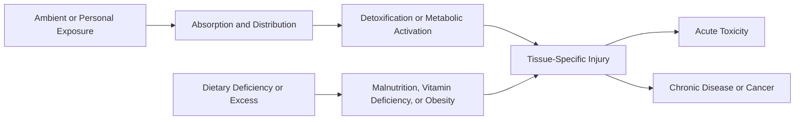
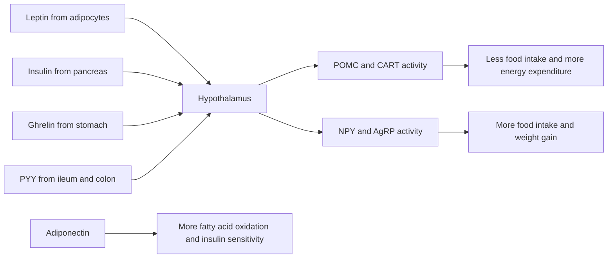

# 08 - Environmental and Nutritional Diseases - Study Notes

## Description

Third-party generated study notes for Chapter 8, "Environmental and Nutritional Diseases." These notes are designed as revision aids and website-ready study content derived from the local Chapter 8 textbook PDF, with trusted college material used only for exam framing and topic emphasis.

## Source Notes

- Primary textbook chapter source: `Robbins Basic Pathology`, 10th Edition, Chapter 8, "Environmental and Nutritional Diseases."
- Course-alignment source: `RCPA - Basic Pathological Sciences Syllabus 2026 - October 2025.`
- The syllabus reference for Section 9 cites: `Robbins and Cotran Pathologic Basis of Disease`, edited by Vinay Kumar, Abul K. Abbas, and Jon C. Aster, 10th Edition, 2020, Elsevier.

## Page Reference Convention

Inline citations in this document use the format `[n]`, where `n` is the printed book page number as it appears in the physical Robbins Basic Pathology 10th Edition textbook, not the sequential page position within the chapter PDF file. Chapter 8 occupies book pages 299-339; citations were aligned to those printed page numbers while drafting these notes. \[299\]\[339\]

## Disclaimer

These notes are third-party generated study materials. They are not produced by, reviewed by, approved by, endorsed by, or affiliated with the textbook authors, Elsevier, the Royal College of Pathologists of Australasia, or any other authority, institution, publisher, or examining body.

## Exam Alignment

The college syllabus breaks this chapter into nine practical revision domains:

1. Health effects of climate change
2. Toxicity of chemical and physical agents
3. Environmental pollution, including air pollution and heavy metals
4. Occupational exposures and tobacco
5. Alcohol
6. Therapeutic drug injury and drugs of abuse
7. Physical agents, including burns and radiation
8. Nutritional disease, severe acute malnutrition, and vitamins
9. Diet, obesity, and systemic disease

For exam purposes, the recurring discriminators are mechanism of injury, the main target organ, the classic clinical pattern, and the best-known exposure-treatment link. \[299\]\[301\]\[304\]\[307\]\[310\]\[312\]\[320\]\[324\]\[334\]

## Big Picture

Chapter 8 links disease to exposure. Some exposures come from the ambient environment, some from work, and some from personal behavior. The same logic keeps recurring: a harmful agent is absorbed, metabolized, distributed to vulnerable tissues, and then produces either acute toxicity, chronic organ damage, fibrosis, or cancer. Nutritional disease is the parallel problem in which the exposure is not a poison but too little, too much, or the wrong composition of food. \[299\]\[301\]\[324\]\[334\]

## 1. Climate Change and Toxicology Basics

Climate change is presented as a health problem, not only an environmental one. Rising atmospheric and ocean temperatures are linked to worsening heat stress and air pollution, more flooding and disruption of water and sewage systems, changes in vector geography, and reduced crop productivity with downstream malnutrition. The underlying driver is the greenhouse effect, particularly from rising atmospheric carbon dioxide together with other greenhouse gases such as methane and ozone. \[299\]\[300\]

The chapter-specific consequences that are most exam-relevant are summarized below. \[299\]\[300\]

| Climate-related change | Main health consequence | High-yield example |
| --- | --- | --- |
| Heat waves and dirty air | Worse cardiopulmonary and cerebrovascular disease | Exacerbation of respiratory and cardiovascular illness |
| Flooding and sewage disruption | Water-borne infection | Gastroenteritis and cholera |
| Vector redistribution | Vector-borne infection | Malaria and dengue fever |
| Crop failure | Nutritional stress | Malnutrition in vulnerable regions |
| Sea-level rise and displacement | Indirect social instability | Poverty, migration, and illness amplification |

Toxicology is the science of poisons. The chapter emphasizes two core ideas: dose determines whether an agent behaves as remedy or poison, and xenobiotics are exogenous chemicals absorbed by inhalation, ingestion, or skin contact. Once absorbed, they may be excreted, stored in tissues such as fat, brain, and bone, or metabolized into less harmful or more harmful compounds. \[301\]

Most solvents and drugs are lipophilic, which helps them cross membranes and circulate with lipoproteins. Their metabolism occurs in two broad phases. Phase I reactions use oxidation, reduction, or hydrolysis; phase II reactions use conjugation steps such as glucuronidation, sulfation, methylation, and glutathione conjugation to create water-soluble products for excretion. \[301\]\[302\]

| Toxicology concept | Key point | Exam angle |
| --- | --- | --- |
| Xenobiotic | Exogenous absorbed chemical | Can be detoxified or activated |
| Phase I metabolism | Oxidation, reduction, hydrolysis | May generate reactive toxic intermediates |
| Phase II metabolism | Conjugation to water-soluble forms | Promotes excretion |
| Cytochrome P-450 | Major phase I enzyme system in liver ER | Activates or detoxifies many drugs and toxins |
| Host variability | Genetics, smoking, alcohol, and starvation alter toxicity | Explains differing susceptibility |

Cytochrome P-450 is the dominant phase I enzyme system. It is particularly active in hepatic endoplasmic reticulum, can detoxify xenobiotics or convert them into reactive metabolites, and may generate reactive oxygen species as a byproduct. Its activity varies across individuals and is increased by smoking and alcohol but can be decreased by fasting or starvation. \[301\]\[302\]

## 2. Environmental Pollution and Heavy Metals

Environmental pollution is examined mainly through air pollution, indoor pollutants, and heavy metals. The lungs bear the brunt of ambient air pollution, but several pollutants also produce systemic injury. Ozone, sulfur dioxide, acid aerosols, particulates, and carbon monoxide are the classic high-yield pollutants. \[302\]\[303\]

| Pollutant | Main mechanism | High-yield effect |
| --- | --- | --- |
| Ozone | Free-radical injury to respiratory epithelium | Reduced lung function; worse asthma |
| Fine particulates | Reach alveoli and trigger inflammatory cell activation | Morbidity and mortality in heart and lung disease |
| Sulfur dioxide and acid aerosols | Airway irritation and inflammatory injury | Increased respiratory symptoms |
| Indoor smoke from biomass fuels | Irritant injury plus carcinogenic hydrocarbon exposure | Lung infection risk in poorly ventilated homes |
| Carbon monoxide | Carboxyhemoglobin-mediated systemic hypoxia | CNS depression, coma, death |

Ozone is a major smog component formed by sunlight-driven reactions involving nitrogen oxides. It damages airway and alveolar lining cells through free-radical chemistry. Fine particulates, especially those less than 10 micrometers in diameter, are more dangerous than larger particles because they travel to the alveoli, where macrophages and neutrophils ingest them and amplify inflammation. \[302\]\[303\]

Carbon monoxide is a nonirritating, colorless, odorless gas that causes systemic asphyxia by binding hemoglobin with roughly 200-fold greater affinity than oxygen. The resulting carboxyhemoglobin cannot transport oxygen effectively, so hypoxia first depresses the CNS and can progress to coma and death. Acute poisoning classically produces cherry-red discoloration in light-skinned victims, while chronic exposure may cause slowly progressive neurologic injury. \[303\]

Heavy metals are memorable because each has a recognizable target-organ pattern. \[304\]\[306\]

| Metal | Typical exposure | Main targets and clues |
| --- | --- | --- |
| Lead | Old paint, contaminated dust, water, occupational exposure | Child CNS injury, adult peripheral neuropathy, basophilic stippling, dense metaphyseal lead lines |
| Mercury | Contaminated fish, vapors, mining contamination | CNS, GI tract, kidney; fetal Minamata disease |
| Arsenic | Groundwater, herbicides, wood preservatives, industry | GI and cardiovascular toxicity acutely; chronic hyperpigmentation, hyperkeratosis, skin and lung cancer |
| Cadmium | Batteries, fertilizers, contaminated food | Kidney and lung toxicity, calcium loss, osteomalacia/osteoporosis |

Lead binds sulfhydryl groups, interferes with calcium metabolism, and inhibits heme synthesis enzymes. In children, the blood-brain barrier is more vulnerable, so CNS injury dominates; in adults, a motor peripheral neuropathy is more typical. The hematologic clue is a microcytic hypochromic anemia with punctate basophilic stippling, and the skeletal clue is radiodense metaphyseal "lead lines" in children. \[304\]\[305\]

Mercury poisoning today is most strongly associated with methyl mercury accumulation in carnivorous fish. The developing fetal brain is especially sensitive, explaining Minamata disease with cerebral palsy, deafness, blindness, and severe CNS damage after in utero exposure. Mercury can also injure the gut and produce acute tubular necrosis in the kidney. \[305\]

Arsenic interferes with mitochondrial oxidative phosphorylation. Acute poisoning produces severe abdominal pain, diarrhea, arrhythmias, shock, and encephalopathy. Chronic exposure causes skin hyperpigmentation and hyperkeratosis, followed by multiple basal and squamous carcinomas that often involve palms and soles. Cadmium is comparatively modern and primarily injures lung and kidney while also promoting calcium loss and skeletal disease, classically illustrated by itai-itai disease. \[306\]

## 3. Occupational Exposure, Tobacco, and Alcohol

Occupational disease in this chapter is built around the idea that a workplace can repeatedly deliver carcinogens, fibrogenic dusts, endocrine disruptors, or neurotoxins. Benzene exposure in rubber workers raises the risk of marrow failure and acute myeloid leukemia. Vinyl chloride is tied to hepatic angiosarcoma. Polycyclic hydrocarbons from high-temperature combustion are potent carcinogens, and inhaled mineral dusts cause pneumoconioses such as silica- and asbestos-related lung disease. \[306\]\[307\]

| Exposure | High-yield association |
| --- | --- |
| Benzene | Marrow toxicity and acute myeloid leukemia |
| Vinyl chloride | Angiosarcoma of the liver |
| Polycyclic hydrocarbons | Potent industrial carcinogens |
| Organochlorines and dioxins | Endocrine disruption and chloracne |
| Mineral dusts | Pneumoconioses and selected occupational cancers |

Tobacco is framed as the most common exogenous cause of human cancer and the most important preventable cause of death. Cigarette smoke delivers nicotine, which drives addiction, together with carcinogens such as polycyclic aromatic hydrocarbons and nitrosamines. Tobacco causes lung cancer, contributes to oral, laryngeal, esophageal, pancreatic, and bladder cancers, and promotes chronic bronchitis, emphysema, atherosclerosis, myocardial infarction, and adverse pregnancy outcomes. \[307\]\[308\]\[309\]

Three tobacco distinctions are especially testable. First, about 90% of lung cancers occur in smokers. Second, tobacco multiplies the cancer risk from other exposures, especially alcohol and occupational carcinogens such as asbestos and uranium. Third, passive smoke is clinically meaningful: in nonsmokers it raises lung-cancer and cardiovascular risk, and in children it increases respiratory illness and asthma. \[307\]\[310\]

Alcohol is more common than illicit drug abuse and causes both acute and chronic injury. At usual blood levels, ethanol is metabolized mainly by alcohol dehydrogenase, with additional metabolism by CYP2E1 and a smaller contribution from catalase. Acetaldehyde is then converted to acetate by acetaldehyde dehydrogenase. The increased NADH/NAD+ ratio created during ethanol oxidation suppresses fatty-acid oxidation, explaining hepatic steatosis and lactic acidosis. \[310\]\[311\]

| Alcohol feature | High-yield consequence |
| --- | --- |
| Alcohol dehydrogenase metabolism | Main route at usual intake |
| Increased NADH/NAD+ ratio | Fatty liver and metabolic acidosis |
| Acetaldehyde accumulation | Flushing and tachycardia in ALDH deficiency |
| Chronic alcoholism | Hepatitis, cirrhosis, gastritis, pancreatitis, cardiomyopathy |
| Pregnancy exposure | Fetal alcohol syndrome |

Chronic alcoholism damages liver, GI tract, peripheral nerves, heart, and pancreas, and it raises the risk of cancers of the oral cavity, larynx, and esophagus. It also interacts with tobacco to magnify upper aerodigestive cancer risk. In many East Asians, partial acetaldehyde dehydrogenase deficiency causes flushing, tachycardia, and hyperventilation after alcohol exposure because acetaldehyde accumulates. \[311\]\[312\]

## 4. Therapeutic Drugs, Drugs of Abuse, and Physical Agents

Adverse drug reactions are harmful effects of drugs given in ordinary therapeutic settings. The chapter stresses pattern recognition rather than memorizing exhaustive lists: blood dyscrasias, hepatotoxicity, nephrotoxicity, interstitial lung injury, skin eruptions, anaphylaxis, and drug-induced lupus are the classic categories. Many involve potent therapies such as anti-neoplastics, but common agents like tetracyclines, acetaminophen, aspirin, estrogens, and oral contraceptives also matter. \[312\]\[313\]

| Drug exposure | High-yield mechanism or consequence |
| --- | --- |
| Menopausal hormone therapy | Combination estrogen-progestin increases breast-cancer and thromboembolic risk over time |
| Oral contraceptives | Lower endometrial and ovarian cancer risk but increase venous thrombosis risk |
| Acetaminophen overdose | NAPQI accumulation causes centrilobular hepatic necrosis |
| N-acetylcysteine | Restores glutathione in acetaminophen toxicity |
| Aspirin | Early respiratory alkalosis, later metabolic acidosis, plus gastric injury and reduced thromboxane A2 |

Acetaminophen is safe at usual doses because most is conjugated, but overdose diverts more drug into CYP-mediated formation of NAPQI. When glutathione is depleted, NAPQI covalently injures hepatocytes and causes centrilobular necrosis, often with severe liver failure. Aspirin toxicity is mainly metabolic rather than morphologic, with respiratory alkalosis followed by metabolic acidosis; chronically it also causes erosive gastritis and a bleeding tendency by blocking platelet thromboxane A2 synthesis. \[314\]

Among drugs of abuse, cocaine and opioids are the most exam-yield. Cocaine is intensely addictive, blocks catecholamine reuptake, causes tachycardia, hypertension, coronary vasospasm, platelet aggregation, myocardial ischemia, arrhythmias, seizures, and hyperpyrexia. Heroin and related opioids kill largely through respiratory depression and are strongly associated with pulmonary edema, opportunistic infection, and right-sided infective endocarditis in intravenous users. Marijuana produces acute sensory distortion and chronic airway symptoms, but its long-term risk profile is more debated. \[315\]\[316\]\[317\]

Physical injury is divided into mechanical trauma, thermal injury, electrical injury, and ionizing radiation. Mechanical trauma is classified as abrasion, contusion, laceration, incised wound, or puncture wound. In burns, depth, total body surface area, inhalation injury, and adequacy of fluid management are the decisive variables. With burns affecting more than 20% of body surface, rapid fluid shifts into interstitium can produce hypovolemic shock. Later, sepsis becomes the leading cause of death. \[317\]\[318\]

| Physical agent | High-yield clue |
| --- | --- |
| Full-thickness burn | Destroys epidermis and dermis; cannot regenerate from skin appendages |
| Heat exhaustion | Hypovolemia with cardiovascular collapse but preserved thermoregulation |
| Heat stroke | Failed thermoregulation with extreme hyperthermia and high mortality |
| Alternating current injury | Tetanic spasm prolongs contact with source |
| Ionizing radiation | DNA damage, mutations, fibrosis, and secondary cancer |

Heat stroke is more dangerous than heat exhaustion because thermoregulation fails, sweating may stop, and core temperature rises dramatically. Electrical injury from ordinary household alternating current is dangerous because tetanic spasm can lock the victim onto the source, prolonging current flow and promoting fatal arrhythmia or asphyxia. \[318\]\[319\]\[320\]

Ionizing radiation removes tightly bound electrons, producing ionization cascades and free-radical injury. The most important cellular target is DNA. Rapidly dividing tissues such as bone marrow, lymphoid tissue, gonads, and GI mucosa are especially radiosensitive. The key units are curie for radioactivity, gray for absorbed energy, and sievert for biologic equivalent dose. Long-term consequences include vascular sclerosis, fibrosis, mutagenesis, carcinogenesis, and second cancers after therapeutic exposure. Whole-body exposure produces acute radiation syndromes that progress from lymphoid and marrow injury to GI and CNS failure at increasing dose levels. \[320\]\[323\]

## 5. Nutritional Disease and Deficiency States

Nutritional disease in this chapter covers both too little and too much intake. Primary malnutrition means the diet itself is deficient; secondary malnutrition means intake is adequate but absorption, storage, use, or retention is impaired. Poverty, ignorance, alcoholism, chronic disease, and self-imposed dietary restriction are recurring causes. \[324\]

Severe acute malnutrition spans marasmus and kwashiorkor. The distinction is not cosmetic; it reflects which protein compartment is most depleted. \[324\]\[325\]

| Feature | Marasmus | Kwashiorkor |
| --- | --- | --- |
| Primary problem | Severe calorie deficiency | Relative protein deficiency with some calories preserved |
| Protein compartment | Somatic depletion dominates | Visceral depletion dominates |
| Body habitus | Marked muscle and fat wasting | Edema may mask weight loss |
| Serum albumin | Normal or only slightly low | Markedly reduced |
| Liver | Not typically fatty | Enlarged fatty liver common |
| Signature clue | Emaciation without major edema | Generalized edema with skin and hair changes |

Marasmus is the classic emaciated child with severe muscle and fat loss, growth failure, and relatively preserved visceral protein stores. Kwashiorkor is the edematous child with hypoalbuminemia, fatty liver, skin and hair changes, and heightened infectious vulnerability. Both states can be accompanied by vitamin deficiency and immune dysfunction. \[324\]\[326\]

Anorexia nervosa and bulimia are self-driven nutritional disorders seen mainly in young women. Anorexia nervosa resembles severe malnutrition and is marked by amenorrhea, bradycardia, cold intolerance, lanugo, osteopenia, and sudden-death risk from hypokalemia. Bulimia involves binge eating followed by purging and is more strongly linked to electrolyte disturbance, aspiration, and esophageal or gastric rupture. \[326\]

The vitamin section is centered on vitamins A, D, and C because their deficiencies produce classic pathology. \[327\]\[332\]

| Vitamin | Core function | Classic deficiency pattern |
| --- | --- | --- |
| Vitamin A | Vision, epithelial differentiation, immunity | Night blindness, xerophthalmia, squamous metaplasia, infection susceptibility |
| Vitamin D | Calcium and phosphate homeostasis; bone mineralization | Rickets in children, osteomalacia in adults |
| Vitamin C | Collagen hydroxylation and antioxidant defense | Scurvy with bleeding and poor wound healing |

Vitamin A deficiency first impairs dark adaptation and can progress to xerophthalmia with conjunctival dryness, Bitot spots, corneal damage, and blindness. It also causes squamous metaplasia of specialized epithelia and increases infection risk because normal mucosal differentiation and host defense fail. Excess vitamin A can produce headache, bone pain, fractures, and teratogenicity. \[327\]\[329\]

Vitamin D maintains calcium and phosphorus availability for mineralization. Deficiency causes rickets in children and osteomalacia in adults. Secondary hyperparathyroidism tends to restore serum calcium but wastes phosphate, so bone mineralization remains defective. The child with rickets develops craniotabes, frontal bossing, a rachitic rosary, pigeon breast deformity, and bowed legs; the adult with osteomalacia develops weak osteoid-rich bone that fractures easily. \[329\]\[332\]

Vitamin C is required for proline and lysine hydroxylation during collagen synthesis. In deficiency, collagen is weak, blood-vessel support fails, hemorrhages occur, and wound healing is poor. That combination explains the core picture of scurvy in both children and adults. Table 8.9 then broadens the review to vitamins E, K, and the B-complex vitamins. \[332\]\[333\]

## 6. Obesity, Diet, and Systemic Disease

Obesity is presented as a disorder of energy regulation rather than a simple excess of food intake. Body mass index is the practical measure used in the chapter, and a BMI above 30 kg/m2 marks obesity. The risk is determined not only by how much fat is present but by where it is stored: central or visceral obesity is much more strongly linked to diabetes, dyslipidemia, hypertension, cardiovascular disease, and cancer than diffuse subcutaneous fat accumulation. \[334\]\[336\]

Leptin is the core adiposity signal. It is secreted by adipocytes in proportion to fat stores and normally suppresses appetite while increasing energy expenditure through hypothalamic signaling. In common obesity, leptin levels are high but the response is blunted, producing leptin resistance. Ghrelin is a meal-initiating signal from the stomach that stimulates appetite. PYY promotes satiety and slows gastric emptying. Adiponectin is the "fat-burning" adipokine that increases fatty-acid oxidation and insulin sensitivity; it falls in obesity. \[335\]\[336\]

| Obesity mechanism or consequence | High-yield point |
| --- | --- |
| Central obesity | Strongest link to metabolic syndrome |
| Hypertriglyceridemia and low HDL | Characteristic atherogenic pattern |
| Hyperinsulinemia | Drives insulin resistance and may raise IGF-1 signaling |
| Low adiponectin | Promotes insulin resistance, fatty liver, and possibly cancer |
| Chronic inflammation | Helps connect obesity to thrombosis, vascular disease, and malignancy |

Clinical consequences of obesity include insulin resistance and type 2 diabetes, hypertension, hypertriglyceridemia with low HDL, nonalcoholic fatty liver disease, gallstones, sleep-related hypoventilation, osteoarthritis, and chronic low-grade inflammation. Obesity also raises the incidence of several cancers, likely through multiple mechanisms including hyperinsulinemia with higher free IGF-1, altered sex-hormone balance, reduced adiponectin, and persistent inflammatory signaling. \[336\]\[337\]

Diet affects systemic disease even when frank vitamin deficiency is absent. Lowering saturated animal fats in favor of polyunsaturated fats reduces serum cholesterol. Sodium restriction lowers blood pressure. Dietary fiber is thought to help protect against diverticulosis. In cancer biology, the chapter emphasizes that clear dietary protection is hard to prove, but examples such as aflatoxin-associated hepatocellular carcinoma and endogenous nitrosamine formation remind you that food can serve as a carcinogen source as well as an energy source. \[337\]\[338\]

For exam framing, the college syllabus specifically pairs obesity with basic cardiovascular-risk biomarkers. In practice, think of obesity and metabolic syndrome alongside fasting glucose, HbA1c, total cholesterol, LDL cholesterol, HDL cholesterol, and triglycerides, even though the textbook chapter focuses more on the underlying mechanisms than on laboratory algorithms.

## 7. Last-Minute Exam Traps

- Carbon monoxide poisoning is systemic asphyxia from carboxyhemoglobin, not an irritant pneumonitis. \[303\]
- Childhood lead toxicity is primarily a CNS problem; adult lead toxicity more often presents as peripheral motor neuropathy. \[304\]\[305\]
- Marasmus means severe calorie deficiency with emaciation and relatively preserved albumin; kwashiorkor means relative protein deficiency with edema and fatty liver. \[324\]\[325\]
- Heat exhaustion reflects hypovolemia, whereas heat stroke reflects failed thermoregulation and marked hyperthermia. \[318\]\[319\]
- Rickets and osteomalacia are the same mineralization problem expressed in growing bone versus adult bone. \[330\]\[331\]
- Visceral obesity is more dangerous than diffuse subcutaneous obesity because it sits at the center of insulin resistance and metabolic syndrome. \[334\]\[336\]
