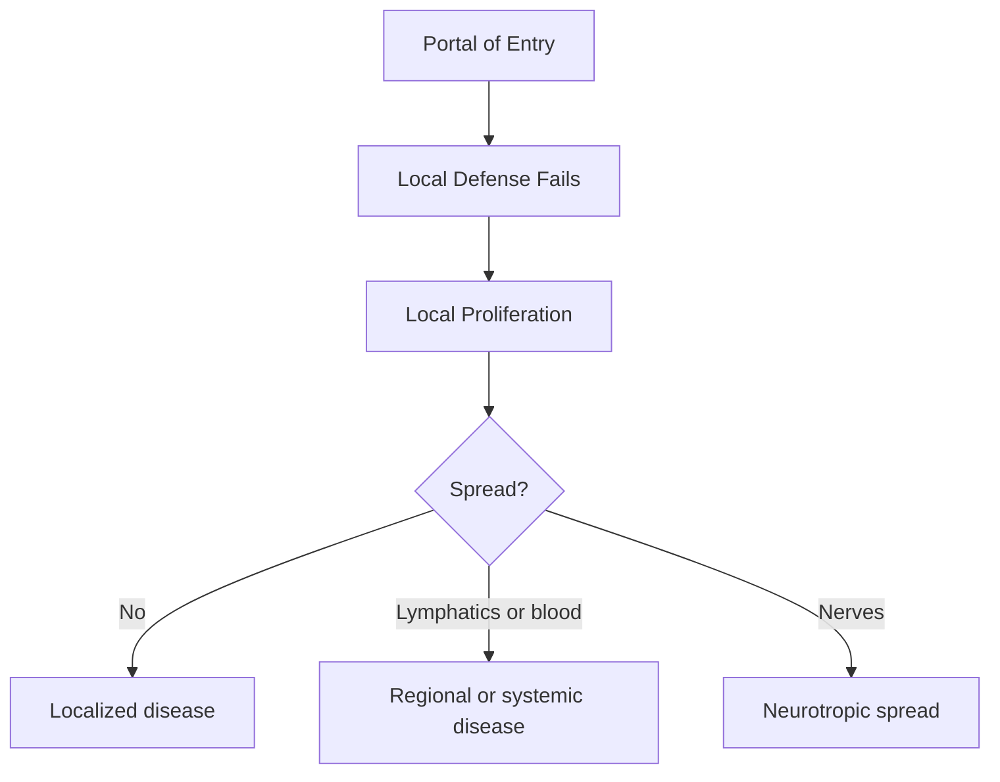

# 09 - General Pathology of Infectious Diseases - Study Notes

## Description

Third-party generated study notes for Chapter 9, "General Pathology of Infectious Diseases." These notes are designed as revision aids and website-ready study content derived from the local Chapter 9 textbook PDF, with trusted college material used only for exam framing and topic emphasis.

## Source Notes

- Primary textbook chapter source: `Robbins Basic Pathology`, 10th Edition, Chapter 9, "General Pathology of Infectious Diseases."
- Course-alignment source: `RCPA - Basic Pathological Sciences Syllabus 2026 - October 2025`, Section 8, "Infectious diseases."
- Style reference: `BPS 2026 Mock Exam Question Set.`

## Page Reference Convention

Inline citations in this document use the format `[n]`, where `n` is the printed book page number as it appears in the physical Robbins Basic Pathology 10th Edition textbook, not the sequential page position within the chapter PDF file. Chapter 9 occupies book pages 341-360; citations were aligned to those printed page numbers while drafting these notes. \[341\]\[360\]

## Disclaimer

These notes are third-party generated study materials. They are not produced by, reviewed by, approved by, endorsed by, or affiliated with the textbook authors, Elsevier, the Royal College of Pathologists of Australasia, or any other authority, institution, publisher, or examining body.

## Exam Alignment

This textbook chapter maps most directly to syllabus Section 8.1 and 8.7: general microbial pathogenesis, host-pathogen interactions, patterns of inflammation, and diagnostic techniques. The organism-specific lists in syllabus Sections 8.2-8.6 build on these principles, so exam questions often test the mechanism first and the organism second. \[346\]\[352\]\[357\]

## Big Picture

Infectious disease pathology is the result of a three-way contest between microbial virulence factors, host barrier and innate defenses, and adaptive immune responses that both control infection and sometimes injure tissue. Most exam questions reduce to four frames: what kind of organism it is, how it entered, how it damages tissue, and what histologic pattern it leaves behind. \[341\]\[352\]\[357\]

## 1. Infectious Agents at a Glance

The chapter organizes human pathogens into prions, viruses, bacteria, fungi, protozoa, helminths, and ectoparasites. The key exam distinction is not just taxonomy but propagation site: obligate intracellular organisms depend heavily on host cells, whereas extracellular organisms more often cause disease through toxins, enzymes, and inflammatory injury. \[341\]\[342\]\[345\]

| Class | Core structural feature | Typical propagation site | High-yield examples |
| --- | --- | --- | --- |
| Prions | Misfolded host protein without nucleic acid | Intracellular | CJD, BSE, vCJD |
| Viruses | DNA or RNA genome in a capsid, sometimes enveloped | Obligate intracellular | Influenza, HBV, CMV, HIV |
| Bacteria | Prokaryotes with variable cell wall structure | Extra- or intracellular | S. aureus, E. coli, M. tuberculosis |
| Fungi | Eukaryotes with beta-glucan, chitin, and mannoprotein cell wall | Extra- or facultative intracellular | Candida, Histoplasma, Aspergillus |
| Protozoa | Single-celled eukaryotes | Extra- or intracellular | Giardia, Plasmodium, Leishmania |
| Helminths | Multicellular parasitic worms | Mostly extracellular | Hookworms, schistosomes, tapeworms |
| Ectoparasites | Arthropods on or in skin | Surface infestation | Lice, mites, ticks |

This table condenses Table 9.1 and the surrounding class descriptions. \[341\]\[345\]

### Agent-specific distinctions

- Prions propagate by inducing conformational change of normal PrP into a protease-resistant abnormal form. \[341\]
- Viruses are obligate intracellular parasites, and their disease patterns depend on genome type, tropism, latency, and host immune status. \[341\]\[342\]
- Gram-positive bacteria have thick peptidoglycan, whereas gram-negative bacteria have thin peptidoglycan plus an outer membrane containing LPS. \[342\]\[343\]
- Mycoplasma and Ureaplasma are unusual bacterial pathogens because they lack cell walls. \[343\]
- Fungi may be yeasts or hyphae; some important pathogenic fungi are thermally dimorphic, growing as hyphae at room temperature and as yeasts at body temperature. \[343\]\[345\]
- Helminth burden often determines severity, and in schistosomiasis much of the injury is caused by the host inflammatory reaction to eggs. \[345\]

## 2. Microbiome, Dysbiosis, and Diagnostic Strategy

The microbiome is the diverse population of bacteria, fungi, and viruses that inhabit body surfaces, especially the gut, skin, upper airway, and vagina. In the intestine it supports epithelial integrity, immune function, nutrient handling, and colonization resistance. Disease can follow dysbiosis, meaning a disease-associated shift in composition rather than invasion by a single new pathogen. \[346\]

- Antibiotics can clear commensal flora and permit toxin-producing C. difficile to overgrow, which is why antibiotic exposure is a major risk factor for relapsing pseudomembranous colitis. \[346\]
- Obesity and inflammatory bowel disease are associated with altered microbiome diversity and shifts in dominant phyla, linking microbial composition to metabolism and inflammation. \[346\]

### Diagnostic techniques

A useful exam rule is to match the method to the question being asked: culture for viability and susceptibility testing, histology and special stains for tissue context, serology for host response, nucleic acid tests for sensitivity and speed, and mass spectrometry for rapid species identification once microbial protein patterns are available. \[346\]\[347\]

| Technique | Best use | High-yield limitation or clue |
| --- | --- | --- |
| Culture | Bacteria and fungi; antibiotic susceptibility | Slow, but still essential for susceptibility testing |
| Histology and special stains | Tissue-localized infection | Organisms are often best seen at the advancing edge of lesions |
| Serology | Acute or recent infection | IgM shortly after symptoms can be diagnostic |
| PCR or other nucleic acid amplification | Fast, sensitive detection | Better than culture for HSV encephalitis and many chlamydial infections |
| Mass spectrometry or proteomics | Rapid species identification | Does not determine antibiotic sensitivity |

Special-stain anchors are exam favorites: Gram for most bacteria, acid-fast for mycobacteria and modified acid-fast for nocardiae, silver for fungi, Legionella, and Pneumocystis, mucicarmine for Cryptococcus, and Giemsa for Leishmania and Plasmodium. \[346\]\[347\]

## 3. Emerging Infection and Public Health

New infectious diseases emerge because detection improves, microbes cross from animals into humans, pathogens acquire new virulence genes, and more patients live with immunosuppression. The chapter uses H. pylori, MERS, SARS, HIV, B. burgdorferi, and shiga-toxin-producing E. coli as examples of these routes to emergence. \[347\]

- Zika virus shows how an old virus can create a new public-health emergency when geography, vector range, or host factors change; congenital infection is associated with microcephaly and other CNS defects. \[347\]
- Human travel, burial practices, climate effects on mosquito range, and antibiotic pressure all reshape infectious-disease epidemiology. \[348\]

### Bioterrorism

The CDC ranks potential bioterror agents according to ease of dissemination, public-health impact, morbidity and mortality, and preparedness burden. Category A agents, such as smallpox and anthrax, are the highest concern. \[348\]

| Category | Defining feature | Examples |
| --- | --- | --- |
| A | Easy dissemination, high mortality, major public-health impact | Smallpox, anthrax, plague, botulism, tularemia, viral hemorrhagic fevers |
| B | Moderate morbidity, lower mortality, requires targeted surveillance | Brucellosis, Q fever, ricin, food and water threats |
| C | Emerging agents with potential for engineered mass dissemination | Nipah virus, hantavirus |

This table condenses Table 9.5. \[348\]

## 4. Entry, Spread, and Transmission

Most infections begin when a pathogen overcomes local barriers at the skin, respiratory tract, gastrointestinal tract, or urogenital tract. Healthy hosts rely on physical barriers, mucociliary clearance, gastric acidity, normal flora, defensins, IgA, urine flow, and acidic vaginal pH to keep inocula below the threshold needed for invasion. \[349\]\[352\]

### Route-by-route high-yield defenses

| Site | Main normal defense | Classic failure pattern | High-yield examples |
| --- | --- | --- | --- |
| Skin | Keratinized barrier, low pH, fatty acids, normal flora | Trauma, burns, ulcers, needles, bites | Staphylococci, Pseudomonas, rabies, malaria |
| GI tract | Gastric acid, mucus, bile, enzymes, defensins, flora, IgA | Low acid, antibiotics, obstruction, M-cell uptake | Cholera, Salmonella, Shigella, Giardia, C. difficile |
| Respiratory tract | Mucociliary clearance, alveolar macrophages | Viral damage to cilia, smoking, CF, aspiration | Influenza, Bordetella, H. influenzae, M. tuberculosis |
| Urogenital tract | Urine flow, vaginal acidity, epithelial integrity | Obstruction, adherence, antibiotics, trauma | E. coli UTI, Candida vaginitis, gonorrhea |

This comparison summarizes Table 9.6 and the surrounding text. \[349\]\[351\]

### Spread within the body

Microbes can spread by direct tissue invasion, by lymphatics and blood, or by cell-to-cell transmission. Bloodborne spread can be free in plasma, inside leukocytes, or inside red cells, depending on the organism. Neurotropic spread is classic for rabies and varicella-zoster virus. \[351\]

- Rabies travels from the bite site to the brain by retrograde transport in sensory neurons. \[351\]
- Poliovirus enters through the gut but can reach motor neurons and cause paralysis. \[351\]
- Vertical transmission may be transplacental, intrapartum, or postnatal through breast milk; timing during gestation strongly influences fetal damage. \[352\]

### Transmission out of the host

Think of transmission in terms of the body fluid or tissue that carries the pathogen out: skin scales, saliva, respiratory droplets, stool, blood, urine, genital secretions, or maternal-fetal routes. The environmental hardiness of the organism determines whether direct contact is required. \[352\]

## 5. How Microorganisms Cause Disease

Infectious disease pathology is produced by three broad mechanisms: direct microbial injury to host cells, toxins or enzymes that damage cells and tissues, and host immune responses that control infection but also injure tissue. \[352\]\[355\]

### Viral injury

Viral tropism depends on host receptors, cell-specific transcription factors, and local tissue conditions such as temperature or bile exposure. Once inside cells, viruses may shut down host macromolecule synthesis, induce apoptosis, create inclusion bodies, trigger cell fusion, or transform host cells. \[353\]

| Mechanism | Representative example | High-yield consequence |
| --- | --- | --- |
| Receptor-driven entry | HIV binding CD4 with CCR5 or CXCR4 | Tissue tropism |
| Tissue-condition tropism | Rhinovirus replication at cooler upper-airway temperatures | Upper respiratory localization |
| Direct cytopathic effect | Poliovirus or HSV | Cell death and dysfunction |
| Immune-mediated injury | HBV | CTL-mediated hepatocyte destruction |
| Transformation | HPV or EBV | Benign or malignant neoplasia |

This table summarizes Fig. 9.7 and the viral injury section. \[353\]

### Bacterial injury

Bacterial virulence depends on adherence, invasion, toxin delivery, immune evasion, and gene exchange. Pathogenicity islands, plasmids, bacteriophages, quorum sensing, and biofilms all matter because they can transform a colonizer into a persistent pathogen. \[353\]\[354\]

- Adhesins are surface molecules that bind host cells or extracellular matrix; pili are especially important for tissue tropism, such as P pili on uropathogenic E. coli. \[354\]
- Gram-negative endotoxin is LPS; lipid A engages CD14 and TLR4, which activates protective innate responses but can also drive septic shock, DIC, and ARDS when excessive. \[354\]
- Exotoxins include enzymes, A-B toxins, superantigens, neurotoxins, and enterotoxins. \[354\]

| Toxin type | Core mechanism | Classic exam association |
| --- | --- | --- |
| Endotoxin (LPS) | Innate immune activation via TLR4 | Septic shock |
| A-B toxin | Binding subunit delivers active enzymatic subunit | Anthrax, cholera, diphtheria |
| Superantigen | Massive nonspecific T-cell activation | Toxic shock syndrome |
| Neurotoxin | Blocks neurotransmitter release | Tetanus, botulism |
| Enterotoxin | Alters intestinal function | Watery or inflammatory diarrhea |

Anthrax toxin is especially testable: edema factor raises intracellular cAMP and causes edema, whereas lethal factor is a protease that disrupts MAP kinase kinase pathways and causes cell death. \[354\]\[355\]

### Host-mediated injury

The immune response is protective but can be pathogenic. Tuberculosis causes delayed-type hypersensitivity and granulomatous inflammation; HBV and HCV injury is largely immune-mediated; poststreptococcal glomerulonephritis is immune-complex disease; chronic inflammation caused by microbes can contribute to cancer. \[355\]

### Immune evasion

Microbes survive by changing surface antigens, resisting antimicrobial peptides, avoiding antibodies and complement, living inside cells, blocking phagolysosome fusion, escaping the inflammasome, interfering with interferon pathways, and reducing antigen presentation to T cells. \[355\]\[357\]

| Evasion strategy | Example | Consequence |
| --- | --- | --- |
| Antigenic variation | HIV, influenza, Borrelia, Trypanosoma, pneumococcal serotypes | Escapes neutralizing antibodies |
| Capsule or antiphagocytic surface protein | S. pneumoniae, S. aureus, S. pyogenes | Resists phagocytosis |
| Intracellular hiding | Mycobacteria, Listeria, Salmonella, Leishmania | Avoids antibodies and complement |
| Block phagolysosome fusion | M. tuberculosis | Survives in macrophages |
| Interfere with MHC or IFN pathways | Herpesviruses and other DNA viruses | Reduced T-cell recognition |

This table condenses Fig. 9.9 and Table 9.7. \[355\]\[357\]

## 6. Histologic Patterns of Infection

Despite great microbial diversity, tissue reactions fall into a limited number of repeating patterns. Exam questions often present the histology first and ask you to infer the organism class or immune mechanism. \[357\]

| Pattern | Typical organisms or settings | Key histologic clue | Best exam inference |
| --- | --- | --- | --- |
| Suppurative inflammation | Pyogenic bacteria, some fungi | Neutrophil-rich pus or abscess | Think extracellular bacteria |
| Mononuclear inflammation | Many viruses, intracellular microbes | Lymphocytes, macrophages, plasma cells | Think chronic or intracellular infection |
| Granulomatous inflammation | M. tuberculosis, Histoplasma, schistosome eggs | Epithelioid macrophages, giant cells, sometimes caseation | Strong T-cell-mediated response to hard-to-eradicate organism |
| Cytopathic-cytoproliferative reaction | Many viruses | Inclusions, multinucleation, epithelial proliferation | Think viral infection |
| Tissue necrosis | Clostridia, amoebae, some viruses | Extensive necrosis, sometimes with little inflammation | Toxin-mediated or rapidly destructive infection |
| Chronic inflammation and scarring | Persistent infections | Fibrosis and architectural distortion | End-stage response to chronic infection |

This table summarizes the morphology section. \[357\]\[359\]

### Immunodeficiency patterns

Immunodeficiency changes both susceptibility and morphology. Classic inflammatory patterns may disappear when the relevant arm of immunity is absent. \[358\]\[359\]

- Antibody deficiency predisposes to severe infection by extracellular bacteria and a few viruses such as enteroviruses and rotavirus. \[358\]
- T-cell defects predispose to intracellular pathogens, especially viruses and some parasites. \[358\]
- Early complement deficiencies predispose to infections by encapsulated bacteria; late complement deficiencies predispose to Neisseria. \[358\]
- Neutrophil defects predispose to S. aureus, some gram-negative bacteria, and fungi. \[358\]
- In AIDS, organisms that usually provoke granulomas may instead accumulate inside macrophages without a granulomatous response. \[359\]
- Defects in IL-17 immunity, including STAT3-associated Th17 failure, are linked to chronic mucocutaneous candidiasis. \[358\]

## 7. High-Yield Exam Traps

- "Obligate intracellular" should make you think viruses, chlamydiae, rickettsiae, and some protozoa rather than toxin-mediated extracellular disease. \[341\]\[343\]
- Gastric acid is a real barrier; if the infectious dose falls sharply after acid suppression, the organism depends on bypassing acidity rather than overwhelming it. \[349\]\[350\]
- HBV liver injury is mostly immune-mediated, not purely viral cytolysis. \[353\]\[355\]
- Capsule, pili, quorum sensing, and biofilm are all virulence strategies, but they do different jobs: antiphagocytosis, adherence, coordinated gene expression, and persistence, respectively. \[354\]\[356\]
- Granulomas mean the host is mounting a strong T-cell response, not that the organism is easy to eliminate. \[357\]
- Absence of expected inflammation in an immunocompromised patient does not exclude infection; it may be the clue. \[358\]\[359\]

## One-Minute Review

1. Know the microbial classes, especially which ones are obligate intracellular versus mainly extracellular. \[341\]\[345\]
2. Match each portal of entry with its main host defense and common failure mode. \[349\]\[352\]
3. Separate direct microbial injury from toxin-mediated injury and host-mediated injury. \[352\]\[355\]
4. Pair classic virulence factors with their job: adhesin, capsule, endotoxin, A-B toxin, superantigen, and biofilm. \[354\]\[356\]
5. Recognize the main histologic response patterns and how immunodeficiency can erase them. \[357\]\[359\]
