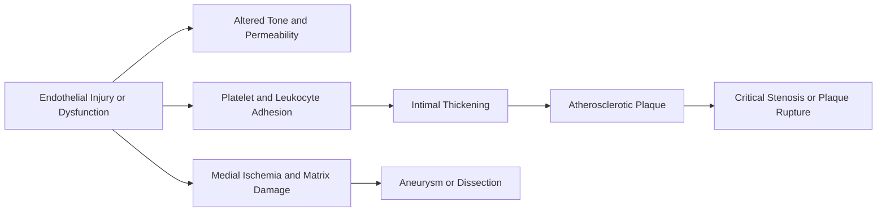
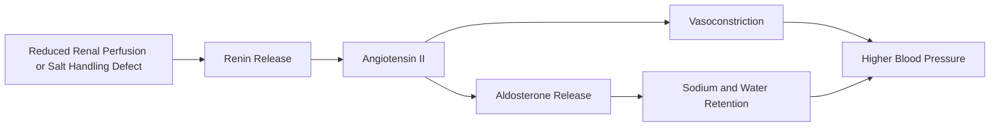

# 10 - Blood Vessels - Study Notes

## Description

Third-party generated study notes for Chapter 10, "Blood Vessels." These notes are designed as revision aids and website-ready study content derived from the local Chapter 10 textbook PDF, with trusted college material used for exam framing and topic prioritization.

## Source Notes

- Primary textbook chapter source: `Robbins Basic Pathology`, 10th Edition, Chapter 10, "Blood Vessels."
- Course-alignment source: `RCPA - Basic Pathological Sciences Syllabus 2026 - October 2025.`
- Style reference source: `BPS 2026 Mock Exam Question Set.`
- Syllabus emphasis note: current BPS Section 11 prioritizes arteriosclerosis, hypertension, atherosclerosis, aneurysms/dissection, and vasculitis; vascular tumours and pathology of vascular intervention are not in the current syllabus emphasis.

## Page Reference Convention

Inline citations in this document use the format `\\[n\\]`, where `n` is the **printed book page number** as it appears in the physical Robbins Basic Pathology 10th Edition textbook, not the sequential page position within the chapter PDF file. Chapter 10 occupies book pages 361-398; the printed page number is visible in the running header or footer of each page in the chapter PDF. Citations verified against the Chapter 10 source PDF.

## Disclaimer

These notes are third-party generated study materials. They are not produced by, reviewed by, approved by, endorsed by, or affiliated with the textbook authors, Elsevier, the Royal College of Pathologists of Australasia, or any other authority, institution, publisher, or examining body.

## Exam Alignment

The current syllabus makes the following Chapter 10 areas highest priority for exam revision:

1. Arteriosclerosis
2. Hypertension
3. Atherosclerosis
4. Aneurysms and dissection
5. Vasculitis

Chapter 10 also covers vascular hyperreactivity, venous and lymphatic disease, vascular tumours, and pathology of vascular intervention. Those sections remain useful for broader revision, but the syllabus explicitly excludes vascular tumours and vascular intervention from current BPS emphasis.

## Big Picture

Blood vessel disease produces harm in two main ways: by narrowing or suddenly occluding the lumen, or by weakening the wall and allowing dilation, dissection, or rupture. Endothelial injury sits at the center of both patterns, linking hypertension, arteriosclerosis, atherosclerosis, thrombosis, aneurysm formation, and vasculitis. \\[361\\]\\[368\\]

## 1. Vascular Organization and Endothelial Biology

All blood vessels are fundamentally tubes built from smooth muscle cells (SMCs) and extracellular matrix (ECM) with a continuous endothelial-cell (EC) lining facing the lumen. What changes from vessel to vessel is the relative amount of elastin, SMC, ECM, and the functional specialization of the endothelium. \\[361\\]\\[362\\]

### Vessel types at a glance

| Vessel type | Main structural feature | Main function | High-yield point |
| --- | --- | --- | --- |
| Elastic arteries | Media rich in elastic lamellae | Dampens pulsatile flow | Stiffening with age, diabetes, or hypertension transmits pressure distally |
| Muscular arteries | Media rich in SMCs | Distributes blood to organs | Coronary and renal arteries are classic examples |
| Arterioles | Tiny SMC-rich resistance vessels | Control pressure and tissue perfusion | Small diameter changes cause large resistance changes |
| Capillaries | Thin EC wall, pericytes | Exchange of gases and solutes | Diffusion is inefficient beyond about 100 um |
| Veins | Thin wall, large lumen, low pressure | Capacitance reservoir and venous return | Valves are crucial in lower limbs |
| Lymphatics | Thin endothelial channels | Drain interstitial fluid and immune cells | Important in edema, infection spread, and metastasis |

This organization explains why atherosclerosis prefers larger arteries, why arterioles dominate peripheral resistance, and why veins are prone to dilation and compression. \\[362\\]\\[363\\]

Arterioles are especially important because resistance to flow is inversely proportional to the fourth power of vessel radius. Halving the diameter increases resistance 16-fold, which is why arteriolar tone is so powerful in blood-pressure control. \\[362\\]

### Endothelial function

The endothelium is a metabolically active organ, not a passive lining. In the resting state it preserves permeability, keeps blood fluid, modulates inflammation, produces ECM, and controls vascular tone through vasodilators such as nitric oxide and prostacyclin and vasoconstrictors such as endothelin and angiotensin-converting enzyme activity. \\[363\\]\\[364\\]

| Resting endothelium | Activated or injured endothelium |
| --- | --- |
| Maintains non-thrombogenic surface | Expresses prothrombotic molecules such as tissue factor and von Willebrand factor |
| Limits leukocyte adhesion | Recruits inflammatory cells via adhesion molecules and cytokines |
| Produces NO and prostacyclin | Can favor vasoconstriction through endothelin and loss of NO balance |
| Maintains barrier function | Becomes more permeable and promotes edema/inflammation |

Once ECs become dysfunctional, vascular pathology becomes much more likely. That single shift drives thrombosis, hypertensive injury, and the earliest steps of atherogenesis. \\[363\\]\\[368\\]

## 2. Blood Pressure Regulation and Hypertensive Vascular Disease

Systemic blood pressure is determined by cardiac output and peripheral vascular resistance. Normal control depends on renal sodium handling, the renin-angiotensin-aldosterone system, natriuretic peptides, the sympathetic nervous system, and local endothelial mediators. \\[364\\]\\[365\\]

### Core control systems

- Angiotensin II raises blood pressure by constricting vascular SMC, stimulating aldosterone release, and increasing renal sodium retention. \\[365\\]
- Natriuretic peptides oppose volume expansion and help lower pressure. \\[365\\]
- Local vascular tone is also shaped by EC-derived nitric oxide, prostacyclin, and endothelin. \\[362\\]\\[364\\]

### Hypertension

Hypertension affects about one quarter of the population and is a major risk factor for atherosclerosis, heart failure, renal failure, cerebrovascular hemorrhage, and aortic dissection. Roughly 90% to 95% of cases are essential (primary) hypertension, while the remainder are secondary to identifiable causes such as renal disease, renovascular narrowing, or adrenal/endocrine disorders. \\[366\\]\\[368\\]

Essential hypertension is a multifactorial disorder driven by environmental factors plus genetic variants affecting sodium resorption, aldosterone pathways, adrenergic tone, and the renin-angiotensin system. Single-gene forms exist, but they account for only a small minority of cases. \\[366\\]\\[367\\]

### Small-vessel lesions of hypertension

| Lesion | Typical setting | Morphology | Consequence |
| --- | --- | --- | --- |
| Hyaline arteriolosclerosis | Benign hypertension, also diabetes | Pink hyaline wall thickening with luminal narrowing | Chronic ischemia, especially nephrosclerosis |
| Hyperplastic arteriolosclerosis | Severe or malignant hypertension | Concentric "onion-skin" laminated thickening | Marked luminal narrowing and end-organ ischemia |
| Necrotizing arteriolitis | Malignant hypertension | Fibrinoid necrosis superimposed on severe arteriolar injury | Particularly prominent in the kidney |

Hyaline arteriolosclerosis reflects plasma leakage across injured ECs plus increased ECM production by SMCs in response to chronic hemodynamic stress. Hyperplastic arteriolosclerosis is the classic lesion of severe hypertension, and when accompanied by fibrinoid necrosis it signals malignant vascular injury. \\[367\\]\\[368\\]

## 3. Vascular Wall Injury, Intimal Thickening, and Arteriosclerosis

Most vascular disease begins with injury or dysfunction of the endothelium. Healing recruits SMCs or SMC precursors into the intima, where they proliferate and make ECM, generating a neointima. That process is reparative in principle, but repeated or persistent injury converts repair into stenosing disease. \\[368\\]\\[369\\]

### Stereotyped response to injury

Intimal thickening is the vessel wall's default wound-healing response to infection, inflammation, immune injury, hypertension, oxidized lipids, cigarette smoke, catheter trauma, and other insults. This same mechanism explains restenosis after stenting and contributes to chronic transplant vasculopathy. \\[368\\]\\[369\\]

### Types of arteriosclerosis

Arteriosclerosis literally means arterial wall thickening and loss of elasticity. Chapter 10 distinguishes four patterns with different clinical consequences. \\[369\\]

| Type | Key feature | Usual clinical significance |
| --- | --- | --- |
| Arteriolosclerosis | Small-vessel wall thickening | Causes downstream ischemic injury |
| Monckeberg medial sclerosis | Calcification in muscular arteries, usually at internal elastic lamina | Usually does not narrow lumen and is often incidental |
| Fibromuscular intimal hyperplasia | Non-atherosclerotic SMC- and ECM-rich intimal thickening | Can produce stenosis after injury or inflammation |
| Atherosclerosis | Intimal atheromatous plaque with fibrous cap and lipid core | Dominant clinically important form |

Monckeberg medial sclerosis is important to recognize because calcification does not necessarily mean flow-limiting plaque. By contrast, fibromuscular intimal hyperplasia and atherosclerosis both produce true stenosis. \\[369\\]

## 4. Atherosclerosis

Atherosclerosis is the most frequent and clinically important pattern of arteriosclerosis. It is an intimal disease composed of a fibrous cap over a soft lipid-rich necrotic core, and it underlies major coronary, cerebral, and peripheral vascular syndromes. \\[369\\]

### Risk factors

| Nonmodifiable | Modifiable and clinically actionable |
| --- | --- |
| Age, male sex, family history, and genetic abnormalities | Hyperlipidemia, hypertension, cigarette smoking, diabetes mellitus, and inflammation |

LDL is the principal atherogenic lipoprotein because it delivers cholesterol to peripheral tissues and accumulates in plaques. HDL is protective because it mobilizes cholesterol from developing or established plaques and returns it to the liver. \\[371\\]

Other associated risks include elevated lipoprotein(a), hyperhomocysteinemia, metabolic syndrome, procoagulant states, clonal hematopoiesis, and difficult-to-quantify factors such as inactivity and chronic stress. \\[372\\]

### Response-to-injury model

The best conceptual framework is the response-to-injury hypothesis: atherosclerosis is a chronic inflammatory response of the arterial wall to endothelial injury. \\[372\\]

The key pathogenic events are EC dysfunction, lipoprotein accumulation, platelet adhesion, monocyte recruitment, macrophage foam-cell formation, T-cell driven inflammation, and SMC migration with ECM production. \\[372\\]\\[374\\]

### Why endothelial dysfunction matters first

The most important early triggers are hemodynamic disturbance and hypercholesterolemia. Lesions favor branch points and ostia where flow is turbulent, while laminar flow is relatively atheroprotective. Chronic hyperlipidemia impairs EC function directly and promotes deposition of modified lipids in the intima. \\[373\\]

Oxidized LDL is particularly pathogenic because it is taken up by scavenger receptors to create foam cells, stimulates cytokine and chemokine release, and is toxic to ECs and SMCs. Cholesterol crystals also act as danger signals that activate inflammasome pathways and IL-1 production. \\[374\\]

### Morphology and progression

Fatty streaks are flat collections of foam cells that appear even in childhood and adolescence, especially at plaque-prone sites. Not all fatty streaks progress, but they mark the territory in which mature plaques later form. \\[374\\]

Mature plaques are patchy and eccentric. In descending order of typical severity, atherosclerosis most heavily affects the infrarenal abdominal aorta, coronary arteries, popliteal arteries, internal carotids, and vessels of the circle of Willis. \\[374\\]

| Stable plaque | Vulnerable plaque |
| --- | --- |
| Thick, collagen-rich fibrous cap | Thin fibrous cap |
| Smaller lipid core | Large lipid core |
| Less inflammation | More macrophages and inflammatory cells |
| More likely to produce fixed stenosis | More likely to rupture and thrombose |

This distinction matters clinically because stable plaques mainly cause chronic ischemia, while vulnerable plaques cause acute events. \\[377\\]\\[378\\]

### Complications that matter in exams

- Progressive stenosis causes chronic ischemia. In the coronary circulation, symptoms typically appear when about 70% of the lumen is occluded. \\[377\\]
- Plaque rupture, erosion, or ulceration exposes thrombogenic material and can trigger acute thrombosis and infarction. \\[376\\]\\[377\\]
- Hemorrhage into a plaque can rapidly enlarge it or precipitate rupture. \\[376\\]
- Plaque-mediated medial weakening helps set the stage for aneurysm formation. \\[369\\]\\[377\\]

One of the most important exam ideas is that myocardial infarction can arise from a previously asymptomatic lesion. The event is often triggered by thrombosis superimposed on a vulnerable plaque that was not yet causing critical chronic stenosis. \\[377\\]\\[378\\]

### Prevention logic

Lowering LDL by diet or drugs slows progression, can regress some plaques, and reduces cardiovascular events. Statins may also stabilize plaques by reducing plaque inflammation, not merely by lowering serum cholesterol. \\[371\\]\\[377\\]

## 5. Aneurysms and Dissections

An aneurysm is a congenital or acquired dilation of a blood vessel or the heart. True aneurysms involve all layers of the wall, whereas false aneurysms are contained extravascular hematomas that communicate with the intravascular lumen through a wall defect. Dissection is different again: blood enters the wall and splits the laminar planes of the media. \\[378\\]

### Shapes and definitions

| Entity | Definition | High-yield example |
| --- | --- | --- |
| True aneurysm | Wall intact but dilated | Atherosclerotic abdominal aortic aneurysm |
| False aneurysm | Rupture contained by surrounding tissue | Post-procedural pulsating hematoma |
| Saccular aneurysm | Focal outpouching | Berry aneurysm, some AAAs |
| Fusiform aneurysm | Circumferential dilation | Many aortic aneurysms |
| Dissection | Blood tracks within the media | Aortic dissection |

### Pathogenesis

Aneurysms form when alterations in SMCs or ECM reduce the structural integrity of the media. The main mechanisms are abnormal connective-tissue synthesis, excessive ECM degradation by metalloproteinases, and loss or phenotypic change of SMCs. \\[378\\]\\[379\\]

The two most important predisposing conditions for aortic aneurysms are atherosclerosis and hypertension. Atherosclerosis is dominant in abdominal aortic aneurysm (AAA), whereas hypertension is especially associated with ascending thoracic aortic aneurysm. \\[379\\]

Inherited connective-tissue disorders provide classic mechanistic examples: Marfan syndrome increases TGF-beta bioavailability because of defective fibrillin, and type IV Ehlers-Danlos syndrome reflects defective type III collagen synthesis. \\[379\\]

### Abdominal aortic aneurysm

AAAs usually arise between the renal arteries and the aortic bifurcation, are more common in men and smokers, and rarely appear before age 50. Pathogenetically, atherosclerotic inflammation promotes ECM degradation, while overlying plaques impair nutrient diffusion to the media, causing medial thinning and necrosis. \\[379\\]

| AAA complication | Why it matters |
| --- | --- |
| Branch-vessel obstruction | Renal, mesenteric, spinal, or limb ischemia |
| Cholesterol or thrombus embolization | Distal ischemic injury |
| Compression of nearby structures | Ureteral obstruction or vertebral erosion |
| Palpable pulsatile mass | Classic bedside clue |
| Rupture | Massive, often fatal hemorrhage |

Rupture risk rises sharply with size: aneurysms 4 cm or less almost never rupture, those 4 to 5 cm rupture at about 1% per year, those 5 to 6 cm at about 11% per year, and those greater than 6 cm at about 25% per year. This is why aneurysms 5 cm or larger are generally managed surgically. \\[380\\]

### Thoracic aortic aneurysm

Thoracic aortic aneurysms are associated with hypertension, bicuspid aortic valves, Marfan syndrome, and selected TGF-beta signaling disorders. The clinical manifestations often come from pressure on mediastinal structures: dysphagia, cough, recurrent laryngeal nerve irritation, coronary-ostial narrowing, valvular insufficiency, dissection, or rupture. \\[380\\]

### Aortic dissection

Aortic dissection occurs when blood enters the media and creates a blood-filled channel within the wall. It is not synonymous with aneurysm, and the older term dissecting aneurysm should be avoided. \\[380\\]\\[381\\]

| Type | Distribution | Why it matters |
| --- | --- | --- |
| Type A | Ascending aorta, with or without extension distally | Highest risk of fatal complications |
| Type B | Usually distal to the subclavian artery | Often managed differently and generally less immediately lethal |

Hypertension is the major risk factor for dissection, especially in men aged 40 to 60. Other important settings are connective-tissue disorders, pregnancy, and iatrogenic instrumentation. The classic presentation is sudden tearing or stabbing chest pain radiating to the back. \\[381\\]\\[382\\]

An important nuance is that substantial atherosclerosis tends to inhibit rather than promote propagation of dissection because medial scarring can block the path of the hematoma. \\[381\\]

## 6. Vasculitis

Vasculitis is inflammation of vessel walls. It commonly presents with fever, malaise, myalgias, arthralgias, and organ dysfunction determined by the size and distribution of involved vessels. Mechanistically, vasculitis can arise from immune-complex deposition, ANCA-mediated neutrophil activation, anti-endothelial antibodies, autoreactive T cells, or direct infection. \\[382\\]\\[384\\]

### Mechanisms to know

- Immune-complex vasculitis includes drug hypersensitivity reactions and some hepatitis B-associated cases of polyarteritis nodosa. \\[383\\]\\[386\\]
- PR3-ANCA is associated with granulomatosis with polyangiitis. \\[384\\]
- MPO-ANCA is associated with microscopic polyangiitis and eosinophilic granulomatosis with polyangiitis. \\[384\\]
- Anti-endothelial antibodies and autoreactive T cells contribute in disorders such as Kawasaki disease and giant cell arteritis. \\[384\\]\\[385\\]\\[387\\]

### Size-based framework

| Pattern | Examples | High-yield clue |
| --- | --- | --- |
| Large-vessel granulomatous vasculitis | Giant cell arteritis, Takayasu arteritis | Temporal headache/vision loss or pulseless disease |
| Medium-vessel necrotizing vasculitis | Polyarteritis nodosa, Kawasaki disease | Renal-visceral ischemia or childhood coronary arteritis |
| Small-vessel ANCA-associated vasculitis | GPA, microscopic polyangiitis, EGPA | Pulmonary, renal, and ENT disease patterns |
| Secondary or infectious vasculitis | Drug hypersensitivity, infection-associated | Think trigger, immune complexes, or direct invasion |

### Key syndromes

| Disease | Vessel size / territory | Classic exam clue |
| --- | --- | --- |
| Giant cell arteritis | Large to small arteries in the head | Age >50, temporal headache, visual symptoms, biopsy diagnosis |
| Takayasu arteritis | Aortic arch and great vessels | Pulseless disease in younger patients |
| Polyarteritis nodosa | Small- and medium-sized muscular arteries | Renal and visceral disease, spares pulmonary circulation |
| Kawasaki disease | Medium-sized arteries in children | Mucocutaneous lymph node syndrome with coronary arteritis |
| Granulomatosis with polyangiitis | Small to medium vessels | Upper/lower respiratory disease plus necrotizing GN, PR3-ANCA |

#### Giant cell arteritis

This is the most common vasculitis of older adults in developed countries. It is usually granulomatous, affects temporal, ophthalmic, vertebral, and sometimes aortic branches, and is a medical emergency because ophthalmic involvement can cause sudden irreversible blindness. It is rare before age 50 and responds well to corticosteroids. \\[384\\]\\[385\\]

#### Takayasu arteritis

Takayasu arteritis is a granulomatous vasculitis of medium- and large-sized arteries, particularly the aortic arch and great vessels. The hallmark is marked weakening of upper-extremity pulses with ocular or neurologic manifestations; renal artery disease can also cause systemic hypertension. \\[385\\]\\[386\\]

#### Polyarteritis nodosa

PAN is a systemic vasculitis of small- and medium-sized muscular arteries that typically involves renal and visceral vessels while sparing the pulmonary circulation. About one third of patients have chronic hepatitis B infection with immune-complex deposition. Untreated disease is often fatal, but immunosuppression markedly improves survival. \\[386\\]\\[387\\]

#### Kawasaki disease

Kawasaki disease is an acute febrile arteritis of infancy and childhood, most often affecting children younger than 4 years. Its importance lies in coronary involvement, because coronary arteritis can produce aneurysm, thrombosis, and myocardial infarction. \\[387\\]

#### Granulomatosis with polyangiitis

GPA is characterized by necrotizing granulomas of the upper and lower respiratory tract, necrotizing vasculitis, and focal necrotizing or crescentic glomerulonephritis. It is strongly associated with PR3-ANCA, and modern treatment has greatly improved survival. \\[388\\]\\[389\\]

## 7. Blood Vessel Hyperreactivity, Veins, and Lymphatics

### Raynaud phenomenon

Raynaud phenomenon reflects episodic vasoconstriction of small arteries and arterioles in the fingers or toes, producing the classic red-white-blue color change sequence. Primary Raynaud is due to exaggerated vasomotor responses to cold or emotion, usually in young women, and early structural lesions are absent. Secondary Raynaud suggests an underlying disease such as systemic lupus erythematosus, scleroderma, Buerger disease, or atherosclerosis. \\[390\\]

### Varicose veins and venous thrombosis

Varicose veins are abnormally dilated tortuous veins caused by chronically increased intraluminal pressure and weak wall support. Valve incompetence leads to stasis, edema, pain, thrombosis, stasis dermatitis, and chronic ulceration. \\[390\\]

Deep venous thrombosis accounts for most clinically relevant thrombophlebitis/phlebothrombosis. Prolonged immobility is the most important risk factor, with surgery, heart failure, pregnancy, oral contraceptives, malignancy, obesity, male sex, and older age also contributing. Pulmonary embolism is the major feared complication and may be the first sign of disease. \\[391\\]

### Lymphangitis and lymphedema

Lymphangitis appears as red painful subcutaneous streaks due to bacterial seeding of lymphatics and is often accompanied by tender draining lymph nodes. Obstructive lymphedema arises from tumors, surgery, radiation, filariasis, or post-inflammatory scarring; chronic edema can produce fibrosis, peau d'orange change, and ulceration. \\[391\\]

## 8. Lower-Priority Chapter Coverage: Vascular Tumours and Vascular Intervention

The current syllabus does not prioritize vascular tumours or pathology of vascular intervention, but Chapter 10 briefly extends into both areas for broader revision. The most common benign vascular tumors are hemangiomas, especially capillary and juvenile forms; many regress spontaneously. Important malignant or intermediate entities include Kaposi sarcoma and angiosarcoma. \\[391\\]\\[392\\]\\[394\\]\\[396\\]

The vascular intervention section is conceptually useful because balloon angioplasty, stenting, and bypass grafting reproduce the same injury-healing program discussed earlier in the chapter. The pathologic response is dominated by endothelial injury, SMC migration, neointimal hyperplasia, restenosis, and graft-related thrombosis or degeneration. \\[369\\]\\[397\\]

If time is limited for BPS revision, master Sections 11.1 to 11.5 first, then use these final pages for enrichment rather than first-pass memorization.

## Rapid Review Table

| Topic | One-line exam takeaway |
| --- | --- |
| Endothelial dysfunction | First step shared by thrombosis, hypertension-related damage, and atherogenesis |
| Arterioles | Main resistance vessels; tiny diameter changes strongly affect pressure |
| Essential hypertension | Common, multifactorial, and usually primary |
| Hyaline vs hyperplastic arteriolosclerosis | Benign chronic pressure injury versus severe malignant pressure injury |
| Atherosclerosis | Chronic inflammatory intimal plaque with lipid core and fibrous cap |
| Vulnerable plaque | Thin cap, large lipid core, high inflammation, high rupture risk |
| AAA | Usually atherosclerotic, infrarenal, smoking-associated |
| Aortic dissection | Hypertension-related medial splitting with tearing chest/back pain |
| Giant cell arteritis | Age >50 with visual risk; diagnose fast, treat fast |
| Takayasu arteritis | Pulseless disease of the aortic arch/great vessels |
| PAN | Medium-vessel necrotizing vasculitis, renal/visceral, pulmonary sparing |
| Kawasaki disease | Childhood vasculitis with coronary aneurysm/thrombosis risk |
| GPA | PR3-ANCA, ENT/lung/kidney disease |
| DVT | Think immobility and pulmonary embolism |

## Final Takeaways

The exam logic of Chapter 10 is to connect mechanism to morphology and then to clinical consequence. If you can move confidently through the chain of endothelial injury -> intimal response -> plaque or pressure lesion -> thrombosis/ischemia/rupture, the chapter becomes much easier to organize. Most BPS-style questions test that chain, not isolated histology facts. \\[368\\]\\[372\\]\\[377\\]
