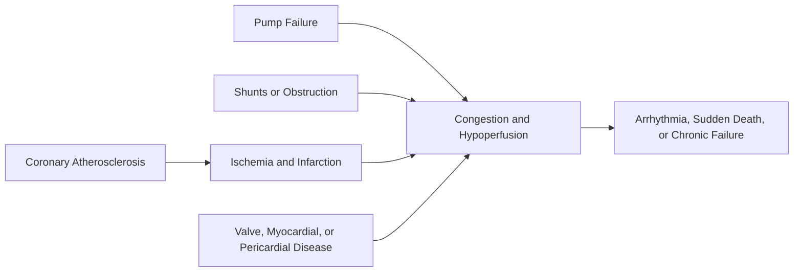

<!-- markdownlint-disable MD052 MD060 -->

# 11 - Heart - Study Notes

## Description

Third-party generated study notes for Chapter 11, "Heart." These notes are designed as revision aids and website-ready study content derived from the local Chapter 11 textbook PDF, with trusted college material used only for broad exam framing and style alignment where relevant.

## Source Notes

- Primary textbook chapter source: `Robbins Basic Pathology`, 10th Edition, Chapter 11, `Heart`.
- Course-alignment source: `RCPA - Basic Pathological Sciences Syllabus 2026 - October 2025.` This organ-system chapter is not directly mirrored by a single syllabus section, so the syllabus was used only for broad exam-framing discipline rather than topic mapping.
- Trusted style reference: `BPS 2026 Mock Exam Question Set.`

## Page Reference Convention

Inline citations in this document use the format `[n]`, where `n` is the printed book page number as it appears in the physical Robbins Basic Pathology 10th Edition textbook, not the sequential page position within the chapter PDF file. Chapter 11 occupies book pages 399-440; the printed page number is visible in the running header or footer of each page in the chapter PDF. Citations were checked against the Chapter 11 source PDF.

## Disclaimer

These notes are third-party generated study materials. They are not produced by, reviewed by, approved by, endorsed by, or affiliated with the textbook authors, Elsevier, the Royal College of Pathologists of Australasia, or any other authority, institution, publisher, or examining body.

## Exam Alignment

This chapter is more organ-system specific than the core general-pathology BPS syllabus sections, so revision is best organized around the disease mechanisms that repeatedly recur in assessment: pump failure, shunts and obstructive lesions, coronary ischemia, infarction timing, valve pathology, cardiomyopathy patterns, myocarditis, pericardial disease, and sudden death risk. [399][400][403][408][419][422][429][436]

## Big Picture

Heart disease in Robbins is organized less by symptoms and more by a small set of recurring pathophysiologic failures: the pump can fail, blood can flow in the wrong direction, blood supply can become inadequate, valves can deform, the myocardium can become intrinsically abnormal, and electrical activity can become unstable. Most clinically important syndromes are combinations of those mechanisms rather than isolated problems. [399][400]

## 1. Overview of Heart Disease and Heart Failure

Robbins reduces major cardiac pathology to six principal mechanisms: failure of the pump, obstruction to forward flow, regurgitant flow, shunted flow, conduction disorders, and rupture of the heart or a major vessel. That framework explains why very different diseases can still converge on cardiogenic shock, congestion, arrhythmia, or sudden death. [399]

Congestive heart failure is the common end point for many cardiac diseases and means that the heart cannot generate enough output to satisfy tissue demands, or can do so only at abnormally high filling pressures. Systolic dysfunction reflects impaired contractility, whereas diastolic dysfunction reflects impaired relaxation and filling; both eventually produce a mixture of forward failure and backward congestion. [400]

### High-yield heart-failure distinctions

| Pattern | Core defect | Common setting | Consequence |
|---|---|---|---|
| Systolic dysfunction | Weak contraction | Ischemic heart disease, hypertension | Reduced ejection and chamber emptying |
| Diastolic dysfunction | Impaired relaxation/filling | LV hypertrophy, fibrosis, amyloid, constrictive pericarditis | Elevated filling pressures despite preserved contraction |
| Forward failure | Inadequate cardiac output | Any severe CHF | Renal, cerebral, and systemic hypoperfusion |
| Backward failure | Venous congestion | Any severe CHF | Pulmonary or systemic edema and effusions |
| Concentric hypertrophy | Parallel sarcomere addition | Pressure overload | Thick wall, relatively small chamber |
| Eccentric hypertrophy | Series sarcomere addition | Volume overload | Dilated chamber with variable wall thickness |

These distinctions are the core conceptual vocabulary for the entire heart-failure section. [400][401]

Compensation initially relies on the Frank-Starling mechanism, neurohumoral activation, and hypertrophy, but each adaptation imposes a cost. Ventricular dilation increases wall tension and oxygen demand, catecholamine and renin-angiotensin signaling sustain afterload and volume retention, and hypertrophy outgrows the capillary bed, making the myocardium increasingly vulnerable to ischemia, apoptosis, fibrosis, and eventual decompensation. [400][401]

### Left-sided versus right-sided failure

| Feature | Left-sided heart failure | Right-sided heart failure |
|---|---|---|
| Typical causes | IHD, systemic hypertension, mitral or aortic valve disease, primary myocardial disease | Most often secondary to left-sided failure; isolated cor pulmonale from pulmonary disease |
| Dominant back-pressure site | Pulmonary circulation | Systemic venous circulation |
| Classic morphology | LV hypertrophy and often dilation; pulmonary edema | RV and RA hypertrophy/dilation; enlarged pulmonary artery |
| Characteristic symptoms/signs | Dyspnea, orthopnea, paroxysmal nocturnal dyspnea, rales, S3 gallop | Hepatomegaly, peripheral edema, ascites, elevated JVP |
| Useful pathology clue | Hemosiderin-laden macrophages in lungs | Congestive enlargement of liver and spleen |

The key exam distinction is that isolated right-sided failure is usually a venous-congestion syndrome without primary respiratory symptoms, whereas left-sided failure is dominated by pulmonary congestion and impaired systemic perfusion. [401][403]

Orthopnea and paroxysmal nocturnal dyspnea reflect redistribution of fluid and increased venous return when recumbent, while chronic pulmonary edema leaves hemosiderin-laden "heart failure cells" in alveoli. Atrial enlargement can trigger atrial fibrillation, which further reduces stroke volume and increases thromboembolic risk. [401][402]

Right-sided failure usually follows left-sided failure, but isolated cor pulmonale results from primary lung or pulmonary vascular disease. The RV hypertrophies and dilates, the septum can bulge leftward, and patients develop hepatosplenomegaly, dependent edema, serous effusions, and portal-hypertension-type findings from systemic venous congestion. [402][403]

## 2. Congenital Heart Disease

Congenital heart disease arises mainly from faulty embryogenesis during weeks 4 to 8, when the major cardiac structures are forming. The cause is unknown in most cases, but environmental factors such as rubella, maternal diabetes, and teratogens, along with genetic lesions affecting pathways such as Wnt, VEGF, BMP, TGF-beta, Notch, and transcription-factor networks, all contribute. [403][404]

### Hemodynamic categories

| Category | Core physiology | Cyanosis pattern | Representative lesions |
|---|---|---|---|
| Left-to-right shunts | Pulmonary overcirculation from systemic-to-pulmonary flow | Usually absent early | ASD, VSD, PDA |
| Right-to-left shunts | Deoxygenated blood enters systemic circulation | Early cyanosis | Tetralogy of Fallot, transposition of the great arteries |
| Obstructive lesions | Pressure overload proximal to narrowed outflow tract | Variable | Coarctation of the aorta |

This three-part classification is the fastest way to organize congenital lesions under exam conditions. [404][408]

ASD, VSD, and PDA all begin as acyanotic left-to-right shunts, but they differ in timing and hemodynamic burden. ASD is often tolerated for years and discovered in adulthood, VSD is the most common defect at birth and frequently closes spontaneously if small, and PDA classically produces a continuous machinery murmur because the high-pressure aorta continuously drives blood into the pulmonary artery. [404][406]

Long-standing left-to-right shunting can remodel pulmonary vasculature, increase pulmonary resistance, and reverse the shunt so that unoxygenated blood enters systemic circulation. That irreversible late reversal is Eisenmenger syndrome and explains delayed cyanosis, clubbing, polycythemia, and hyperviscosity in previously acyanotic defects. [404][406]

Tetralogy of Fallot combines VSD, right-ventricular outflow obstruction, an overriding aorta, and RV hypertrophy. Clinical severity depends mainly on the degree of pulmonic outflow obstruction: mild obstruction can mimic a VSD, whereas severe obstruction produces early cyanosis, a boot-shaped heart, and the classic complications of chronic right-to-left shunting. [406][407]

Transposition of the great arteries creates parallel rather than serial circulations because the aorta arises from the right ventricle and the pulmonary artery from the left ventricle. Life after birth therefore depends on a mixing lesion such as a VSD, patent foramen ovale, or PDA until emergent surgical correction is achieved. [407]

Coarctation of the aorta is the high-yield obstructive lesion. The infantile preductal form depends on a PDA for distal perfusion and causes lower-body cyanosis early in life, whereas the adult postductal form presents later with upper-extremity hypertension, weak lower-extremity pulses, claudication, and collateral intercostal flow that produces rib notching on imaging. [407][408]

## 3. Ischemic Heart Disease and Angina

Ischemic heart disease is an imbalance between myocardial oxygen supply and demand, and more than 90% of cases reflect atherosclerotic coronary artery disease. Fixed stenoses of less than 70% are often clinically silent, stenoses greater than 70% limit flow during exertion, and stenoses of 90% or more can compromise perfusion even at rest. [408][410]

Acute coronary syndromes are driven less by the size of the chronic plaque than by abrupt plaque change. Vulnerable plaques have large lipid cores, thin fibrous caps, and many macrophages but relatively little stabilizing smooth muscle and collagen; rupture or erosion exposes thrombogenic material, promotes platelet aggregation and vasospasm, and can convert a previously noncritical lesion into complete occlusion within minutes. [409][410]

Inflammation contributes to every stage of atherosclerosis, thrombosis converts plaque disruption into a clinical event, and vasospasm can both worsen narrowing and increase local shear forces that make disruption more likely. The classic circadian peak of acute MI between early morning and noon reflects adrenergic surges superimposed on vulnerable coronary plaques. [409][410]

### Angina patterns

| Type | Mechanism | Trigger pattern | Practical clue |
|---|---|---|---|
| Stable angina | Fixed atherosclerotic narrowing | Predictable exertion | Relieved by rest or nitroglycerin |
| Prinzmetal angina | Coronary vasospasm | Often at rest | Rapid vasodilator response |
| Unstable angina | Plaque disruption with thrombosis, embolization, or spasm | Increasing frequency, less exertion, or rest pain | Warning sign for impending infarction |

If the stem says the pain is becoming more frequent, occurs with less exertion, or appears at rest, think unstable angina rather than ordinary fixed-stenosis disease. [411]

## 4. Myocardial Infarction

Myocardial infarction is necrosis of myocardium caused by ischemia, usually from acute thrombosis superimposed on preexisting atherosclerosis. LAD occlusion is the most common distribution, RCA is second, LCX is third, and the infarct territory depends on coronary dominance, speed of occlusion, and adequacy of collateral flow. [411][413]

The subendocardium is the most vulnerable zone because it is furthest from the epicardial blood supply and experiences the highest intramural pressures. That is why necrosis begins there and why global hypoperfusion or transient partial occlusion tends to cause subendocardial rather than transmural infarction. [413][414]

### Infarct patterns

| Pattern | Typical mechanism | ECG association | Distribution |
|---|---|---|---|
| Transmural infarct | Persistent epicardial coronary occlusion | ST elevation and later Q waves | Through most or all of wall thickness |
| Subendocardial infarct | Partial or transient occlusion, or diffuse hypotension with severe CAD | ST depression or T-wave changes without Q waves | Inner third to half of wall |
| Microinfarct | Small-vessel occlusion, emboli, vasculitis, spasm | Often nondiagnostic | Scattered microscopic foci |

This is the core ECG-pathology link the chapter expects you to know. [413][414]

### Morphologic evolution of MI

| Time after infarct | High-yield pathology |
|---|---|
| 0-4 hours | Usually no gross change; early reversible injury on EM only |
| 4-24 hours | Early coagulative necrosis, edema, hemorrhage, wavy fibers, early neutrophils |
| 1-3 days | Dense coagulative necrosis with heavy neutrophilic infiltrate |
| 3-7 days | Macrophage cleanup; myocardium soft and rupture-prone |
| 7-14 days | Granulation tissue becomes established |
| 2-8 weeks | Progressive collagen deposition and scar formation |
| More than 2 months | Dense collagenous scar |

When the question asks when rupture risk peaks, the key interval is 3 to 7 days, when the infarct is maximally soft because dead myocardium has been digested but strong scar has not yet formed. [414][418]

Reperfusion is lifesaving because it salvages reversibly injured myocardium, but it also produces reperfusion injury. The important mechanisms are mitochondrial dysfunction, calcium-driven hypercontracture, oxygen free radicals, leukocyte plugging of microvasculature, and platelet/complement activation. The signature morphologic clue is contraction band necrosis in a hemorrhagic reperfused infarct. [415][416]

Cardiac troponins are the most sensitive and specific serum markers in current use. They rise within hours, peak at about 48 hours, and remain elevated for 7 to 10 days, whereas CK-MB normalizes much earlier and is therefore more useful if reinfarction soon after the first event is suspected. [416]

### Major MI complications

| Complication | Why it happens | High-yield timing or clue |
|---|---|---|
| Arrhythmia | Electrical instability in ischemic myocardium | Most common early killer |
| Pump failure / cardiogenic shock | More than 40% LV damaged | Worst with large transmural infarcts |
| Free-wall rupture | Soft necrotic myocardium gives way | Usually 3-7 days; hemopericardium and tamponade |
| Septal rupture | Interventricular septum tears | New VSD and left-to-right shunt |
| Papillary muscle rupture | Mechanical failure of valvular support | Acute severe mitral regurgitation |
| Mural thrombus | Stasis plus endocardial injury | Embolic stroke risk |
| Ventricular aneurysm | Thin fibrous scar bulges chronically | Heart failure, arrhythmia, mural thrombus; rarely ruptures |

Chronic ischemic heart disease is the long-term failure syndrome that follows old infarction or diffuse ischemic injury. Morphologically it shows LV hypertrophy and dilation, healed gray-white scars, significant CAD, and often endocardial thickening or mural thrombi. [416][419]

## 5. Arrhythmias, Sudden Cardiac Death, and Hypertensive Heart Disease

Arrhythmias can arise anywhere from the SA node to an individual ventricular myocyte. The high-yield causes in this chapter are ischemic injury, chamber dilation, intrinsic conduction-system disease, and inherited channelopathies such as long QT syndrome, in which ion-channel mutations prolong repolarization and predispose to malignant ventricular arrhythmias. [419][420]

Atrial fibrillation is the classic rhythm consequence of atrial dilation. The atria depolarize chaotically, AV-node transmission becomes variable, the rhythm becomes irregularly irregular, and the combination of poor atrial emptying and chamber enlargement increases thromboembolic risk. [419][420]

Sudden cardiac death is unexpected death from a lethal arrhythmia, usually asystole or ventricular fibrillation. Coronary artery disease accounts for 80% to 90% of cases, yet most victims do not show a fresh infarct at autopsy; the usual immediate mechanism is electrical instability in ischemic myocardium rather than massive new necrosis. [420]

Systemic hypertensive heart disease is identified by LV hypertrophy in a patient with hypertension and no other sufficient cause of hypertrophy. The gross pattern is concentric LV thickening, the microscopy shows enlarged boxcar nuclei and interstitial fibrosis, and the clinical course may remain silent for years before atrial fibrillation, ischemic disease, CHF, or sudden death emerges. [420][421]

Pulmonary hypertensive heart disease, or cor pulmonale, is the RV hypertrophy and dilation caused by pulmonary hypertension secondary to lung parenchymal, pulmonary vascular, chest wall, or hypoventilation disorders. It explicitly excludes RV changes due to left-heart disease or congenital shunts. Acute cor pulmonale causes sudden RV dilation, whereas chronic cor pulmonale produces RV and often RA hypertrophy. [422]

## 6. Valvular Disease and Endocarditis

Valves fail either by stenosis, which obstructs forward flow, or by insufficiency, which allows reverse flow. Murmurs are the auscultatory expression of turbulence, and the tempo of valve injury matters: slow deformation allows prolonged compensation, while abrupt destructive lesions can cause sudden hemodynamic collapse. [422]

### High-yield valve lesions

| Lesion | Key pathology | Classic clue |
|---|---|---|
| Calcific aortic stenosis | Heaped-up calcific masses on outflow side of cusps without commissural fusion | Symptoms of angina, syncope, or CHF predict poor survival without surgery |
| Myxomatous mitral valve prolapse | Redundant floppy leaflets with expanded spongiosa and attenuated fibrosa | Midsystolic click with or without regurgitant murmur |
| Rheumatic mitral stenosis | Commissural fusion, chordal thickening, scarring, calcification | Fishmouth or buttonhole valve; atrial dilation and atrial fibrillation |
| Infective endocarditis | Friable infected vegetations with tissue destruction | Fever is most consistent sign; embolic and septic complications |
| NBTE | Small sterile bland vegetations on otherwise normal valves | Hypercoagulable or wasting states, especially mucinous adenocarcinoma |

This table is the most efficient way to separate degenerative, inflammatory, infectious, and sterile vegetations. [423][429]

Calcific aortic stenosis is the most common cause of acquired aortic stenosis. In a normal tricuspid valve it presents late in life, but in a bicuspid valve it appears much earlier. Once the patient develops angina, CHF, or syncope, the prognosis rapidly worsens without valve replacement. [423][424]

Primary myxomatous mitral valve disease causes floppy ballooning leaflets, elongated or ruptured chordae, and the classic midsystolic click. Most cases are benign, but the lesion can progress to significant mitral regurgitation, infective endocarditis, arrhythmia-related sudden death, or embolic events. [424][425]

Rheumatic heart disease is an immune-mediated sequela of group A streptococcal infection. Acute disease produces pancarditis with pathognomonic Aschoff bodies and small verrucae along valve closure lines; chronic disease replaces active inflammation with fibrotic scarring, commissural fusion, and chordal thickening, especially in the mitral valve. [425][427]

Infective endocarditis is microbial infection of valves or mural endocardium. Viridans streptococci classically seed previously damaged valves, whereas Staphylococcus aureus can attack normal valves and is especially important in intravenous drug users. Friable vegetations embolize easily, may erode into myocardium to form ring abscesses, and can produce petechiae, splinter hemorrhages, Roth spots, Janeway lesions, Osler nodes, and immune-complex glomerulonephritis. [427][428]

Nonbacterial thrombotic endocarditis and Libman-Sacks endocarditis are the two important sterile vegetation syndromes in this chapter. NBTE occurs in hypercoagulable states and is important because of embolization or later bacterial colonization, whereas Libman-Sacks lesions in SLE reflect immune-complex injury and can occur on either valve surface or even adjacent endocardium. [428][429]

## 7. Cardiomyopathies and Myocarditis

Cardiomyopathies are intrinsic myocardial diseases divided functionally into dilated, hypertrophic, and restrictive forms. DCM is primarily a systolic pump-failure disease, whereas HCM and restrictive cardiomyopathy are mainly diastolic filling disorders. [429][434]

### Cardiomyopathy comparison

| Type | Functional defect | Morphology | Signature association |
|---|---|---|---|
| Dilated cardiomyopathy | Systolic dysfunction | Flabby enlarged heart with four-chamber dilation | Familial disease, alcohol, myocarditis, peripartum state, doxorubicin, iron overload |
| Arrhythmogenic RV cardiomyopathy | Rhythm disturbance and RV failure | Thinned RV wall with fatty replacement and fibrosis | Desmosomal protein mutations; sudden death in athletes |
| Hypertrophic cardiomyopathy | Diastolic dysfunction, sometimes dynamic outflow obstruction | Massive hypertrophy, often asymmetric septal; myofiber disarray | Sarcomeric gain-of-function mutations; sudden death in young athletes |
| Restrictive cardiomyopathy | Impaired ventricular compliance | Stiff ventricle, nondilated chambers, enlarged atria | Amyloid, endomyocardial fibrosis, Loeffler endocarditis, radiation fibrosis |

These phenotypes are the essential cardiomyopathy pattern-recognition table. [429][435]

Dilated cardiomyopathy usually presents between ages 20 and 50 with progressive CHF, low ejection fraction, mural thrombi, arrhythmia, and poor survival. About 20% to 50% of cases are genetic, but myocarditis, chronic alcohol use, anthracyclines, peripartum states, and iron overload are all important acquired routes into the same end-stage dilated phenotype. [429][433]

Arrhythmogenic right ventricular cardiomyopathy is an autosomal dominant desmosomal disease in which RV myocardium is progressively replaced by fat and fibrosis. It is disproportionately important because it is overrepresented among sudden deaths in athletes. [432]

Hypertrophic cardiomyopathy is a sarcomeric gain-of-function disease, most often caused by beta-myosin heavy-chain or myosin-binding protein C mutations. The heart is thick, hypercontractile, and nondilated, the septum is often asymmetrically enlarged, the cavity may become banana-shaped, and histology shows myocyte disarray plus interstitial fibrosis. [432][434]

Restrictive cardiomyopathy is the stiff-heart pattern. Amyloid, endomyocardial fibrosis, and Loeffler endocarditis are the classic textbook causes, and the clue is impaired filling with enlarged atria but ventricles that are normal sized or only slightly enlarged rather than massively dilated. [433][434]

Myocarditis is inflammation targeting the myocardium, most commonly viral in the United States. The biopsy pattern is usually patchy lymphocytic infiltrates with myocyte injury, which is why small biopsy samples can miss the diagnosis. Viral injury may be direct, but immune-mediated injury to infected myocytes is often more important. [434][436]

Nonviral causes of myocarditis include Chagas disease, Lyme disease, Toxoplasma, drug hypersensitivity, systemic immune disease, and toxic catecholamine states. Giant-cell myocarditis is the aggressive poor-prognosis extreme, while hypersensitivity myocarditis is notable for eosinophil-rich infiltrates. [435][436]

## 8. Pericardial Disease, Cardiac Tumors, Carcinoid Disease, and Transplantation

The pericardial space normally contains only a small volume of clear fluid, but the clinical effect of extra fluid depends more on rate than absolute volume. A slowly accumulating effusion can become large with little compromise, whereas an acute hemopericardium of only a few hundred milliliters can cause fatal cardiac tamponade by compressing thin-walled chambers and restricting filling. [436]

Acute pericarditis usually causes chest pain that is worse when recumbent and a friction rub rather than exertional ischemic pain. Viral and uremic cases are typically fibrinous and produce the classic bread-and-butter appearance, while purulent bacterial or tuberculous infection can heal by dense fibrosis and, in extreme cases, constrictive pericarditis. [436][437]

Myxoma is the most common primary cardiac tumor in adults and usually arises in the left atrium near the fossa ovalis. Its importance is mechanical and systemic: it can intermittently obstruct the AV valve like a ball valve, embolize, or trigger constitutional symptoms through IL-6 production. Rhabdomyoma is the dominant primary cardiac tumor of infancy and childhood and is strongly linked to tuberous sclerosis. [437][438]

Carcinoid heart disease is a right-sided plaque-forming valvular and endocardial lesion caused by circulating vasoactive tumor products, especially serotonin-related pathways. Because hepatic metabolism protects the left heart, the classic pattern is tricuspid insufficiency plus pulmonic stenosis. [438][439]

Cardiac transplantation remains the definitive treatment for selected end-stage heart failure. The major long-term limitation is allograft arteriopathy, a diffuse intimal proliferative coronary disease, while acute rejection shows interstitial lymphocytic inflammation and myocyte damage that can resemble myocarditis histologically. [439][440]

## Rapid Review Associations

| Prompt | Best association |
|---|---|
| Adult with acyanotic congenital lesion discovered late | ASD |
| Continuous machinery murmur | PDA |
| Boot-shaped heart | Tetralogy of Fallot |
| Upper-limb hypertension with weak leg pulses | Postductal coarctation |
| Rest pain from coronary spasm | Prinzmetal angina |
| Soft rupture-prone infarct | 3-7 days after MI |
| Hemorrhagic infarct with contraction bands | Reperfused MI |
| Fishmouth mitral valve | Chronic rheumatic heart disease |
| Fever plus friable valve vegetation | Infective endocarditis |
| Four-chamber flabby dilation | Dilated cardiomyopathy |
| Myofiber disarray in thick septum | Hypertrophic cardiomyopathy |
| Eosinophil-rich myocarditis | Hypersensitivity myocarditis |

These are the chapter's most reusable exam associations because each one collapses a large section of descriptive pathology into one discriminating clue. [404][407][411][415][426][428][433][436]
